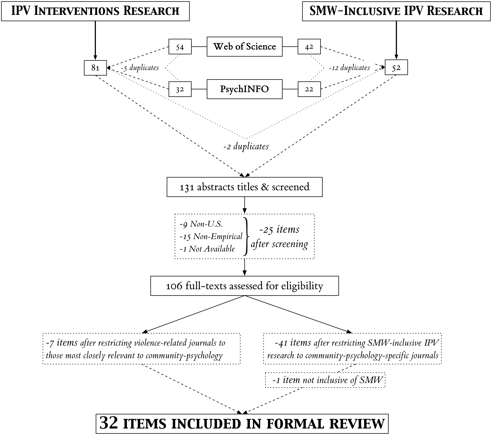

# README: Conducting a **Community-Psychology-Focused** Systematic Literature Review

A newly implemented component of the doctoral comprehensive exam for Applied Psychology doctoral students majoring in Community Psychology at Portland State University is writing a Major Area Paper (MAP) consisting of a systematic literature review focused each student's substantive research area. This repository contains the inputs and outputs from my personal process of completing this component of my comprehensive exam.

-----

The process of conducting the community-psychology-focused systematic review of empirical research related to IPV and sexual minority women was arduous to say the least. Community Psychological, as a field, is overwhelmingly more multi-disciplinary than most scientific research fields. Further, the field of Community Psychology is more so a methodologically- and values- focused field, rather than a field of study defined around a specific substantive area of research. That is, unlike research fields such as medicine, or sub-fields of medicine such as Oncology, Community Psychology is a primarily a field of social scientific research providing a range of general and specific values-based frameworks and ecologically-relevant methodologies. In addition, although intimate partner violence is increasingly recognized and treated as a public health issue, like many of the substantive research topics covered by community scientists, IPV-related research is not exclusive to any one research discipline, such as Public Health, nor is it in and of itself a distinct field of research. Rather, IPV-specific and related research is conducted out of a multitude of research and practice fields, including, but certainly not limited to, Psychology and its various sub-fields (e.g., Community, Social, Clinical, Organizational, and Cognitive Psychology), Sociology, Criminology, Public Policy, Economics, Public Health, Biology, Medicine, etcetera.

Given the multi-disciplinary and complex natures of both community-psychological and IPV-related research, as well as the specificity of the present systematic review's focus, the author was careful to maintain detailed records regarding each decision made throughout the article selection and review process (see flowchart below), as well as the rationale underlying each decision. The criteria and procedures used in the present review to determine the community-psychology relevance of research obtained from the literature database searches are provided in this repository for two purposes: (1) to ensure the transparency and reproducibility of the systematic review methods conducted for this review, and (2) as a potentially useful by-product of this process for future efforts to conduct similarly community-psychology-focused systematic literature reviews, including and beyond research related to intimate partner violence and sexual minority women.

-----

