<hr class="Bold" />

# Systematic Database Search

Six separate literature searches were conducted using the [_PsycINFO_](http://www.apa.org/pubs/databases/psycinfo/) and [_Web of Science_](http://wokinfo.com) online citation indexing databases via the [Portland State University library website](library.pdx.edu)^[Note that (1) "intimate partner violence" included "domestic violence" and "partner abuse", (2) "same-sex" included "same-gender", and (3) the results ranges provided after each search description listed reflect the minimum and maximum number of results returned across the two databases searched.]:

<!-- _C. Key search terms_ -->

1. _Intimate Partner Violence - General_
2. _Intimate Partner Violence Interventions_
3. _Intimate Partner Violence Intervention Evaluations_
4. _Female Same-Sex Intimate Partner Violence - General_
5. _Female Same-Sex Intimate Partner Violence Interventions_
6. _Female Same-Sex Intimate Partner Violence Intervention Evaluations_


Table: Descriptions of database searches conducted with corresponding ranges of the number of results returned {#tbl:dbsrch}

     Database Search^a^                               $Range_{N_{Results}}$ 
---  ----------------------------------------------  -----------------------
 1.  **IPV - General**                                 3,376, 4,386 _(PI)_  
 2.  --- _Interventions_                                337, 686 _(WoS)_    
 3.  --- _Intervention Evaluations_                      32, 46 _(WoS)_     
 4.  **Female Same-Sex/Same-Gender IPV - General**       18, 34 _(WoS)_     
 5.  --- _Interventions_                                  0, 4 _(WoS)_      
 6.  --- _Intervention Evaluations_                       0, 2 _(WoS)_      

__Note:__
^a^ For each database search, multiple search terms were included for the subject/keywords parameters to represent intimate partner violence<br /><br />


-----

# Community Psychology Publications & Closely-Related Violence-Specific Publications


<span class="newthought">Community-psychology journals</span> included in database searches:


  * Action Research
  * American Journal of Community Psychology
  * American Journal of Health Promotion
  * American Journal of Orthopsychiatry
  * American Journal of Preventive Medicine
  * American Journal of Public Health
  * Australian Community Psychologist
  * Community Development
  * Community Development Journal
  * Community Mental Health Journal
  * Community Psychology in Global Perspective
  * Cultural Diversity and Ethnic Minority Psychology
  * Global Journal of Community Psychology Practice
  * Health Education and Behavior
  * Health Promotion Practice
  * Journal of Applied Social Psychology
  * Journal of Community and Applied Social Psychology
  * Journal of Community Practice
  * Journal of Community Psychology
  * Journal of Health and Social Behavior
  * Journal of Prevention and Intervention
  * Journal of Primary Prevention
  * Journal of Rural Community Psychology
  * Journal of Social Issues
  * Journal of Community Psychology
  * Psychiatric Rehabilitation Journal
  * Psychology of Women Quarterly
  * Social Science and Medicine
  * the Community Psychologist
  * Transcultural Psychiatry
  * Progress in Community Health Partnerships

<!-- end of list -->


<span class="newthought">Violence-specific journals</span> selected for inclusion in database searches.


  * Journal of Interpersonal Violence
  * Violence Against Women
  * Violence and Victims
  * Journal of Family Violence

<!-- end of list -->


-----

# Results of Systematic Database Searches:


```r
Rbibkeys <- function(bib) {
    keys <- bib[grep("\\@.*?\\{.*?,", bib, perl = TRUE)]
    keys <- gsub("\\@\\w+\\{(.*?)", "\\1", keys, perl = TRUE)
    keys <- keys[!grepl("\\%.*?,", keys, perl = TRUE)]
    keys <- gsub(" ", NA_character_, keys)
    keys <- gsub(",", "", keys)
    return(keys)
}
bib <- readLines("MAP.bib")
BIBKEY <- Rbibkeys(bib)
library(bib2df)
bibdf <- bib2df("MAP.bib")
n.init <- nrow(bibdf)
ID <- seq(1:nrow(bibdf))
MAP.au <- cbind(BIBKEY, bibdf[, "AUTHOR"])
```


```r
MAP1 <- cbind(ID, BIBKEY, bibdf[, c("YEAR", "TITLE", "JOURNAL", "ABSTRACT")]) %>% 
    as.data.frame()
names(MAP1)[-1] <- tolower(names(MAP1)[-1])
KEYSv0 <- as.character(MAP1$bibkey)
```


```r
csid <- caseids[, c("caseid", "case", "RM", "scat")]
csid$case <- factor(csid$case)
MAP2 <- merge(MAP1, csid, by.x = "bibkey", by.y = "case")
n.inits3 <- MAP2[MAP2$scat == "S3", ] %>% nrow()
n.inits4 <- MAP2[MAP2$scat == "S4", ] %>% nrow()
```


```r
ctbl.z1 <- merge(ctbl.z1, cbk, all.x = TRUE, all.y = FALSE)
ctbl.z1$clab <- factor(ctbl.z1$clab) %>% droplevels()
t.excl <- Rtdf(ctbl.z1$clab, names = c("Reason for Exclusion", "$N_{excluded~articles}$"))
v1v2 <- paste0("@", as.character(ctbl.z1[, "case"]))
```


<span class="newthought">$N = 26$ items excluded </span> after restricting results to only _U.S.-based empirical_ studies.


Table: Number of Articles Removed per Exclusion Criteria

Reason for Exclusion       $N_{excluded~articles}$
------------------------  ------------------------
Full Text Not Available                          1
Non-Empricial                                   15
Non-US                                           9
Not SMW-Inclusive                                1


```r
MAP2$RM <- ifelse(MAP2$RM == 1, NA, 0)
MAP2rm <- MAP2[is.na(MAP2$RM), "bibkey"] %>% droplevels() %>% as.character()
MAP2 <- na.omit(MAP2)
MAP2 <- droplevels(MAP2)
KEYSv1 <- as.character(MAP2$bibkey)
```


```r
MAP2$journal <- sapply(MAP2$journal, tolower)
MAP2$journal <- gsub(" & ", " and ", MAP2$journal)
cp <- MAP2$journal %in% j.cp
map.cp <- MAP2[cp, ] %>% data.frame()
vlc <- MAP2$journal %in% j.v
map.v <- MAP2[vlc, ] %>% data.frame()
map.v <- map.v[map.v$scat == "S3", , drop = FALSE]
map.v$journal <- sapply(map.v$journal, RtCap)
j.cpv <- c(j.v, j.cp)
cpv <- MAP2$journal %in% j.cpv
map.cpv <- MAP2[cpv, ] %>% data.frame()
map.cpv$rms4 <- ifelse(map.cpv$journal %in% j.v & map.cpv$scat == "S4", NA, 
    map.cpv$scat)
map.cpv <- na.omit(map.cpv)
MAP3 <- MAP2[vlc | cp, ] %>% data.frame()
MAP3$bibkey <- as.character(MAP3$bibkey)
KEYSv2 <- as.character(MAP3$bibkey)
v1v2 <- KEYSv1[!KEYSv1 %in% KEYSv2]
```

<span class="newthought">$N = 7$ items excluded after restricting search results</span> to only those published in community-psychology specific journals and the _four selected_ violence-related journals (i.e., _Journal of Interpersonal Violence_, , _Violence Against Women_, , _Violence and Victims_,  and _Journal of Family Violence_.


```r
MAP3$rms4 <- ifelse(MAP3$journal %in% j.v & MAP3$scat == "S4", NA, MAP3$scat)
MAP <- na.omit(MAP3)
KEYSv3 <- as.character(MAP$bibkey)
v2v3 <- KEYSv2[!KEYSv2 %in% KEYSv3]
```


<span class="newthought">$N = 41$ items excluded after restricting </span> SMW-inclusive search results to only include items published in community-psychology specific journals.


------


<span class="newthought">$N = 32$ items included in the formal literature review</span> [@balsam2005relationship; @blosnich2009comparisons; @boal2014barriers; @boal2014impact; @contrino2007compliance; @edwards2016college; @enriquez2010development; @ermentrout2014this; @feder2011need; @foshee2004assessing; @gillum2008benefits; @glass2008risk; @gondolf1999comparison; @gregory2002effects; @hendricks2006recidivism; @hovell2006evaluation; @howell2015strengthening; @kan2014can; @lewis2014sexual; @muftic2007evaluation; @oswald2010lesbian; @portwood2011evaluation; @potter2011bringing; @price2009batterer; @roffman2008mens; @rumptz1991ecological; @sargent2016evaluating; @silvergleid2006batterer; @sullivan2002findings; @sylaska2015disclosure; @thompson2000identification; @welland2010culturally]


```r
MAP <- merge(MAP, jdat, by = "journal", all.x = TRUE)
MAP$journal <- factor(MAP$journal)
levels(MAP$journal) <- sapply(levels(MAP$journal), RtCap)
MAP$jrnl <- sapply(as.character(MAP$journal), Rabbr)
```


-----

# Systematically-Reviewed Literature


<span class="newthought">The resulting selection of empirical literature</span>, representing a community-psychology-focused subset of the U.S.-based IPV-related literature, was reviewed using a `primarily deductive` _qualitative comparative analytic approach_ [_QCA_; @leech2007array; @onwuegbuzie2017framework]. This approach was conducted as part of an initial data reduction and organization process in which the reviewed literature was categorized according to the commonalities in overarching research topics, target populations, sampling frames, sampling and data collection methodologies, and data analytic approaches. In addition, the QCA approach served as a systematic method for examining the similarities, differences, and anomalies within the groups identified in the initial data reduction and organization process [@onwuegbuzie2017framework; @onwuegbuzie2009qualitative]. The qualitative comparative analysis of the reviewed literature was aided by the _`RQDA`_ package created for use with the _`R` Statistical Programming Language and Environment_ [@R-RQDA; @R-base].


```r
cb <- merge(MAP, ctbl, by = c("caseid", "scat"))
cb <- within(cb, {
    journal <- droplevels(journal)
    jrnl <- sapply(as.character(journal), Rabbr)
    code <- gsub("FG-\\w+", "FG", code)
    code <- gsub("SVY-QL-MM", "SVY-QL", code)
    code <- gsub("SVY-QT-MM", "SVY-QT", code)
    code <- gsub("IVW-\\w+", "IVW", code)
    code <- gsub("SMIN-\\w+", NA, code)
    code <- gsub("HET", NA, code)
    scat <- factor(scat, labels = c("IPV Interventions", "SMW-Inclusive Research"))
})
cb <- na.omit(cb) %>% droplevels()
cb <- cb[, c("caseid", "scat", "journal", "bibkey", "year", "RM", "rms4", "j.loc", 
    "j.year", "SJR", "Hindex", "jrnl", "case", "cid", "code", "catid", "cat")]
cb <- merge(cb, cbk, by = "code")
cb$code <- factor(cb$code)
cb$clab <- factor(cb$clab)
```


## Codebook


```r
catt <- Rtdf(cdbk$catlab, names = c("Information Category", "$N_{sub-codes}$"))
cdbk.ft1 <- with(cdbk, {
    ftable(clab, catlab) %>% data.frame()
})
cdbk.ft1$Freq <- ifelse(cdbk.ft1$Freq == 0, NA, cdbk.ft1$Freq)
cdbk.ft <- na.omit(cdbk.ft1)[, 1:2]
rownames(cdbk.ft) <- NULL
cdbk.ft$catlab <- as.character(cdbk.ft$catlab)
cdbk.ft$catlab <- ifelse(duplicated(cdbk.ft$catlab), NA, paste0("**", cdbk.ft$catlab, 
    "**"))
cdbk.ft <- cdbk.ft[, c("catlab", "clab"), drop = FALSE]
kable(cdbk.ft, col.names = c("**Information Category**", "Codes"), caption = "Codebook Constructed from the Discrete Summative Data Compiled Across the Formally Reviewed Literature {#tbl:cdbk}", 
    align = c("r", "l"))
```


Table: Codebook Constructed from the Discrete Summative Data Compiled Across the Formally Reviewed Literature {#tbl:cdbk}

                  **Information Category**  Codes                                              
------------------------------------------  ---------------------------------------------------
               **Archival Data Source(s)**  Client Records                                     
                                         -  Government-Sponsored Survey                        
                                         -  Police/Court Records                               
       **Ecological Level(s) of Analysis**  Community                                          
                                         -  Exo-Macro                                          
                                         -  Individual                                         
                                         -  Meso-Exo                                           
                                         -  Micro                                              
                                         -  Relationship                                       
                                         -  Societal                                           
                   **Experimental Design**  Longitudinal Design                                
                                         -  Pre-Test/Post-Test Design                          
                                         -  Randomized Control Trial (Baseline & Follow-Up)    
                                         -  Randomized Control Trial (Longitudinal)            
                           **Methodology**  Meta-Analysis                                      
                                         -  Mixed-Methods                                      
                                         -  Not Applicable - Methodology                       
                                         -  QuaLitative Methods                                
                                         -  QuaNTitative Methods                               
                                         -  Systematic Literature Review                       
              **Mixed (QL & QNT) Methods**  1-on-1 Interviews                                  
                                         -  Focus Groups                                       
                                         -  Multi-Modal Data Collection Methods                
                                         -  QuaLitative Survey                                 
                                         -  QuaNTitative Survey                                
          **Mixed-Methods Resarch Design**  Cross-Sectional Design                             
                                         -  Experimental Design                                
                                         -  Longitudinal Design                                
                                         -  Pre-Test/Post-Test Design                          
       **QuaLitative Analytic Approaches**  Constant Comparative Analysis                      
                                         -  Content Analysis                                   
                                         -  Cross-Case Analysis                                
                                         -  Grounded Theory (GT)-Based Analysis                
                                         -  Grouped Thematic Analysis                          
                                         -  Qualitative Descriptive Analysis                   
                                         -  Thematic Analysis                                  
              **QuaLitative Methods (QL)**  1-on-1 Interviews                                  
                                         -  Archival/Secondary Data                            
                                         -  Case Study                                         
                                         -  Focus Groups                                       
                                         -  Group Interviews                                   
                                         -  Multi-Modal Data Collection Methods                
                                         -  Participatory Observation                          
                                         -  QuaLitative Survey                                 
           **QuaLitative Research Design**  Experimental Design                                
                                         -  Longitudinal Design                                
                                         -  Narrative (Descriptive)                            
                                         -  Phenomenological                                   
      **QuaNTitative Analytic Approaches**  Analysis of Covariance (ANCOVA)                    
                                         -  Analysis of Variance (ANOVA)                       
                                         -  Boostrapping                                       
                                         -  Chi-Square Difference Test                         
                                         -  Chi-Square Goodness of Fit                         
                                         -  Cluster Analysis                                   
                                         -  Confirmatory Factor Analysis (CFA)                 
                                         -  Correlations                                       
                                         -  Descriptives                                       
                                         -  Exploratory Factor Analysis (EFA)                  
                                         -  Factorial Invariance Testing Across Groups         
                                         -  Full SEM (Measurement & Structural Models)         
                                         -  Grounded Theory (GT)-Based Analysis                
                                         -  Hierarchical Linear Regression                     
                                         -  Indirect-Effects                                   
                                         -  Item Response Theory (IRT)                         
                                         -  Latent Variable Modeling                           
                                         -  Likelihood Ratio Tests (LRT)                       
                                         -  Linear Regression                                  
                                         -  Logistic Regression                                
                                         -  Maximum Likelihood Estimation (MLE)                
                                         -  Mediation Analysis                                 
                                         -  Mixed-Effects Modeling (MEM)                       
                                         -  Moderation/Conditional Process Analysis            
                                         -  Multi-Group Modeling                               
                                         -  Multi-Level/Hierarchical Linear Modeling (MLM/HLM) 
                                         -  Multivariate Analyses                              
                                         -  Multivariate Analysis of Covariance (MANCOVA)      
                                         -  Multivariate Analysis of Variance (MANOVA)         
                                         -  Odds Ratios (OR)                                   
                                         -  Ordinary Least Squares Regression                  
                                         -  Path Analysis                                      
                                         -  Post-Hoc Comparisons                               
                                         -  Relative Risk Ratios (RRR)                         
                                         -  Repeated-Measures ANOVA/ANCOVA                     
                                         -  Step-Wise Regression                               
                                         -  Structural Equation Modeling (SEM)                 
                                         -  T-Tests (Mean Differences)                         
                                         -  Variance Adjusted Estimation                       
                                         -  Weighted Least Squares (WLS) Estimation            
            **QuaNTitative Methods (QNT)**  1-on-1 Interviews                                  
                                         -  Archival/Secondary Data                            
                                         -  Multi-Modal Data Collection Methods                
                                         -  QuaNTitative Survey                                
          **QuaNTitative Research Design**  Cross-Sectional Design                             
                                         -  Experimental Design                                
                                         -  Longitudinal Design                                
                                         -  Pre-Test/Post-Test Design                          
                                         -  Quasi-Experimental Design                          
             **Quasi-Experimental Design**  Quasi-Experimental Longitudinal Design             
                                **Remove**  Full Text Not Available                            
                                         -  Non-Empricial                                      
                                         -  Non-US                                             
                                         -  Not SMW-Inclusive                                  
                     **Research Category**  IPV Interventions Research                         
                                         -  LGBTQ-IPV Research                                 
                       **Research Design**  Cross-Sectional Design                             
                                         -  Experimental Design                                
                                         -  Narrative (Descriptive)                            
                                         -  Phenomenological                                   
                                         -  Quasi-Experimental Design                          
                        **Research Topic**  Approach Evaluation                                
                                         -  Bystander Intervention                             
                                         -  Community Capacity                                 
                                         -  Coordinated Community Response to IPV              
                                         -  Help-Seeking                                       
                                         -  HIV Intervention/Prevention                        
                                         -  Intervention/Prevention (General)                  
                                         -  IPV Consequences                                   
                                         -  IPV Dynamics                                       
                                         -  IPV Intervention Description                       
                                         -  IPV Intervention Efficacy                          
                                         -  IPV Intervention Program Development               
                                         -  IPV Intervention Program Evaluation                
                                         -  IPV Intervention Proposal                          
                                         -  IPV Perpetrator Interventions                      
                                         -  IPV Prevalance                                     
                                         -  IPV Screening                                      
                                         -  IPV Victimization Intervention                     
                                         -  Key Stakeholders' Perspectives                     
                                         -  Macro or Mid-Macro Context(s) of IPV               
                                         -  Measures                                           
                                         -  Outsiders' (general) Perspective                   
                                         -  Perpetrator Characteristics                        
                                         -  Practitioners' Perspectives                        
                                         -  Prevention (General)                               
                                         -  Protective Factors                                 
                                         -  Public/Program Policy                              
                                         -  Research/Evaluation Methods                        
                                         -  Risk Factors                                       
                                         -  System Response                                    
                                         -  Victims'/Survivors' Perspectives                   
 **Target Population(s) & Sampling Frame**  African Americans                                  
                                         -  Asian Americans                                    
                                         -  At Risk Populations                                
                                         -  Cis-Genders                                        
                                         -  College Students                                   
                                         -  Couples                                            
                                         -  Disabled-Persons                                   
                                         -  Females/Women/Girls                                
                                         -  Gender Minorities                                  
                                         -  General Population                                 
                                         -  Graduate Students                                  
                                         -  Heterosexuals                                      
                                         -  IPV Intervention Programs                          
                                         -  IPV Perpetrators                                   
                                         -  IPV Victims/Survivors                              
                                         -  IPV-Specific Community-Based Practitioners         
                                         -  Latina/os                                          
                                         -  Males/Men/Boys                                     
                                         -  Non-IPV Community-Based Practitioners              
                                         -  Non-IPV Crime Victims                              
                                         -  Non-IPV System Entities                            
                                         -  Not Applicable - Population                        
                                         -  Parents                                            
                                         -  Racial Minorities                                  
                                         -  Sexual Minorities                                  
                                         -  Sexual Minority Women (as distinct group)          
                                         -  Sexual Minority Women Only                         
                                         -  Urban-Specific Populations                         
                                         -  Youth/Children                                     


-----

# General Research Categories


```r
catpal <- c(adjustcolor(pal_my[16], alpha.f = 0.9), adjustcolor(pal_my[5], alpha.f = 0.9))
cpv.s3 <- MAP[MAP$scat == "S3", ]
cpv.s4 <- MAP[MAP$scat == "S4", ]
ct.scat <- within(MAP, {
    scat <- ifelse(scat == "S3", "IPV Interventions", "SMW-Inclusive Research")
})
t.scat <- Rtdf(ct.scat$scat, names = c("Category", "N"))
t.scat %>% kable()
```


Category                   N
-----------------------  ---
IPV Interventions         25
SMW-Inclusive Research     7

```r
scat.t <- table(ct.scat$scat)
scat.bn <- Rbinom(scat.t)
scat.bn %>% kable(caption = "Binomial Test of the Difference in Search Category Proportions", 
    col.names = c("Alternative", "Null Value ($\\pi_{0}$)", "Parameter", "Estimate", 
        "$\\chisq$", "$p$-value", "CI"), format = "latex", booktabs = T, escape = FALSE)
```

\begin{table}

\caption{\label{tab:scat}Binomial Test of the Difference in Search Category Proportions}
\centering
\begin{tabular}[t]{lrrrrrl}
\toprule
Alternative & Null Value ($\pi_{0}$) & Parameter & Estimate & $\chisq$ & $p$-value & CI\\
\midrule
two.sided & 0.5 & 1 & 0.781 & 10.1 & 0.001 & 0.61, 0.89\\
\bottomrule
\end{tabular}
\end{table}

```r
t.scat$prop <- t.scat$N/sum(t.scat$N)
t.scat <- t.scat[order(t.scat$prop), ]
t.scat$ymax <- cumsum(t.scat$prop)
t.scat$ymin <- c(0, head(t.scat$ymax, n = -1))
```

```r
library(ggplot2)
scat.p <- ggplot(t.scat, aes(fill = Category, ymax = ymax, ymin = ymin, xmax = 4, 
    xmin = 3)) + scale_fill_manual(values = catpal) + geom_rect() + coord_polar(theta = "y") + 
    xlim(c(0, 4)) + annotate("text", x = 0, y = 0, label = "Category Proportions") + 
    labs(title = "") + thm_Rtft(ytitle = FALSE) + theme(axis.text = element_blank(), 
    axis.ticks = element_blank(), legend.text = element_text(size = rel(1)), 
    legend.key.width = unit(0.5, "cm"), legend.key.height = unit(0.5, "cm"))
scat.p
```

{#fig:donut_scat}


-----

# Publication Titles


```r
t.jrnl <- Rtdf(MAP$journal)
ft.jrnl <- with(MAP, {
    ftable(journal, scat) %>% matrix(nrow = nrow(t.jrnl), byrow = FALSE)
})
dimnames(ft.jrnl) <- list(`Publication Title` = levels(MAP$journal), Category = c("IPV Interventions", 
    "SMW-Inclusive Research"))
ft.jrnl <- ifelse(ft.jrnl == 0, NA, ft.jrnl)
ft.jrnl %>% kable(caption = "Number of Publications in Each Research Category per Journal", 
    align = c("l", "r", "r"))
```


Table: Number of Publications in Each Research Category per Journal

                                           IPV Interventions    SMW-Inclusive Research
-----------------------------------------  ------------------  -----------------------
American Journal of Community Psychology   1                                         2
American Journal of Preventive Medicine    1                                         -
American Journal of Public Health          1                                         2
Journal of Family Violence                 1                                         -
Journal of Interpersonal Violence          6                                         -
Journal of Primary Prevention              1                                         -
Psychology of Women Quarterly              -                                         3
Violence Against Women                     9                                         -
Violence and Victims                       5                                         -

```r
cpv.s3$jrnl <- sapply(as.character(cpv.s3$journal), Rabbr) %>% factor()
cpv.s4$jrnl <- sapply(as.character(cpv.s4$journal), Rabbr) %>% factor()
j.cp <- sapply(j.cp, Rabbr, USE.NAMES = FALSE)
cb$cpv <- ifelse(cb$jrnl %in% j.cp, "CP", "V")
j.v <- sapply(j.v, Rabbr, USE.NAMES = FALSE)
pr.jv <- length(j.v)/length(j.cp)
pr.jcp <- 1 - pr.jv
pr.j <- c(pr.jv, pr.jcp)
MAP$cpv <- ifelse(MAP$jrnl %in% j.cp, "CP", "V")
```


-----

## Research Category by Journal & Journal Category


```r
ftm.j <- Rna(ft.jrnl)
sum.j <- apply(ftm.j, 1, sum)
ftm.j <- ifelse(ftm.j == 0, NA, ftm.j)
ftm.jp <- cbind(ft.jrnl, `**Total**` = sum.j)
ftm.jp %>% kable(align = rep("r", 3), caption = "$N_{articles}$ in Each Research Category per Journal")
```


Table: $N_{articles}$ in Each Research Category per Journal

                                            IPV Interventions   SMW-Inclusive Research   **Total**
-----------------------------------------  ------------------  -----------------------  ----------
American Journal of Community Psychology                    1                        2           3
American Journal of Preventive Medicine                     1                        -           1
American Journal of Public Health                           1                        2           3
Journal of Family Violence                                  1                        -           1
Journal of Interpersonal Violence                           6                        -           6
Journal of Primary Prevention                               1                        -           1
Psychology of Women Quarterly                               -                        3           3
Violence Against Women                                      9                        -           9
Violence and Victims                                        5                        -           5

```r
Rdotchart(main = expression(paste(italic(N[Articles]), italic(" per Publication"))), 
    ftm.j, pch = 19, gcolor = pal_my[20], xlab = expression(N[Articles]), cex = 0.7, 
    gcex = 0.75, gfont = 2, pt.cex = 1.125, color = c(rep(catpal[1], nrow(ftm.j)), 
        rep(catpal[2], nrow(ftm.j))), xaxt = "n")
axis(1, at = seq(range(ftm.j, na.rm = TRUE)[1], range(ftm.j, na.rm = TRUE)[2], 
    by = 3))
```

{#fig:}

```r
MAP.jrnl <- MAP[, c("scat", "journal")]
names(MAP.jrnl) <- c("Category", "Journal")
MAP.jrnl$Category <- ifelse(MAP.jrnl$Category == "S3", "IPV Interventions", 
    "SMW-Inclusive Research")
pj <- mpal(1:length(unique(MAP$jrnl)), p = sci)
library(ggparallel)
pscat <- c("#a6afbb", pal_my[17])
t.jrnl$log <- log(t.jrnl[, 2]) + 1
lj <- c(3.5, 3.5, t.jrnl[, 3])
parset.jrnl <- ggparset2(list("Category", "Journal"), data = MAP.jrnl, method = "parset", 
    label = TRUE, label.size = lj, text.angle = 0, order = c(0, 0)) + scale_fill_manual(values = c(pscat, 
    adjustcolor(pj, alpha.f = 0.55)), guide = FALSE) + scale_colour_manual(values = c(pscat, 
    pj), guide = FALSE) + thm_Rtft(ticks = FALSE, ytext = FALSE)
parset.jrnl + labs(subtitle = "Journals")
```

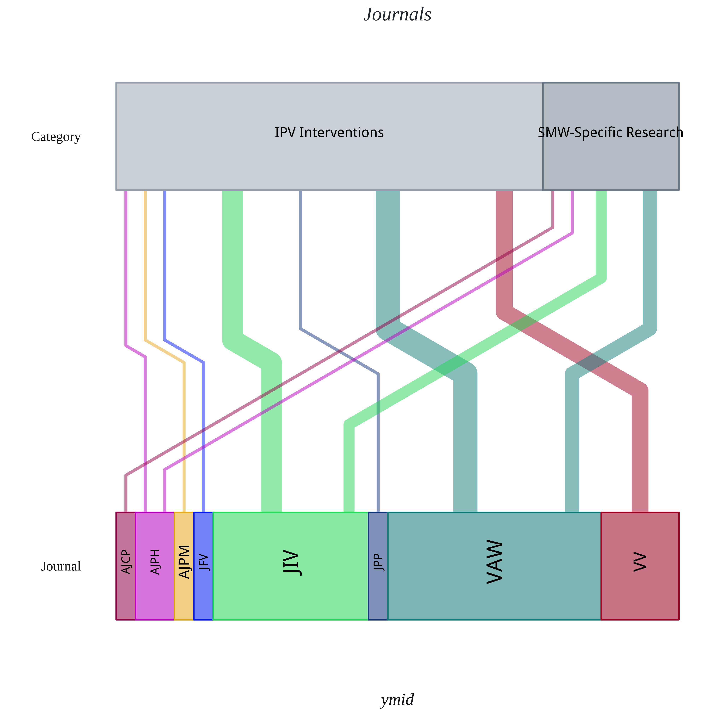{#fig:}

```r
MAP.jrnl <- MAP[, c("scat", "journal", "cpv", "jrnl")]
pcpv <- mpal(1:2)
clr.cpv1 <- levels(factor(MAP.jrnl$journal))
clr.cpv <- ifelse(clr.cpv1 %in% j.cpp, pcpv[1], pcpv[2])
MAP.jrnl$cpv <- ifelse(MAP.jrnl$cpv == "CP", "Community Psychology", "Violence-Specific")
MAP.jrnl$scat <- ifelse(MAP.jrnl$scat == "S3", "IPV Interventions", "SMW-Inclusive Research")
names(MAP.jrnl) <- c("Category", "Journal", "Discipline", "jrnl")
parset.jrnl2 <- ggparset2(list("Category", "Journal", "Discipline"), data = MAP.jrnl, 
    method = "parset", label = TRUE, label.size = 2.75, text.angle = 0, order = c(1, 
        0, 0)) + scale_fill_manual(values = c(pscat, adjustcolor(pcpv, alpha.f = 0.85), 
    adjustcolor(clr.cpv, alpha.f = 0.55)), guide = FALSE) + scale_colour_manual(values = c(pscat, 
    adjustcolor(pcpv, alpha.f = 0.85), adjustcolor(clr.cpv, alpha.f = 0.85)), 
    guide = FALSE) + thm_Rtft(ticks = FALSE, ytext = FALSE)
parset.jrnl2 + labs(subtitle = "Journals & Research Disciplines")
```

{#fig:}


\tufteskip

# Publication Years


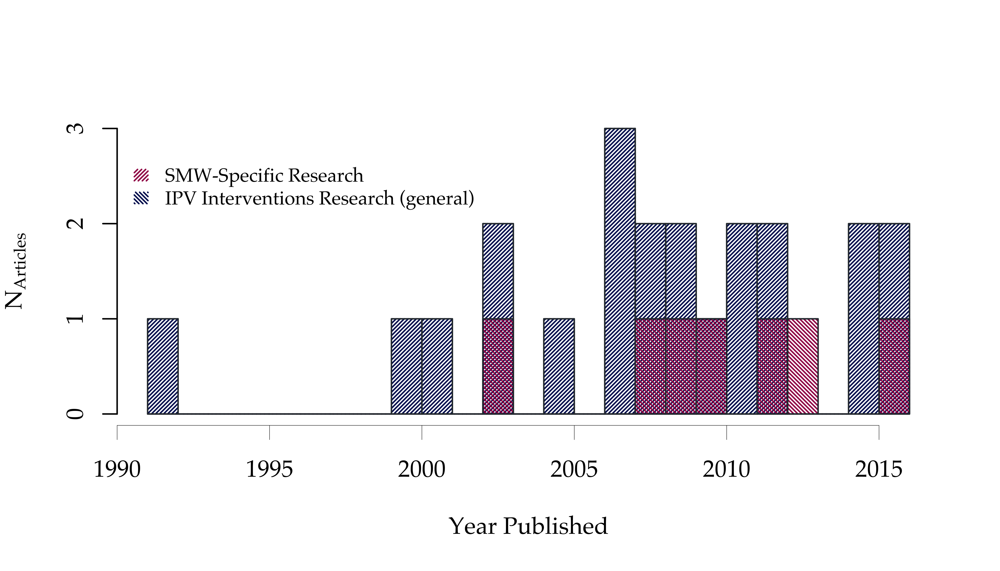{#fig:}


-----

# Research Topics, Sampling Frames, and Methodologies


```r
Rftm <- function(x1, x2, dnn = NULL, zero.action = NA, zero.qt = FALSE) {
    if (!is.null(dnn)) {
        tx <- Rtdf(x1, names = dnn[[1]])
        ftm <- ftable(x1, x2, row.vars = 1) %>% matrix(nrow = nrow(tx), byrow = FALSE)
        dimnames(ftm) <- list(levels(x1), dnn[[2]])
    }
    else {
        tx <- Rtdf(x1)
        ftm <- ftable(x1, x2, row.vars = 1) %>% matrix(nrow = nrow(tx), byrow = FALSE)
        dimnames(ftm) <- list(levels(x1))
    }
    if (!is.null(zero.action)) {
        if (zero.qt == 0 | zero.qt == 1) {
            zero.qt <- as.logical(zero.qt)
        }
        if (zero.qt == TRUE) {
            ftm <- ifelse(ftm == 0, quote(zero.action), ftm)
        }
        else {
            ftm <- ifelse(ftm == 0, noquote(zero.action), ftm)
        }
    }
    y <- list(tx, ftm)
    names(y) <- c(paste0("Tabulation of ", deparse(substitute(x1))), paste0("Cross-Tabulation of ", 
        deparse(substitute(x1)), " & ", deparse(substitute(x2))))
    return(y)
}
```


## Primary Topics


```r
codes.tp <- cb[cb$cat == "TOPIC", "clab"] %>% droplevels()
ctp.dnn <- c("Topic", "$N_{Articles}$")
scats.tp <- cb[cb$cat == "TOPIC", "scat"] %>% droplevels()
stp.dnn <- c("IPV Interventions", "SMW-Inclusive Research")
topics <- Rftm(codes.tp, scats.tp, dnn = list(ctp.dnn, stp.dnn))
t.tp <- topics[[1]]
ftm.tp <- topics[[2]]
ftm.tp2 <- Rna(ftm.tp)
sum.tp <- apply(ftm.tp2, 1, sum)
ftm.tpp <- cbind(ftm.tp, `**Total**` = sum.tp)
ftm.tpp %>% kable(align = rep("r", 3), caption = "Research Topics")
```


Table: Research Topics

                                         IPV Interventions   SMW-Inclusive Research   **Total**
--------------------------------------  ------------------  -----------------------  ----------
Approach Evaluation                                      1                        -           1
Bystander Intervention                                   1                        -           1
Community Capacity                                       -                        1           1
Coordinated Community Response to IPV                    1                        1           2
Help-Seeking                                             -                        1           1
HIV Intervention/Prevention                              1                        -           1
Intervention/Prevention (General)                       25                        -          25
IPV Consequences                                         -                        1           1
IPV Intervention Description                             3                        -           3
IPV Intervention Program Development                     3                        -           3
IPV Intervention Program Evaluation                     21                        -          21
IPV Intervention Proposal                                1                        -           1
IPV Perpetrator Interventions                           13                        -          13
IPV Prevalance                                           -                        1           1
IPV Screening                                            1                        -           1
IPV Victimization Intervention                           8                        -           8
Measures                                                 -                        1           1
Outsiders' (general) Perspective                         -                        1           1
Practitioners' Perspectives                              1                        -           1
Prevention (General)                                     2                        -           2
Public/Program Policy                                    2                        -           2
Research/Evaluation Methods                              3                        -           3
Risk Factors                                             -                        3           3
System Response                                          2                        -           2
Victims'/Survivors' Perspectives                         2                        -           2

```r
Rdotchart(main = "Research Topics", ftm.tp, pch = 19, gcolor = pal_my[20], xlab = expression(N[Articles]), 
    cex = 0.7, gcex = 0.75, gfont = 2, pt.cex = 1.125, color = c(rep(catpal[1], 
        nrow(ftm.tp)), rep(catpal[2], nrow(ftm.tp))))
```

{#fig:}


-----


```r
dfm.tp2 <- data.frame(ftm.tp)
names(dfm.tp2) <- c("s3", "s4")
top.s3 <- data.frame(dfm.tp2$s3, row.names = rownames(dfm.tp2))
top.s3 <- na.omit(top.s3)
top.s4 <- data.frame(dfm.tp2$s4, row.names = rownames(dfm.tp2))
top.s4 <- na.omit(top.s4)
tp.s3 <- cb[cb$scat == levels(cb$scat)[1] & cb$cat == "TOPIC", ] %>% droplevels()
tp.s4 <- cb[cb$scat == levels(cb$scat)[2] & cb$cat == "TOPIC", ] %>% droplevels()
```


-----

## Research Designs


```r
ct.d <- cb[cb$cat == "DESIGN", ] %>% droplevels()
t.d <- Rtdf(ct.d$clab)
ct.d$clab <- gsub(" Design", "", ct.d$clab) %>% factor()
ft.d <- ftable(ct.d[, c("clab", "scat")], row.vars = 1)
ftm.d <- matrix(ft.d, nrow = nrow(t.d), byrow = FALSE)
dimnames(ftm.d) <- list(Design = levels(ct.d$clab), Category = c("IPV Interventions", 
    "SMW-Inclusive Research"))
sum.d <- apply(ftm.d, 1, sum)
ftm.d <- ifelse(ftm.d == 0, NA, ftm.d)
ftm.d <- cbind(ftm.d, `**Total**` = sum.d)
ftm.d %>% kable(align = rep("r", 3), caption = "Research Designs")
```


Table: Research Designs

                           IPV Interventions   SMW-Inclusive Research   **Total**
------------------------  ------------------  -----------------------  ----------
Cross-Sectional                            2                        5           7
Experimental                              16                        2          18
Narrative (Descriptive)                    7                        2           9
Phenomenological                           2                        -           2
Quasi-Experimental                         1                        -           1

```r
nlabs <- length(unique(ct.d$clab))
pd <- mpal(1:length(unique(ct.d$clab)), p = sci)
ct.d <- dplyr::rename(ct.d, Category = scat, Design = clab)
```

```r
library(ggparallel)
pscat <- c("#a6afbb", pal_my[17])
t.d$log <- log(t.d[, 2]) + 1
ld <- c(3.5, 3.5, t.d[, 3])
parset.dsgn <- ggparset2(list("Category", "Design"), data = ct.d, method = "parset", 
    label = TRUE, label.size = ld, text.angle = 0, order = c(0, 0)) + scale_fill_manual(values = c(pscat, 
    adjustcolor(pd, alpha.f = 0.55)), guide = FALSE) + scale_colour_manual(values = c(pscat, 
    pd), guide = FALSE) + thm_Rtft(ticks = FALSE, ytext = FALSE)
parset.dsgn + labs(subtitle = "Research Designs")
```

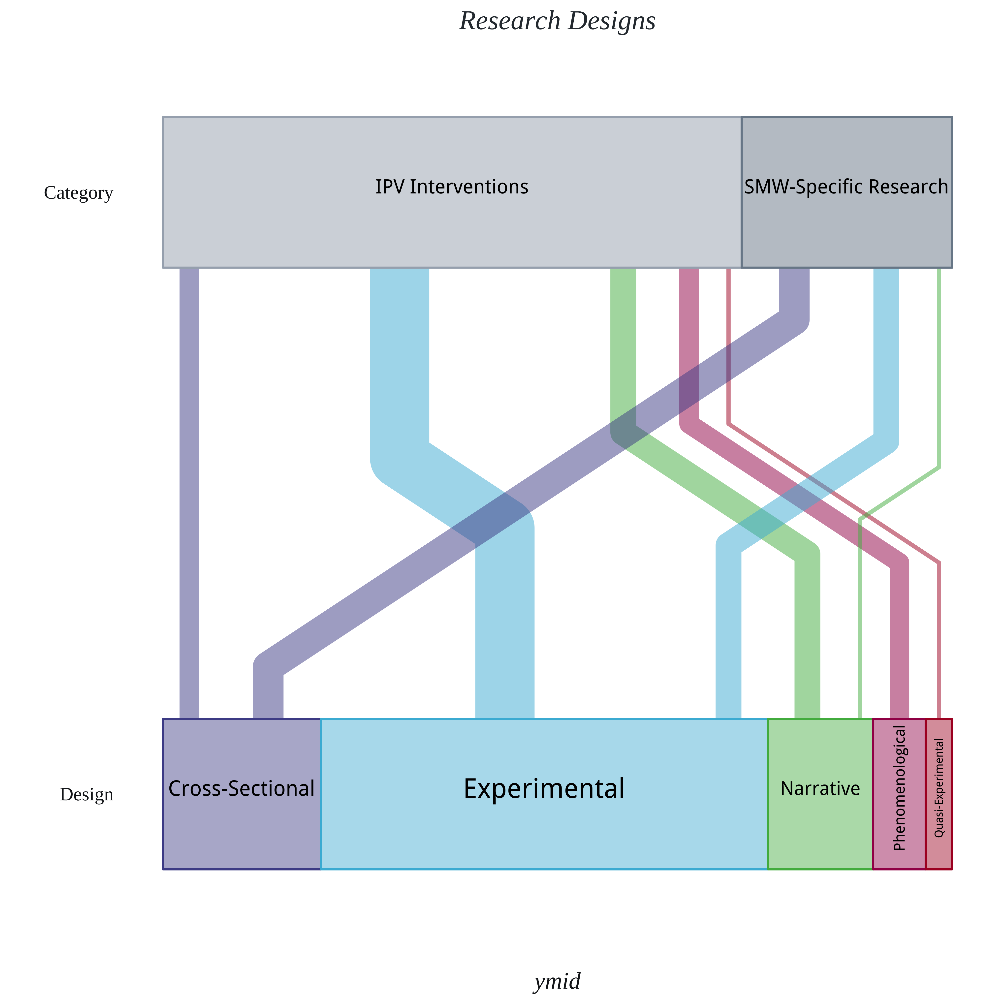{#fig:}


-----

<span class="newthought">Experimental Research Designs</span>


```r
ct.exp <- cb[cb$cat == "DESIGN-EXP", ] %>% droplevels()
ct.exp <- ct.exp[!duplicated(ct.exp), ]
t.exp <- Rtdf(ct.exp$clab)
ct.exp$clab <- gsub(" Design", "", ct.exp$clab) %>% factor()
ct.exp$clab <- gsub(" \\(", " \n\\(", ct.exp$clab) %>% factor()
ft.exp <- ftable(ct.exp[, c("clab", "scat")], row.vars = 1)
ftm.exp <- matrix(ft.exp, nrow = nrow(t.exp), byrow = FALSE)
dimnames(ftm.exp) <- list(`Experimental Design` = levels(ct.exp$clab), Category = c("IPV Interventions", 
    "SMW-Inclusive Research"))
sum.exp <- apply(ftm.exp, 1, sum)
ftm.exp <- ifelse(ftm.exp == 0, NA, ftm.exp)
ftm.expp <- cbind(ftm.exp, `**Total**` = sum.exp)
ftm.expp %>% kable(align = rep("r", 3), caption = "Experimental Research Designs")
```


Table: Experimental Research Designs

                                                    IPV Interventions   SMW-Inclusive Research   **Total**
-------------------------------------------------  ------------------  -----------------------  ----------
Longitudinal                                                       13                        -          13
Pre-Test/Post-Test                                                  2                        1           3
Randomized Control Trial 
(Baseline & Follow-Up)                    3                        -           3
Randomized Control Trial 
(Longitudinal)                            3                        1           4

```r
nlabs <- length(unique(ct.exp$clab))
pexp <- mpal(1:length(unique(ct.exp$clab)), p = sci)
ct.exp <- dplyr::rename(ct.exp, Category = scat, `Experimental Design` = clab)
```

```r
library(ggparallel)
pscat <- c("#a6afbb", pal_my[17])
t.exp$log <- log(t.exp[, 2]) + 1
lexp <- c(3.5, 3.5, t.exp[, 3])
parset.exp <- ggparset2(list("Category", "Experimental Design"), data = ct.exp, 
    method = "parset", label = TRUE, label.size = lexp, text.angle = 0, order = c(0, 
        0)) + scale_fill_manual(values = c(pscat, adjustcolor(pexp, alpha.f = 0.55)), 
    guide = FALSE) + scale_colour_manual(values = c(pscat, pexp), guide = FALSE) + 
    thm_Rtft(ticks = FALSE, ytext = FALSE)
parset.exp + labs(subtitle = "Experimental Designs")
```

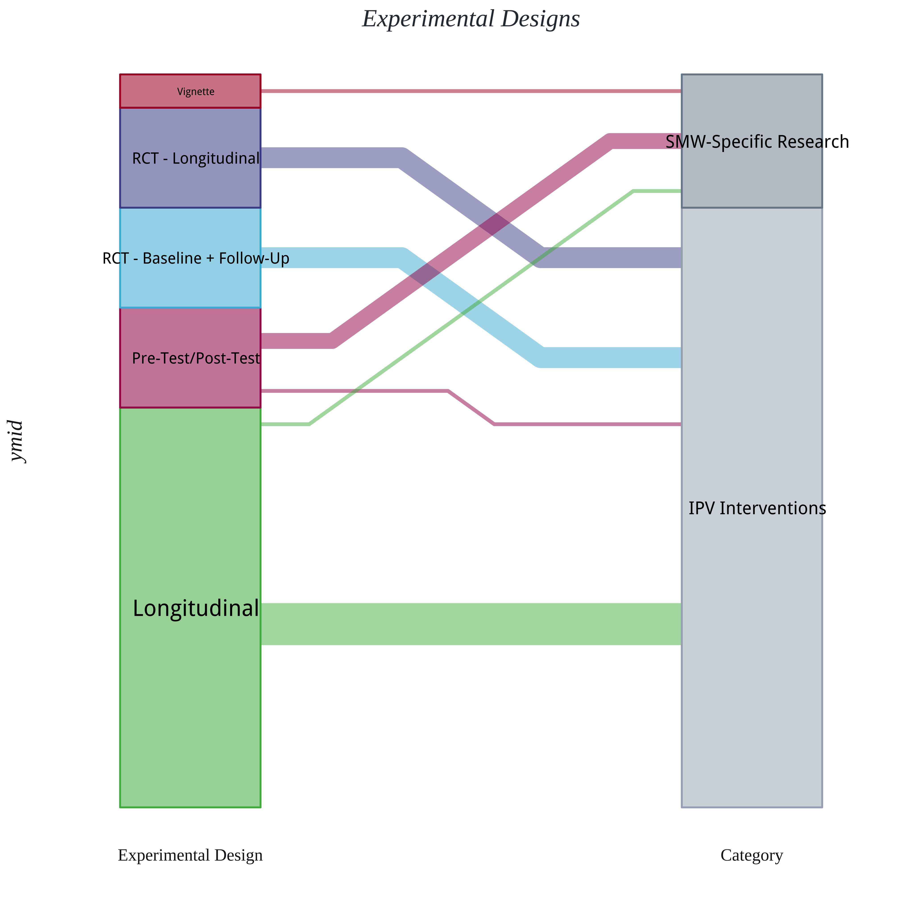{#fig:}


-----

## Data Collection Methodologies


```r
ct.mo <- cb[cb$cat == "METHODS", ] %>% droplevels()
ct.mo <- ct.mo[!duplicated(ct.mo), ]
t.mo <- Rtdf(ct.mo$clab)
ft.mo <- ftable(ct.mo[, c("clab", "scat")], row.vars = 1)
ftm.mo <- matrix(ft.mo, nrow = nrow(t.mo), byrow = FALSE)
dimnames(ftm.mo) <- list(Methodology = levels(ct.mo$clab), Category = c("IPV Interventions", 
    "SMW-Inclusive Research"))
sum.mo <- apply(ftm.mo, 1, sum)
ftm.mo <- ifelse(ftm.mo == 0, NA, ftm.mo)
ftm.mo <- cbind(ftm.mo, `**Total**` = sum.mo)
ftm.mo %>% kable(align = rep("r", 3), caption = "Methodologies")
```


Table: Methodologies

                        IPV Interventions   SMW-Inclusive Research   **Total**
---------------------  ------------------  -----------------------  ----------
Mixed-Methods                           3                        2           5
QuaLitative Methods                     6                        1           7
QuaNTitative Methods                   16                        4          20

```r
nlabs <- length(unique(ct.mo$clab))
pmo <- mpal(1:length(unique(ct.mo$clab)), p = sci)
ct.mo <- dplyr::rename(ct.mo, Category = scat, Methodology = clab)
t.mo$log <- log(t.mo[, 2]) + 1
lmo <- c(3.5, 3.5, t.mo[, 3])
pscat <- c("#a6afbb", pal_my[17])
parset.mo <- ggparset2(list("Category", "Methodology"), data = ct.mo, method = "parset", 
    label = TRUE, label.size = lmo, text.angle = 0, order = c(0, 0)) + scale_fill_manual(values = c(pscat, 
    adjustcolor(pmo, alpha.f = 0.55)), guide = FALSE) + scale_colour_manual(values = c(pscat, 
    pmo), guide = FALSE) + thm_Rtft(ticks = FALSE, ytext = FALSE)
parset.mo + labs(subtitle = "Methodologies")
```

{#fig:}


-----


<span class="newthought">Qua<strong>L</strong>itative Research _Designs_</span>


```r
ct.dql <- cb[cb$cat == "D-QL", ] %>% droplevels()
ct.dql <- ct.dql[!duplicated(ct.dql), ]
t.dql <- Rtdf(ct.dql$clab)
ft.dql <- ftable(ct.dql[, c("clab", "scat")], row.vars = 1)
ftm.dql <- matrix(ft.dql, nrow = nrow(t.dql), byrow = FALSE)
dimnames(ftm.dql) <- list(`QuaLitative Design` = levels(ct.dql$clab), Category = c("IPV Interventions", 
    "SMW-Inclusive Research"))
sum.dql <- apply(ftm.dql, 1, sum)
ftm.dql <- ifelse(ftm.dql == 0, NA, ftm.dql)
ftm.dql <- cbind(ftm.dql, `**Total**` = sum.dql)
ftm.dql %>% kable(align = rep("r", 3), caption = "Qua**L**itative Designs")
```


Table: Qua**L**itative Designs

                           IPV Interventions   SMW-Inclusive Research   **Total**
------------------------  ------------------  -----------------------  ----------
Narrative (Descriptive)                    4                        1           5
Phenomenological                           2                        -           2

```r
nlabs <- length(unique(ct.dql$clab))
pdql <- mpal(1:length(unique(ct.dql$clab)), p = sci)
ct.dql <- dplyr::rename(ct.dql, `QuaLitative Design` = clab, Category = scat)
t.dql$log <- log(t.dql[, 2]) + 2
ldql <- c(3.5, 3.5, t.dql[, 3])
parset.dql <- ggparset2(list("Category", "QuaLitative Design"), data = ct.dql, 
    method = "parset", label = TRUE, label.size = ldql, text.angle = 0, order = c(0, 
        0)) + scale_fill_manual(values = c(pscat, adjustcolor(pdql, alpha.f = 0.55)), 
    guide = FALSE) + scale_colour_manual(values = c(pscat, pdql), guide = FALSE) + 
    thm_Rtft(ticks = FALSE, ytext = FALSE)
parset.dql + labs(subtitle = "Qualitative Research Designs")
```

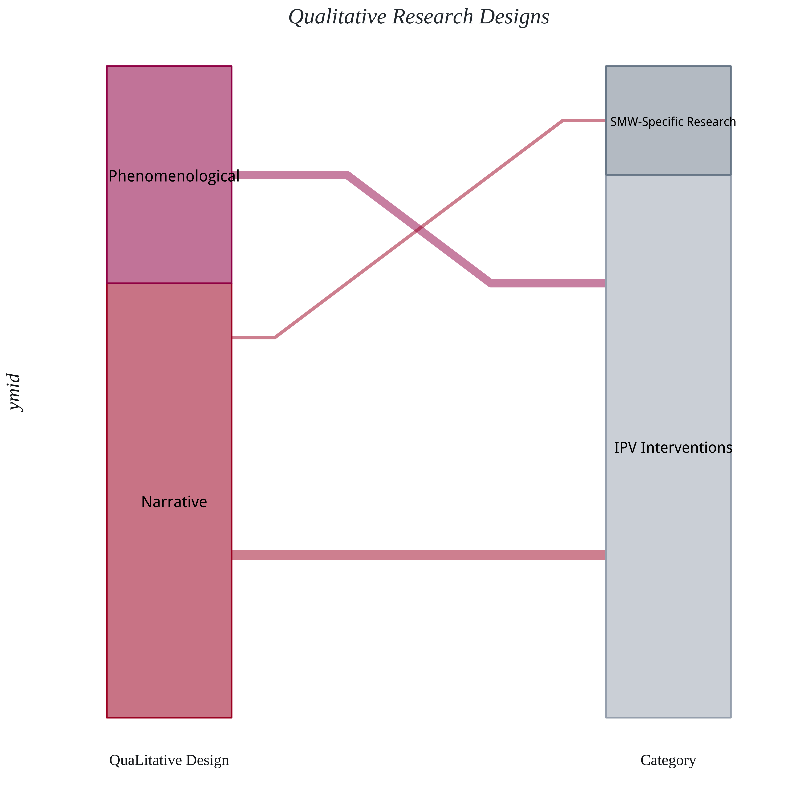{#fig:}


-----

<span class="newthought">Qua<strong>L</strong>itative _Methods_</span>


```r
ct.ql <- cb[cb$cat == "M-QL", ] %>% droplevels()
ct.ql <- ct.ql[!duplicated(ct.ql), ]
t.ql <- Rtdf(ct.ql$clab)
ft.ql <- ftable(ct.ql[, c("clab", "scat")], row.vars = 1)
ftm.ql <- matrix(ft.ql, nrow = nrow(t.ql), byrow = FALSE)
dimnames(ftm.ql) <- list(`QuaLitative Method(s)` = levels(ct.ql$clab), Category = c("IPV Interventions", 
    "SMW-Inclusive Research"))
sum.ql <- apply(ftm.ql, 1, sum)
ftm.ql <- ifelse(ftm.ql == 0, NA, ftm.ql)
ftm.ql <- cbind(ftm.ql, `**Total**` = sum.ql)
ftm.ql %>% kable(align = rep("r", 3), caption = "Qua**L**itative Method(s)")
```


Table: Qua**L**itative Method(s)

                                       IPV Interventions   SMW-Inclusive Research   **Total**
------------------------------------  ------------------  -----------------------  ----------
1-on-1 Interviews                                      4                        1           5
Archival/Secondary Data                                -                        1           1
Group Interviews                                       4                        1           5
Multi-Modal Data Collection Methods                    1                        -           1
QuaLitative Survey                                     1                        -           1

```r
pql <- mpal(1:length(unique(ct.ql$clab)), p = sci)
ct.ql <- dplyr::rename(ct.ql, `QuaLitative Methods` = clab, Category = scat)
t.ql$log <- log(t.ql[, 2]) + 2
lql <- c(3.5, 3.5, t.ql[, 3])
parset.ql <- ggparset2(list("Category", "QuaLitative Methods"), data = ct.ql, 
    method = "parset", label = TRUE, label.size = lql, text.angle = 0, order = c(0, 
        0)) + scale_fill_manual(values = c(pscat, adjustcolor(pql, alpha.f = 0.55)), 
    guide = FALSE) + scale_colour_manual(values = c(pscat, pql), guide = FALSE) + 
    thm_Rtft(ticks = FALSE, ytext = FALSE)
parset.ql + labs(subtitle = "Qualitative Research Methods")
```

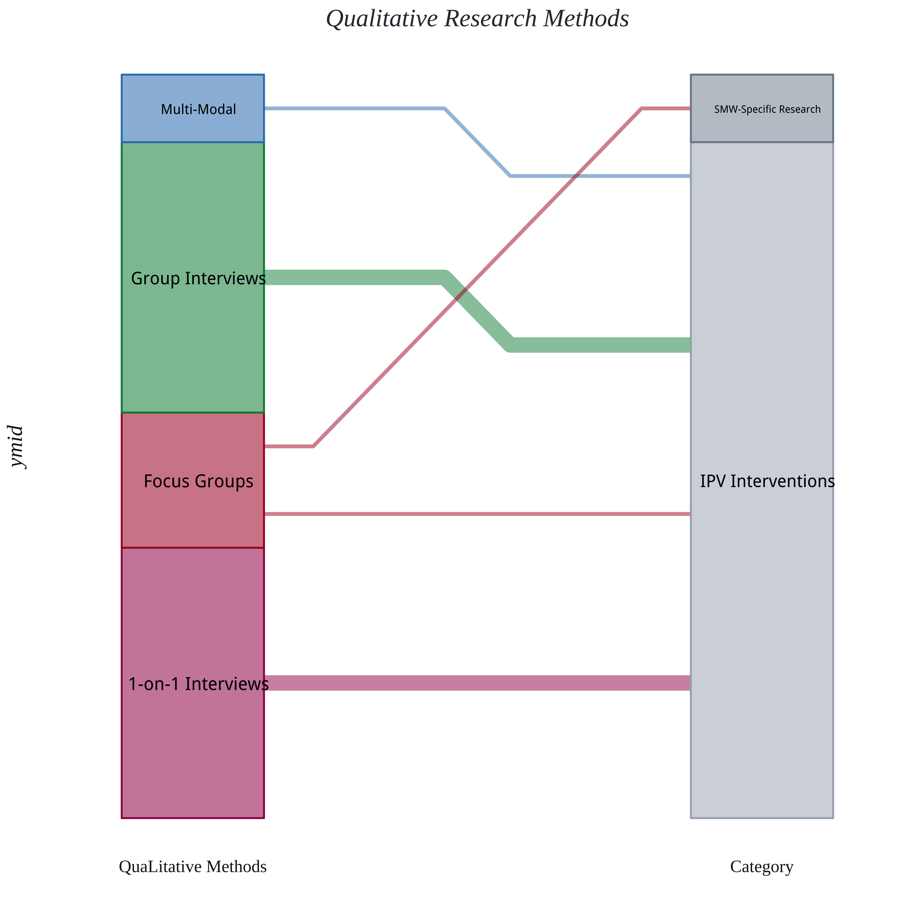{#fig:}


-----

<span class="newthought">Qua<strong>L</strong>itative Data Analytic Approaches</span>


```r
ct.aql <- cb[cb$cat == "A-QL", ] %>% droplevels()
ct.aql <- ct.aql[!duplicated(ct.aql), ]
t.aql <- Rtdf(ct.aql$clab)
ft.aql <- ftable(ct.aql[, c("clab", "scat")], row.vars = 1)
ft.aql2 <- ftable(ct.aql[, c("code", "scat")], row.vars = 1)
ftm.aql <- matrix(ft.aql, nrow = nrow(t.aql), byrow = FALSE)
dimnames(ftm.aql) <- list(`QuaLitative Data Analytic Approaches` = levels(ct.aql$clab), 
    scat = c("IPV Interventions", "SMW-Inclusive Research"))
sum.aql <- apply(ftm.aql, 1, sum)
ftm.aql <- ifelse(ftm.aql == 0, NA, ftm.aql)
ftm.aqlp <- cbind(ftm.aql, `**Total**` = sum.aql)
ftm.aqlp %>% kable(align = rep("r", 3), caption = "Qua**L**itative Analytic Approaches")
```


Table: Qua**L**itative Analytic Approaches

                                       IPV Interventions   SMW-Inclusive Research   **Total**
------------------------------------  ------------------  -----------------------  ----------
Constant Comparative Analysis                          1                        -           1
Content Analysis                                       4                        1           5
Cross-Case Analysis                                    1                        -           1
Grounded Theory (GT)-Based Analysis                    3                        1           4
Grouped Thematic Analysis                              -                        1           1
Qualitative Descriptive Analysis                       -                        3           3
Thematic Analysis                                      7                        3          10

```r
nlabs <- length(unique(ct.aql$clab))
paql <- mpal(1:length(unique(ct.aql$clab)), p = sci)
ct.aqlps <- dplyr::rename(ct.aql, `QuaLitative Analytic Approaches` = clab, 
    Category = scat)
aql.s3 <- ftm.aql[, 1]
aql.s4 <- ftm.aql[, 2]
Rdotchart(main = "QuaLitative Analytics", ftm.aql, pch = 19, gcolor = pal_my[20], 
    xlab = expression(N[Articles]), cex = 0.7, gcex = 0.75, gfont = 2, pt.cex = 1.125, 
    color = c(rep(catpal[1], nrow(ftm.aql)), rep(catpal[2], nrow(ftm.aql))))
```

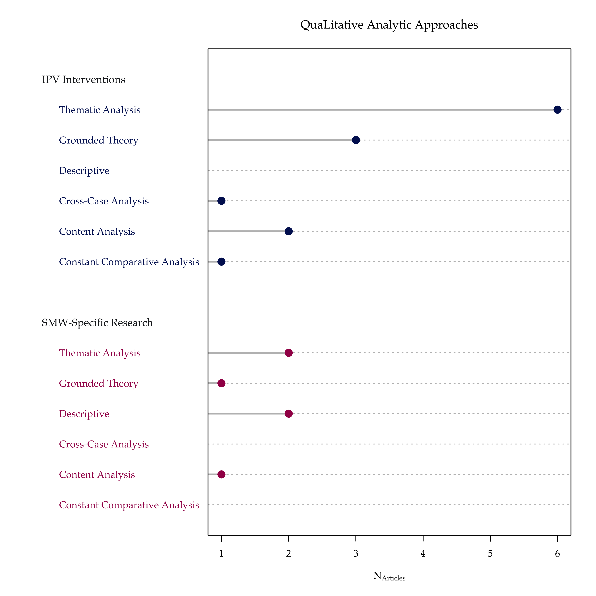{#fig:}

```r
t.aql$log <- log(t.aql[, 2]) + 2
laql <- c(3.5, 3.5, t.aql[, 3])
```

```r
parset.aql <- ggparset2(list("Category", "QuaLitative Analytic Approaches"), 
    data = ct.aqlps, method = "parset", label = TRUE, label.size = laql, text.angle = 0, 
    asp = 1.25, text.offset = 0, order = c(0, 0), label.hjust = c(rep(0.5, 2), 
        rep(0.55, nrow(t.aql)))) + scale_fill_manual(values = c(pscat, adjustcolor(paql, 
    alpha.f = 0.55)), guide = FALSE) + scale_colour_manual(values = c(pscat, 
    paql), guide = FALSE) + thm_Rtft(ticks = FALSE, ytext = FALSE)
parset.aql + labs(subtitle = "Qualitative Analytics")
```

{#fig:}


-----

<span class="newthought">Qua<strong>NT</strong>itative Research _Designs_</span>


```r
ct.dqt <- cb[cb$cat == "D-QT", ] %>% droplevels()
ct.dqt <- ct.dqt[!duplicated(ct.dqt), ]
t.dqt <- Rtdf(ct.dqt$clab)
ft.dqt <- ftable(ct.dqt[, c("clab", "scat")], row.vars = 1)
ftm.dqt <- matrix(ft.dqt, nrow = nrow(t.dqt), byrow = FALSE)
dimnames(ftm.dqt) <- list(`QuaNTitative Design` = levels(ct.dqt$clab), Category = c("IPV Interventions", 
    "SMW-Inclusive Research"))
sum.dqt <- apply(ftm.dqt, 1, sum)
ftm.dqt <- ifelse(ftm.dqt == 0, NA, ftm.dqt)
ftm.dqt <- cbind(ftm.dqt, `**Total**` = sum.dqt)
ftm.dqt %>% kable(align = rep("r", 3), caption = "Qua**NT**itative Designs")
```


Table: Qua**NT**itative Designs

                             IPV Interventions   SMW-Inclusive Research   **Total**
--------------------------  ------------------  -----------------------  ----------
Cross-Sectional Design                       2                        4           6
Experimental Design                         12                        -          12
Longitudinal Design                         13                        -          13
Quasi-Experimental Design                    1                        -           1

```r
nlabs <- length(unique(ct.dqt$clab))
pdqt <- mpal(1:length(unique(ct.dqt$clab)), p = sci)
ct.dqt <- dplyr::rename(ct.dqt, `QuaNTitative Design` = clab, Category = scat)
t.dqt$log <- log(t.dqt[, 2]) + 1
ldqt <- c(3.5, 3.5, t.dqt[, 3])
parset.dqt <- ggparset2(list("Category", "QuaNTitative Design"), data = ct.dqt, 
    method = "parset", label = TRUE, label.size = ldqt, text.angle = 0, order = c(0, 
        0)) + scale_fill_manual(values = c(pscat, adjustcolor(pdqt, alpha.f = 0.55)), 
    guide = FALSE) + scale_colour_manual(values = c(pscat, pdqt), guide = FALSE) + 
    thm_Rtft(ticks = FALSE, ytext = FALSE)
parset.dqt + labs(subtitle = "QuaNTitative Research Designs")
```

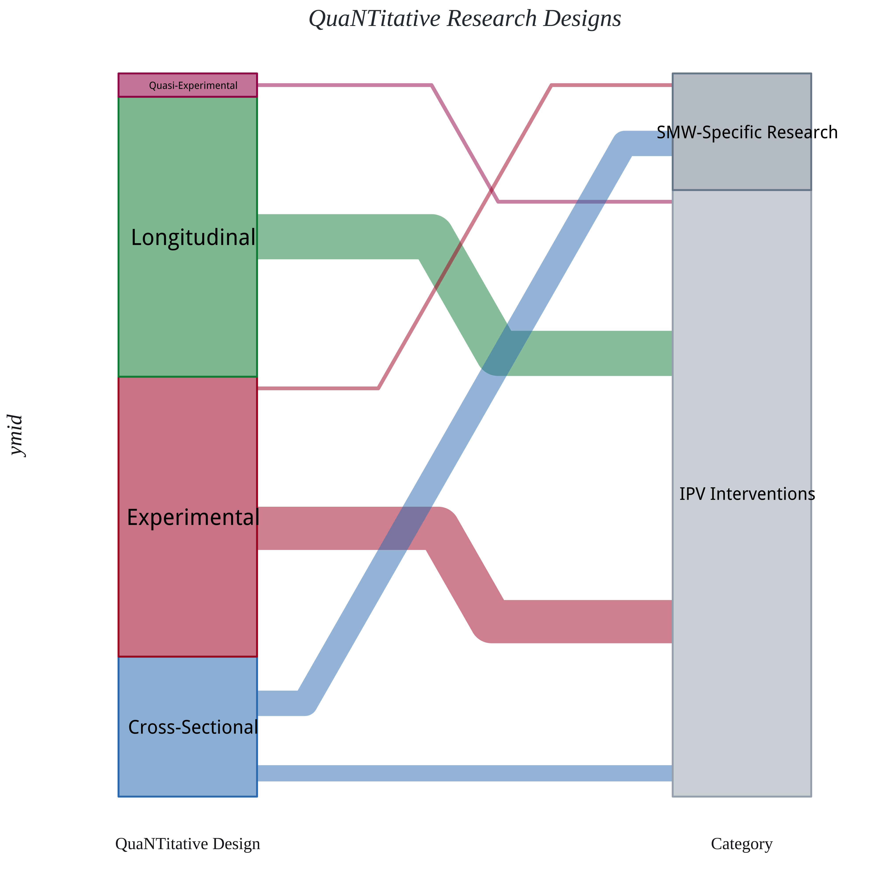{#fig:}


-----

<span class="newthought">Qua<strong>NT</strong>itative _Methods_</span>


```r
ct.qt <- cb[cb$cat == "M-QT", ] %>% droplevels()
ct.qt <- ct.qt[!duplicated(ct.qt), ]
t.qt <- Rtdf(ct.qt$clab)
ft.qt <- ftable(ct.qt[, c("clab", "scat")], row.vars = 1)
ftm.qt <- matrix(ft.qt, nrow = nrow(t.qt), byrow = FALSE)
dimnames(ftm.qt) <- list(`Qua**NT**itative Method` = levels(ct.qt$clab), Category = c("IPV Interventions", 
    "SMW-Inclusive Research"))
sum.qt <- apply(ftm.qt, 1, sum)
ftm.qt <- ifelse(ftm.qt == 0, NA, ftm.qt)
ftm.qt <- cbind(ftm.qt, `**Total**` = sum.qt)
ftm.qt %>% kable(align = rep("r", 3), caption = "QuaNTitative Methods")
```


Table: QuaNTitative Methods

                                       IPV Interventions   SMW-Inclusive Research   **Total**
------------------------------------  ------------------  -----------------------  ----------
Archival/Secondary Data                                2                        1           3
Multi-Modal Data Collection Methods                    2                        -           2
QuaNTitative Survey                                   13                        4          17

```r
nlabs <- length(unique(ct.qt$clab))
pqt <- mpal(1:length(unique(ct.qt$clab)), p = sci)
ct.qt <- dplyr::rename(ct.qt, `QuaNTitative Methods` = clab, Category = scat)
t.qt$log <- log(t.qt[, 2]) + 1
lqt <- c(3.5, 3.5, t.qt[, 3])
parset.qt <- ggparset2(list("Category", "QuaNTitative Methods"), data = ct.qt, 
    method = "parset", label = TRUE, label.size = lqt, text.angle = 0, order = c(0, 
        0)) + scale_fill_manual(values = c(pscat, adjustcolor(pqt, alpha.f = 0.55)), 
    guide = FALSE) + scale_colour_manual(values = c(pscat, pqt), guide = FALSE) + 
    thm_Rtft(ticks = FALSE, ytext = FALSE)
parset.qt + labs(subtitle = "Quantitative Research Methods")
```

{#fig:}


-----

<span class="newthought">Qua<strong>NT</strong>itative Data Analytic Approaches</span>


```r
ct.aqt <- cb[cb$cat == "A-QT", ] %>% droplevels()
ct.aqt <- ct.aqt[!duplicated(ct.aqt), ]
t.aqt <- Rtdf(ct.aqt$clab)
ft.aqt <- ftable(ct.aqt[, c("clab", "scat")], row.vars = 1)
ft.aqt2 <- ftable(ct.aqt[, c("code", "scat")], row.vars = 1)
ftm.aqt <- matrix(ft.aqt, nrow = nrow(t.aqt), byrow = FALSE)
dimnames(ftm.aqt) <- list(`QuaNTitative Data Analytic Approaches` = levels(ct.aqt$clab), 
    scat = c("IPV Interventions", "SMW-Inclusive Research"))
sum.aqt <- apply(ftm.aqt, 1, sum)
ftm.aqt <- ifelse(ftm.aqt == 0, NA, ftm.aqt)
ftm.aqtp <- cbind(ftm.aqt, `**Total**` = sum.aqt)
ftm.aqtp %>% kable(align = rep("r", 3), caption = "Qua**NT**itative Analytic Approaches")
```


Table: Qua**NT**itative Analytic Approaches

                                                      IPV Interventions   SMW-Inclusive Research   **Total**
---------------------------------------------------  ------------------  -----------------------  ----------
Analysis of Covariance (ANCOVA)                                       1                        -           1
Analysis of Variance (ANOVA)                                          6                        1           7
Boostrapping                                                          -                        1           1
Chi-Square Difference Test                                            8                        2          10
Confirmatory Factor Analysis (CFA)                                    -                        1           1
Correlations                                                          4                        3           7
Descriptives                                                         17                        5          22
Full SEM (Measurement & Structural Models)                            -                        1           1
Indirect-Effects                                                      -                        1           1
Linear Regression                                                     2                        -           2
Logistic Regression                                                   4                        2           6
Maximum Likelihood Estimation (MLE)                                   -                        1           1
Mediation Analysis                                                    -                        1           1
Mixed-Effects Modeling (MEM)                                          1                        -           1
Moderation/Conditional Process Analysis                               3                        -           3
Multi-Level/Hierarchical Linear Modeling (MLM/HLM)                    2                        -           2
Multivariate Analyses                                                 4                        -           4
Multivariate Analysis of Covariance (MANCOVA)                         1                        -           1
Multivariate Analysis of Variance (MANOVA)                            1                        -           1
Odds Ratios (OR)                                                      3                        1           4
Ordinary Least Squares Regression                                     1                        -           1
Path Analysis                                                         -                        1           1
Post-Hoc Comparisons                                                  1                        1           2
Relative Risk Ratios (RRR)                                            -                        1           1
Repeated-Measures ANOVA/ANCOVA                                        1                        -           1
Structural Equation Modeling (SEM)                                    -                        1           1
T-Tests (Mean Differences)                                            8                        1           9
Weighted Least Squares (WLS) Estimation                               -                        1           1

```r
nlabs <- length(unique(ct.aqt$clab))
paqt <- mpal(1:length(unique(ct.aqt$clab)), p = sci)
ct.aqtps <- dplyr::rename(ct.aqt, `QuaNTitative Analytic Approaches` = clab, 
    Category = scat)
aqt.s3 <- ftm.aqt[, 1]
aqt.s4 <- ftm.aqt[, 2]
Rdotchart(main = "QuaNTitative Analytics", ftm.aqt, pch = 19, gcolor = pal_my[20], 
    xlab = expression(N[Articles]), cex = 0.7, gcex = 0.75, gfont = 2, pt.cex = 1.125, 
    color = c(rep(catpal[1], nrow(ftm.aqt)), rep(catpal[2], nrow(ftm.aqt))))
```

{#fig:}

```r
t.aqt$log <- log(t.aqt[, 2]) * 1.65
laqt <- c(3.5, 3.5, t.aqt[, 3])
```

```r
parset.aqt <- ggparset2(list("Category", "QuaNTitative Analytic Approaches"), 
    data = ct.aqtps, method = "parset", label = TRUE, label.size = laqt, text.angle = 0, 
    order = c(0, 0), label.hjust = c(rep(0.5, 2), rep(0.55, nrow(t.aqt)))) + 
    scale_fill_manual(values = c(pscat, adjustcolor(paqt, alpha.f = 0.55)), 
        guide = FALSE) + scale_colour_manual(values = c(pscat, paqt), guide = FALSE) + 
    thm_Rtft(ticks = FALSE, ytext = FALSE)
parset.aqt + labs(subtitle = "Quantitative Analytics")
```

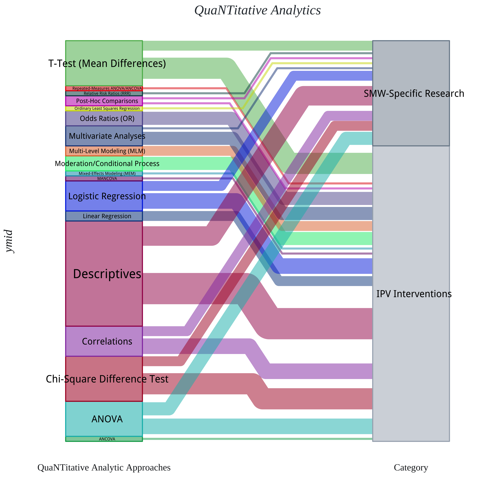{#fig:}


-----

<span class="newthought">Archival/Secondary Data Sources</span>


```r
ct.rcrd <- cb[cb$cat == "M-RCRD", ] %>% droplevels()
ct.rcrd <- ct.rcrd[!duplicated(ct.rcrd), ]
t.rcrd <- Rtdf(ct.rcrd$clab)
ft.rcrd <- ftable(ct.rcrd[, c("clab", "scat")], row.vars = 1)
ftm.rcrd <- matrix(ft.rcrd, nrow = nrow(t.rcrd), byrow = FALSE)
dimnames(ftm.rcrd) <- list(`Archival Data Source` = levels(ct.rcrd$clab), Category = c("IPV Interventions", 
    "SMW-Inclusive Research"))
sum.rcrd <- apply(ftm.rcrd, 1, sum)
ftm.rcrd <- ifelse(ftm.rcrd == 0, NA, ftm.rcrd)
ftm.rcrd <- cbind(ftm.rcrd, `**Total**` = sum.rcrd)
ftm.rcrd %>% kable(align = rep("r", 3), caption = "Archival Data Sources")
```


Table: Archival Data Sources

                               IPV Interventions   SMW-Inclusive Research   **Total**
----------------------------  ------------------  -----------------------  ----------
Client Records                                 3                        -           3
Government-Sponsored Survey                    -                        1           1
Police/Court Records                           2                        -           2

```r
nlabs <- length(unique(ct.rcrd$clab))
prcrd <- mpal(1:length(unique(ct.rcrd$clab)), p = sci)
ct.rcrd <- dplyr::rename(ct.rcrd, `Archival Data Source` = clab, Category = scat)
t.rcrd$log <- log(t.rcrd[, 2]) + 2
lrcrd <- c(3.5, 3.5, t.rcrd[, 3])
parset.rcrd <- ggparset2(list("Category", "Archival Data Source"), data = ct.rcrd, 
    method = "parset", label = TRUE, label.size = lrcrd, text.angle = 0, order = c(0, 
        0)) + scale_fill_manual(values = rev(c(rev(pscat), adjustcolor(prcrd, 
    alpha.f = 0.55))), guide = FALSE) + scale_colour_manual(values = rev(c(rev(pscat), 
    prcrd)), guide = FALSE) + thm_Rtft(ticks = FALSE, ytext = FALSE)
parset.rcrd + labs(subtitle = "Archival/Secondary Data Sources")
```

{#fig:}


-----

<span class="newthought">Mixed-Methodological _Designs_</span>


```r
ct.dmm <- cb[cb$cat == "D-MM", ] %>% droplevels()
ct.dmm <- ct.dmm[!duplicated(ct.dmm), ]
t.dmm <- Rtdf(ct.dmm$clab)
ft.dmm <- ftable(ct.dmm[, c("clab", "scat")], row.vars = 1)
ftm.dmm <- matrix(ft.dmm, nrow = nrow(t.dmm), byrow = FALSE)
dimnames(ftm.dmm) <- list(`Mixed-Methodological Design` = levels(ct.dmm$clab), 
    scat = c("IPV Interventions", "SMW-Inclusive Research"))
sum.dmm <- apply(ftm.dmm, 1, sum)
ftm.dmm <- ifelse(ftm.dmm == 0, NA, ftm.dmm)
ftm.dmm <- cbind(ftm.dmm, `**Total**` = sum.dmm)
ftm.dmm %>% kable(align = rep("r", 3), caption = "Mixed-Methodological Designs")
```


Table: Mixed-Methodological Designs

                             IPV Interventions   SMW-Inclusive Research   **Total**
--------------------------  ------------------  -----------------------  ----------
Cross-Sectional Design                       -                        1           1
Experimental Design                          -                        1           1
Longitudinal Design                          -                        1           1
Pre-Test/Post-Test Design                    1                        1           2

```r
nlabs <- length(unique(ct.dmm$clab))
pmm <- mpal(1:length(unique(ct.dmm$clab)), p = sci)
ct.dmm <- dplyr::rename(ct.dmm, `Mixed-Methodological Design` = clab, Category = scat)
t.dmm$log <- log(t.dmm[, 2]) + 3
ldmm <- c(3.5, 3.5, t.dmm[, 3])
parset.dmm <- ggparset2(list("Category", "Mixed-Methodological Design"), data = ct.dmm, 
    method = "parset", label = TRUE, label.size = ldmm, text.angle = 0, order = c(0, 
        0)) + scale_fill_manual(values = c(pscat, adjustcolor(pmm, alpha.f = 0.55)), 
    guide = FALSE) + scale_colour_manual(values = c(pscat, pmm), guide = FALSE) + 
    thm_Rtft(ticks = FALSE, ytext = FALSE)
parset.dmm + labs(subtitle = "Mixed-Methods Research Designs")
```

{#fig:}


-----

<span class="newthought">Mixed (Qua<strong>L</strong>itative \& Qua<strong>NT</strong>itative) _Methods_</span>


```r
ct.mm <- cb[cb$cat == "M-MM", ] %>% droplevels()
ct.mm <- ct.mm[!duplicated(ct.mm), ]
t.mm <- Rtdf(ct.mm$clab)
ft.mm <- ftable(ct.mm[, c("clab", "scat")], row.vars = 1)
ftm.mm <- matrix(ft.mm, nrow = nrow(t.mm), byrow = FALSE)
dimnames(ftm.mm) <- list(`Mixed-Methods` = levels(ct.mm$clab), scat = c("IPV Interventions", 
    "SMW-Inclusive Research"))
sum.mm <- apply(ftm.mm, 1, sum)
ftm.mm <- ifelse(ftm.mm == 0, NA, ftm.mm)
ftm.mm <- cbind(ftm.mm, `**Total**` = sum.mm)
ftm.mm %>% kable(align = rep("r", 3), caption = "Mixed-Methods")
```


Table: Mixed-Methods

                                       IPV Interventions   SMW-Inclusive Research   **Total**
------------------------------------  ------------------  -----------------------  ----------
1-on-1 Interviews                                      -                        1           1
Focus Groups                                           3                        1           4
Group Interviews                                       -                        1           1
Multi-Modal Data Collection Methods                    1                        -           1
QuaLitative Survey                                     -                        1           1
QuaNTitative Survey                                    3                        2           5

```r
nlabs <- length(unique(ct.mm$clab))
pmm <- mpal(1:length(unique(ct.mm$clab)), p = sci)
ct.mm <- dplyr::rename(ct.mm, `Mixed-Methods` = clab, Category = scat)
t.mm$log <- log(t.mm[, 2]) + 2
lmm <- c(3.5, 3.5, t.mm[, 3])
parset.mm <- ggparset2(list("Category", "Mixed-Methods"), data = ct.mm, method = "parset", 
    label = TRUE, label.size = lmm, text.angle = 0, order = c(0, 0)) + scale_fill_manual(values = c(pscat, 
    adjustcolor(pmm, alpha.f = 0.55)), guide = FALSE) + scale_colour_manual(values = c(pscat, 
    pmm), guide = FALSE) + thm_Rtft(ticks = FALSE, ytext = FALSE)
parset.mm + labs(subtitle = "Mixed-Methods")
```

{#fig:}


-----

## Target Populations & Sampling Frames


```r
ct.pop <- cb[cb$cat == "POPULATION", ] %>% droplevels()
ct.pop <- ct.pop[!duplicated(ct.pop), ]
t.pop <- Rtdf(ct.pop$clab)
ft.pop <- ftable(ct.pop[, c("clab", "scat")], row.vars = 1)
ftm.pop <- matrix(ft.pop, nrow = nrow(t.pop), byrow = FALSE)
dimnames(ftm.pop) <- list(Populations = levels(ct.pop$clab), scat = c("IPV Interventions", 
    "SMW-Inclusive Research"))
sum.pop <- apply(ftm.pop, 1, sum)
ftm.pop <- ifelse(ftm.pop == 0, NA, ftm.pop)
ftm.popp <- cbind(ftm.pop, `**Total**` = sum.pop)
ftm.popp %>% kable(align = rep("r", ncol(ftm.popp)), caption = "Populations Included in Sampling Frame")
```


Table: Populations Included in Sampling Frame

                                              IPV Interventions   SMW-Inclusive Research   **Total**
-------------------------------------------  ------------------  -----------------------  ----------
African Americans                                             1                        -           1
College Students                                              -                        2           2
Couples                                                       -                        1           1
Females/Women/Girls                                           9                        7          16
General Population                                            2                        -           2
IPV Intervention Programs                                     6                        -           6
IPV Perpetrators                                              8                        3          11
IPV Victims/Survivors                                         4                        4           8
IPV-Specific Community-Based Practitioners                    1                        -           1
Latina/os                                                     1                        -           1
Males/Men/Boys                                                6                        3           9
Non-IPV Community-Based Practitioners                         2                        -           2
Non-IPV System Entities                                       1                        -           1
Parents                                                       3                        1           4
Sexual Minorities                                             -                        7           7
Sexual Minority Women (as distinct group)                     -                        5           5
Sexual Minority Women Only                                    -                        4           4
Urban-Specific Populations                                    -                        1           1
Youth/Children                                                3                        -           3

```r
Rdotchart(main = "Populations", ftm.pop, pch = 19, gcolor = pal_my[20], xlab = expression(N[Articles]), 
    cex = 0.7, gcex = 0.75, gfont = 2, pt.cex = 1.125, color = c(rep(catpal[1], 
        nrow(ftm.pop)), rep(catpal[2], nrow(ftm.pop))))
```

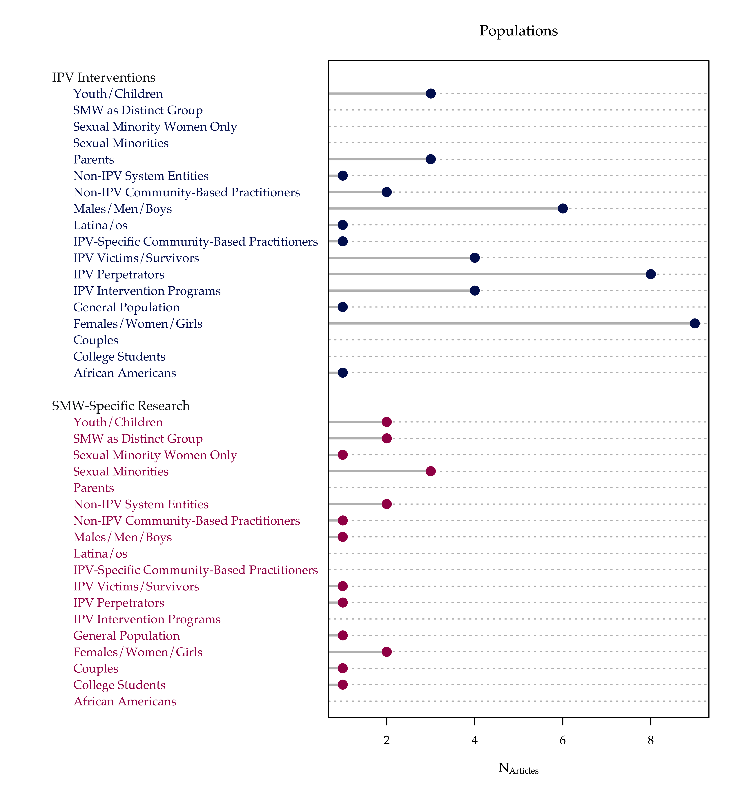{#fig:}


-----

## Sampling Settings


```r
ct.set <- cb[cb$cat == "M-SETTINGS", ] %>% droplevels()
ct.set <- ct.set[!duplicated(ct.set), ]
ct.set <- ct.set[!ct.set$code == "CJ-POLICE", ] %>% droplevels()
t.set <- Rtdf(ct.set$clab)
ft.set <- ftable(ct.set[, c("clab", "scat")], row.vars = 1)
ftm.set <- matrix(ft.set, nrow = nrow(t.set), byrow = FALSE)
dimnames(ftm.set) <- list(`Sampling Settings` = levels(ct.set$clab), scat = c("IPV Interventions", 
    "SMW-Inclusive Research"))
sum.set <- apply(ftm.set, 1, sum)
ftm.set <- ifelse(ftm.set == 0, NA, ftm.set)
ftm.setp <- cbind(ftm.set, `**Total**` = sum.set)
ftm.setp %>% kable(align = rep("r", ncol(ftm.setp)), caption = "Sampling Settings")
```


Table: Sampling Settings

                                               IPV Interventions   SMW-Inclusive Research   **Total**
--------------------------------------------  ------------------  -----------------------  ----------
Anger Management Programs                                      1                        -           1
Childcare Services                                             2                        -           2
Children's Services                                            2                        -           2
Colleges/Univeresities                                         2                        2           4
Community Centers                                              1                        -           1
Community-Based Services                                      21                        2          23
Criminal Justice System                                        4                        -           4
Drug & Alcohol Abuse Treatment Services                        2                        -           2
IPV Perpetrator Intervention Programs                         10                        -          10
IPV-Victim Services                                            7                        2           9
Legal-Aid                                                      1                        -           1
LGBT Pride Festivals                                           -                        1           1
Mental Health Services                                         1                        -           1
Multi-Site                                                     5                        2           7
National Telephone Survey                                      -                        1           1
Online Market Research Panels                                  -                        1           1
Online Media/Forums                                            1                        5           6
Online Media/Forums - Colleges/Universities                    -                        2           2
Online Media/Forums - IPV-Victims                              -                        1           1
Online Media/Forums - LGBT                                     -                        5           5
Parent Education Services                                      2                        -           2
Primary & Emer. Healthcare Services                            6                        -           6
Primary Schools                                                1                        -           1
Print Media                                                    1                        -           1
Social Services                                                1                        -           1

```r
Rdotchart(main = "Sampling Settings", ftm.set, pch = 19, gcolor = pal_my[20], 
    xlab = expression(N[Articles]), cex = 0.7, gcex = 0.75, gfont = 2, pt.cex = 1.125, 
    color = c(rep(catpal[1], nrow(ftm.set)), rep(catpal[2], nrow(ftm.set))))
```

{#fig:}

```r
sets <- c(191, 196, 198, 202, 203, 206, 207, 208, 209, 210, 211, 212, 213, 216, 
    218, 219)
ct.set2 <- ct.set[ct.set$cid %in% sets, ] %>% droplevels()
ct.set2$clab <- droplevels(ct.set2$clab)
t.set2 <- Rtdf(ct.set2$clab)
nlabs <- length(unique(ct.set2$clab))
pset2 <- mpal(1:length(unique(ct.set2$clab)), p = sci)
ct.set2 <- dplyr::rename(ct.set2, `Sampling Settings` = clab, Category = scat)
t.set2$log <- log(t.set2[, 2]) + 1
lset <- c(3.5, 3.5, t.set2[, 3])
parset.set <- ggparset2(list("Category", "Sampling Settings"), data = ct.set2, 
    method = "parset", label = TRUE, label.size = lset, text.angle = 0, order = c(0, 
        0)) + scale_fill_manual(values = c(pscat, adjustcolor(pset2, alpha.f = 0.55)), 
    guide = FALSE) + scale_colour_manual(values = c(pscat, pset2), guide = FALSE) + 
    thm_Rtft(ticks = FALSE, ytext = FALSE)
parset.set + labs(subtitle = "Sampling Settings")
```

{#fig:}


-----

## Sampling Methods


```r
ct.smthds <- cb[cb$cat == "M-SAMPLING", ] %>% droplevels()
ct.smthds <- ct.smthds[!duplicated(ct.smthds), ]
t.smthds <- Rtdf(ct.smthds$clab)
ft.smthds <- ftable(ct.smthds[, c("clab", "scat")], row.vars = 1)
ftm.smthds <- matrix(ft.smthds, nrow = nrow(t.smthds), byrow = FALSE)
dimnames(ftm.smthds) <- list(Populations = levels(ct.smthds$clab), scat = c("IPV Interventions", 
    "SMW-Inclusive Research"))
sum.smthds <- apply(ftm.smthds, 1, sum)
ftm.smthds <- ifelse(ftm.smthds == 0, NA, ftm.smthds)
ftm.smthdsp <- cbind(ftm.smthds, `**Total**` = sum.smthds)
ftm.smthdsp %>% kable(align = rep("r", ncol(ftm.smthdsp)), caption = "Sampling Methods")
```


Table: Sampling Methods

                                            IPV Interventions   SMW-Inclusive Research   **Total**
-----------------------------------------  ------------------  -----------------------  ----------
Convenience                                                18                        4          22
Maximum Variation                                           1                        -           1
Multiple Sampling Methods                                   9                        4          13
Not Applicable (Archival/Secondary Data)                    1                        2           3
Probability/Random                                          5                        3           8
Purposive                                                  11                        4          15
Purposive-Probability                                      13                        4          17
Random Digit Dialing                                        -                        1           1
Snowball                                                    2                        2           4
Stratified Random                                           1                        -           1

```r
Rdotchart(main = "Sampling Methods", ftm.smthds, pch = 19, gcolor = pal_my[20], 
    xlab = expression(N[Articles]), cex = 0.7, gcex = 0.75, gfont = 2, pt.cex = 1.125, 
    color = c(rep(catpal[1], nrow(ftm.smthds)), rep(catpal[2], nrow(ftm.smthds))))
```

{#fig:}

```r
nlabs <- length(unique(ct.smthds$clab))
psmthds <- mpal(1:length(unique(ct.smthds$clab)), p = sci)
ct.smthds <- dplyr::rename(ct.smthds, `Sampling Methods` = clab, Category = scat)
t.smthds$log <- log(t.smthds[, 2]) + 1
lsmthds <- c(3.5, 3.5, t.smthds[, 3])
parset.smthds <- ggparset2(list("Category", "Sampling Methods"), data = ct.smthds, 
    method = "parset", label = TRUE, label.size = lsmthds, text.angle = 0, order = c(0, 
        0)) + scale_fill_manual(values = c(pscat, adjustcolor(psmthds, alpha.f = 0.55)), 
    guide = FALSE) + scale_colour_manual(values = c(pscat, psmthds), guide = FALSE) + 
    thm_Rtft(ticks = FALSE, ytext = FALSE)
parset.smthds + labs(subtitle = "Sampling Methods")
```

{#fig:}


-----

# Ecological Levels of Analysis


```r
ct.eco <- cb[cb$cat == "ECO", ] %>% droplevels()
ct.eco <- ct.eco[!duplicated(ct.eco), ]
t.eco <- Rtdf(ct.eco$clab)
ft.eco <- ftable(ct.eco[, c("clab", "scat")], row.vars = 1)
ftm.eco <- matrix(ft.eco, nrow = nrow(t.eco), byrow = FALSE)
dimnames(ftm.eco) <- list(`Ecological Levels of Analysis` = levels(ct.eco$clab), 
    scat = c("IPV Interventions", "SMW-Inclusive Research"))
sum.eco <- apply(ftm.eco, 1, sum)
ftm.eco <- ifelse(ftm.eco == 0, NA, ftm.eco)
ftm.eco <- cbind(ftm.eco, `**Total**` = sum.eco)
ftm.eco %>% kable(align = rep("r", 3), caption = "Mixed-Methodological Designs")
```


Table: Mixed-Methodological Designs

                IPV Interventions   SMW-Inclusive Research   **Total**
-------------  ------------------  -----------------------  ----------
Community                      25                        3          28
Individual                     22                        7          29
Relationship                   11                        4          15
Societal                        5                        1           6

```r
nlabs <- length(unique(ct.eco$clab))
peco <- mpal(1:length(unique(ct.eco$clab)), p = sci)
ct.eco <- dplyr::rename(ct.eco, `Levels of Analysis` = clab, Category = scat)
t.eco$log <- log(t.eco[, 2]) + 1
leco <- c(3.5, 3.5, t.eco[, 3])
parset.eco <- ggparset2(list("Category", "Levels of Analysis"), data = ct.eco, 
    method = "parset", label = TRUE, label.size = leco, text.angle = 0, order = c(0, 
        0)) + scale_fill_manual(values = c(pscat, adjustcolor(peco, alpha.f = 0.55)), 
    guide = FALSE) + scale_colour_manual(values = c(pscat, peco), guide = FALSE) + 
    thm_Rtft(ticks = FALSE, ytext = FALSE)
parset.eco + labs(subtitle = "Ecological Levels of Analysis")
```

{#fig:}


-----


```r
mpeco0 <- read.csv("data/mapeco.csv")
mplvls0 <- read.csv("data/maplvls.csv")
mplvls1 <- within(mplvls0, {
    micro <- ifelse(l1 | l2 == 1, 1, 0)
    meso_exo <- ifelse(l3 == 1, 1, 0)
    exo_macro <- ifelse(l4 == 1, 1, 0)
})
mplvls1$nlvls <- apply(mplvls1[, 2:5], 1, sum)
mplvls1$nsys <- apply(mplvls1[, 6:8], 1, sum)
rownames(mplvls1) <- mplvls1[, 1]
mplvls <- mplvls1[, -1, drop = FALSE]
```


# Levels of Analysis


```r
vclrs <- rev(grad(1:10, p = nord_polar))[4:7]
vtclrs <- rev(grad(1:10, p = nord_polar))[6:9]
catpal85 <- adjustcolor(catpal, alpha.f = 0.85)
lcvclrs <- c("1 = vclrs[1]; 2 = vclrs[2]; 3 = vclrs[3]; 4 = vclrs[4]; 'S3' = catpal85[1]; 'S4' = catpal85[2]")
ltclrs <- c("1 = vtclrs[1]; 2 = vtclrs[2]; 3 = vtclrs[3]; 4 = vtclrs[4]")
llabs1 <- c("1 = 'Individual'; 2 = 'Relationship'; 3 = 'Community'; 4 = 'Societal'")
sclabs <- c("'S3' = 'IPV Interventions Research'; 'S4' = 'SMW-Inclusive IPV Research'")
```


```r
l <- mplvls[, 1:4]
l$id <- rownames(l)
mpjscat <- MAP[, c("bibkey", "scat", "journal")]
l <- merge(l, mpjscat, by.x = "id", by.y = "bibkey", all = TRUE)
llong0 <- reshape(l, varying = 2:5, direction = "long", sep = "")
llong1 <- dplyr::rename(llong0, lvl = time, ynlvl = l)
rownames(llong1) <- NULL
llong1$ynlvl <- ifelse(llong1$ynlvl == 0, NA, llong1$ynlvl)
llong2 <- na.omit(llong1)[, c("id", "scat", "journal", "lvl")]
llong2$lvclr <- car::recode(llong2$lvl, lcvclrs)
llong2$cvclr <- car::recode(llong2$scat, lcvclrs)
llongv1 <- Rtdf(llong2[, "id"], names = c("x", "Freq"))
llongv1 <- merge(llongv1, llong2[, c("id", "cvclr")], all = FALSE, by.x = "x", 
    by.y = "id")
llongv2 <- Rtdf(llong2[, "lvl"], names = c("x", "Freq"))
llongv2$cvclr <- rep(NA, nrow(llongv2))
llongv0 <- rbind(llongv1, llongv2)
llongv01 <- within(llongv0, {
    vclr <- car::recode(x, lcvclrs)
    x <- car::recode(x, llabs1)
})
kindex <- nrow(llongv01) - 4
llongv01$vclr[1:kindex] <- gsub("\\w+\\d{4}\\w+", NA, llongv01$vclr[1:kindex])
llongv01$vclr <- as.character(llongv01$vclr)
llongv01$cvclr[-1:-kindex] <- pal_my[18]
llongv <- llongv01[!duplicated(llongv01), ]
llong <- within(llong2[, c("id", "lvl")], {
    lvl <- car::recode(lvl, llabs1)
})
llongbi1 <- dplyr::rename(llong, from = id, to = lvl)
llongbi2 <- llongbi1[, c(2, 1)] %>% dplyr::rename(from = to, to = from)
```

```r
library(igraph)
llongg <- graph_from_data_frame(llong, directed = F, vertices = llongv)
lvnames0 <- vertex_attr(llongg, "name")
lvnames1 <- gsub("(\\w+)\\d{4}\\w+", "\\1", lvnames0)
lvnames <- sapply(lvnames1, RtCap, USE.NAMES = FALSE)
V(llongg)$name <- lvnames
V(llongg)$size <- V(llongg)$Freq + 1
V(llongg)$color <- adjustcolor(V(llongg)$vclr, alpha.f = 0.5)
V(llongg)$frame.color <- adjustcolor(V(llongg)$vclr, alpha.f = 0.85)
E(llongg)$width <- 0.35
kindex.g <- V(llongg)$name %>% length() - 4
lblsize <- c(log(V(llongg)$size[1:kindex.g]) * 0.35, log(V(llongg)$size[-1:-kindex.g]) * 
    0.125)
```


```r
par(mar = rep(0, 4))
lfr <- layout_with_fr(llongg) %>% norm_coords()
plot(llongg, rescale = T, layout = lfr, vertex.label.color = V(llongg)$cvclr, 
    vertex.label.cex = lblsize)
```

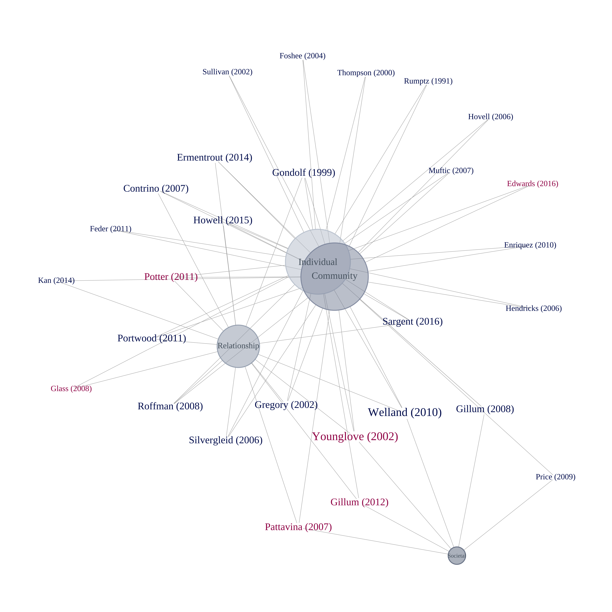{#fig:}

```r
lnet12 <- within(l, {
    from <- Rdich(l1, values = c(NA, "l1"))
    to <- Rdich(l2, values = c(NA, "l2"))
})
lnet12 <- na.omit(lnet12)
lnet13 <- within(l, {
    from <- Rdich(l1, values = c(NA, "l1"))
    to <- Rdich(l3, values = c(NA, "l3"))
})
lnet13 <- na.omit(lnet13)
lnet14 <- within(l, {
    from <- Rdich(l1, values = c(NA, "l1"))
    to <- Rdich(l4, values = c(NA, "l4"))
})
lnet14 <- na.omit(lnet14)
lnet23 <- within(l, {
    from <- Rdich(l2, values = c(NA, "l2"))
    to <- Rdich(l3, values = c(NA, "l3"))
})
lnet23 <- na.omit(lnet23)
lnet24 <- within(l, {
    from <- Rdich(l2, values = c(NA, "l2"))
    to <- Rdich(l4, values = c(NA, "l4"))
})
lnet24 <- na.omit(lnet24)
lnet34 <- within(l, {
    from <- Rdich(l3, values = c(NA, "l3"))
    to <- Rdich(l4, values = c(NA, "l4"))
})
lnet34 <- na.omit(lnet34)
lnet0 <- rbind(lnet12, lnet13, lnet14, lnet23, lnet24, lnet34)[, c("id", "from", 
    "to")]
lnet <- lnet0[, -1]
```

```r
library(car)
llabs <- c("'l1' = 'Individual'; 'l2' = 'Relationship'; 'l3' = 'Community'; 'l4' = 'Societal'")
lnet$from <- car::recode(lnet$from, llabs)
lnet$to <- car::recode(lnet$to, llabs)
```

```r
lfrq1 <- lnet[, 1]
lfrq2 <- lnet[, 2]
lfrq3 <- c(lfrq1, lfrq2)
lfrq <- Rtdf(lfrq3, names = c("lvl", "Freq"))
library(igraph)
lnetg <- graph_from_data_frame(lnet, directed = FALSE, vertices = lfrq)
V(lnetg)$size <- V(lnetg)$Freq * 1.5
lnetcol <- mpal(lfrq, p = nord_aurora, a = 0.8)
V(lnetg)$color <- lnetcol
E(lnetg)$width <- 0.25
```


```r
par(mar = rep(0, 4))
ll3 <- layout.gem(lnetg)
ll3n <- norm_coords(ll3)
plot(lnetg, rescale = T, layout = ll3n, edge.arrow.size = 0.2, vertex.label.color = "#1a1e22", 
    vertex.frame.color = NA)
```

{#fig:}


-----


```r
lnetft <- ftable(lnet)
llvls <- c("Individual", "Relationship", "Community", "Societal")
lnetp <- within(lnet, {
    from <- factor(from, ordered = FALSE)
    to <- factor(to, ordered = FALSE)
    levels(from) <- c(levels(from), llvls[!llvls %in% levels(from)])
    levels(to) <- c(levels(to), llvls[!llvls %in% levels(to)])
})
lnetftp <- ftable(lnetp) %>% matrix(nrow = nrow(lfrq), byrow = FALSE)
dimnames(lnetftp) <- list(`Level-1` = levels(lnetp$to), `Level-2` = levels(lnetp$from))
lnetftp <- ifelse(lnetftp == 0, NA, lnetftp)
kable(lnetftp, align = rep("c", ncol(lnetftp)))
```

                Community    Individual    Relationship    Societal 
-------------  -----------  ------------  --------------  ----------
Community           -            -              5             -     
Relationship       25            15             4             -     
Societal           12            -              2             -     
Individual          -            -              -             -     


```r
library(arcdiagram)
ledges <- cbind(lnet$from, lnet$to)
lvals <- V(lnetg)$Freq
ldeg <- degree(lnetg)
larcs <- 0.35 * (lnetft %>% matrix())
larcs <- ifelse(larcs == 0, NA, larcs) %>% na.omit()
```

```r
par(mar = c(5, 0, 0, 0))
arcplot(ledges, col.arcs = hsv(0, 0, 0.1, 0.075), pch.nodes = 21, bg.nodes = adjustcolor(lnetcol, 
    alpha.f = 0.75), cex.nodes = log(ldeg[c("Individual", "Relationship", "Community", 
    "Societal")]) * 0.37, col.nodes = lnetcol, lwd.nodes = 0.75, lwd.arcs = larcs, 
    line = 1.25, cex.labels = 0.5, font = 1, col.labels = pal_my[20])
```

{#fig:}


```r
cbanl <- cb[cb$cat == "A-QT" | cb$cat == "A-QL", c("bibkey", "scat", "cat", 
    "code", "clab")] %>% droplevels()
cbaqt <- cbanl[cbanl$cat == "A-QT", ] %>% droplevels()
cbaql <- cbanl[cbanl$cat == "A-QL", ] %>% droplevels()
alabs <- paste0(seq(1:length(levels(cbanl$clab))), " = ", levels(cbanl$clab))
alabsqt <- paste0(seq(1:length(levels(cbaqt$clab))), " = ", levels(cbaqt$clab))
alabsql <- paste0(seq(1:length(levels(cbaql$clab))), " = ", levels(cbaql$clab))
kysanl <- cbanl[, c("bibkey", "clab")] %>% dplyr::rename(from = bibkey, to = clab)
kysaqt <- cbaqt[, c("bibkey", "clab")] %>% dplyr::rename(from = bibkey, to = clab)
kysaql <- cbaql[, c("bibkey", "clab")] %>% dplyr::rename(from = bibkey, to = clab)
```


-----

# Ecological Systems


```r
sys <- names(mplvls[, 5:7])
slabs <- c("'micro' = 'Micro-system'; 'meso_exo' = 'Meso- & Exo-system'; 'exo_macro' = 'Exo- & Macro-system'")
slabs2 <- c("'micro' = 'Micro'; 'meso_exo' = 'Meso-Exo'; 'exo_macro' = 'Exo-Macro'")
s <- mplvls[, 5:7]
s$id <- rownames(s)
snet12 <- within(s, {
    from <- Rdich(micro, values = c(NA, "micro"))
    to <- Rdich(micro, values = c(NA, "micro"))
})
snet12 <- na.omit(snet12)
snet13 <- within(s, {
    from <- Rdich(micro, values = c(NA, "micro"))
    to <- Rdich(meso_exo, values = c(NA, "meso_exo"))
})
snet13 <- na.omit(snet13)
snet14 <- within(s, {
    from <- Rdich(micro, values = c(NA, "micro"))
    to <- Rdich(exo_macro, values = c(NA, "exo_macro"))
})
snet14 <- na.omit(snet14)
snet23 <- within(s, {
    from <- Rdich(micro, values = c(NA, "micro"))
    to <- Rdich(meso_exo, values = c(NA, "meso_exo"))
})
snet23 <- na.omit(snet23)
snet24 <- within(s, {
    from <- Rdich(micro, values = c(NA, "micro"))
    to <- Rdich(exo_macro, values = c(NA, "exo_macro"))
})
snet24 <- na.omit(snet24)
snet34 <- within(s, {
    from <- Rdich(meso_exo, values = c(NA, "meso_exo"))
    to <- Rdich(exo_macro, values = c(NA, "exo_macro"))
})
snet34 <- na.omit(snet34)
snet0 <- rbind(snet12, snet13, snet14, snet23, snet24, snet34)[, c("id", "from", 
    "to")]
snet <- snet0[, -1]
snet$from <- car::recode(snet$from, slabs2)
snet$to <- car::recode(snet$to, slabs2)
sfrq1 <- snet[, 1]
sfrq2 <- snet[, 2]
sfrq3 <- c(sfrq1, sfrq2)
sfrq <- Rtdf(sfrq3, names = c("lvl", "Freq"))
library(igraph)
snetg <- graph_from_data_frame(snet, directed = FALSE, vertices = sfrq)
V(snetg)$size <- V(snetg)$Freq * 1.5
snetcol <- mpal(sfrq, p = nord_aurora, a = 0.8)
V(snetg)$color <- snetcol
E(snetg)$width <- 0.25
```


```r
par(mar = rep(0, 4))
ls1 <- layout.fruchterman.reingold(snetg)
ls1n <- norm_coords(ls1)
plot(snetg, rescale = T, layout = ls1n, edge.arrow.size = 0.2, vertex.label.color = "#1a1e22", 
    vertex.frame.color = NA)
```

{#fig:}


-----


```r
snetft <- ftable(snet) %>% matrix(nrow = nrow(sfrq), byrow = FALSE)
dimnames(snetft) <- list(levels(factor(snet$to)), levels(factor(snet$from)))
snetp <- within(snet, {
    from <- factor(from, ordered = FALSE)
    to <- factor(to, ordered = FALSE)
    levels(from) <- c(levels(to)[!levels(to) %in% levels(from)], levels(from))
    levels(to) <- c(levels(from)[!levels(from) %in% levels(to)], levels(to))
})
snetftp <- ftable(snetp) %>% matrix(nrow = nrow(sfrq), byrow = FALSE)
dimnames(snetftp) <- list(`Ecological System-1` = levels(snetp$to), `Ecological System-2` = levels(snetp$from))
snetftp <- ifelse(snetft == 0, NA, snetft)
sedges <- cbind(snet$from, snet$to)
svals <- V(snetg)$Freq
sdeg <- degree(snetg)
sarcs <- 0.15 * (snetft %>% matrix())
sarcs <- ifelse(sarcs == 0, NA, sarcs) %>% na.omit()
```

```r
par(mar = c(5, 0, 0, 0))
arcplot(sedges, col.arcs = hsv(0, 0, 0.1, 0.06), pch.nodes = 21, bg.nodes = adjustcolor(snetcol, 
    alpha.f = 0.5), cex.nodes = log(sdeg[c("Micro", "Meso-Exo", "Exo-Macro")]) * 
    0.3, col.nodes = snetcol, lwd.nodes = 0.75, lwd.arcs = sarcs, line = 1.25, 
    cex.labels = 0.5, font = 1, col.labels = pal_my[20])
```

{#fig:}


-----

# Data Analytic Approaches by Ecological Levels of Analysis


```r
cba <- cb[cb$cat == "A-QT" | cb$cat == "A-QL", c("bibkey", "scat", "cat", "code", 
    "clab")] %>% droplevels()
cba <- cba[!duplicated(cba), ]
cbaqt <- cba[cba$cat == "A-QT", ] %>% droplevels()
cbaql <- cba[cba$cat == "A-QL", ] %>% droplevels()
alabs <- paste0(seq(1:length(levels(cba$clab))), " = ", levels(cba$clab))
alabsqt <- paste0(seq(1:length(levels(cbaqt$clab))), " = ", levels(cbaqt$clab))
alabsql <- paste0(seq(1:length(levels(cbaql$clab))), " = ", levels(cbaql$clab))
kysanl <- cba[, c("bibkey", "clab")] %>% dplyr::rename(from = bibkey, to = clab)
kysaqt <- cbaqt[, c("bibkey", "clab")] %>% dplyr::rename(from = bibkey, to = clab)
kysaql <- cbaql[, c("bibkey", "clab")] %>% dplyr::rename(from = bibkey, to = clab)
la <- mplvls[, 1:4]
la$id <- rownames(la)
lcba <- merge(la, cba, by.x = "id", by.y = "bibkey", all = FALSE)
lcba.a <- lcba[, c("code", "l1", "l2", "l3", "l4")] %>% dplyr::rename(id = code)
lcba.a <- lcba.a[!duplicated(lcba.a), ]
alnet1 <- lcba.a[, 1:2] %>% Rtdf(names = c(names(lcba.a[, 1:2]), "Freq"))
alnet1$l1 <- as.numeric(alnet1$l1)
alnet1$l1 <- ifelse(alnet1$l1 == 1, NA, "l1")
alnet1$Freq <- ifelse(alnet1$Freq == 0, NA, alnet1$Freq)
alnet1 <- na.omit(alnet1)
names(alnet1) <- c("from", "to", "Freq")
alnet2 <- lcba.a[, c(1, 3)] %>% Rtdf(names = c(names(lcba.a[, c(1, 3)]), "Freq"))
alnet2$l2 <- as.numeric(alnet2$l2)
alnet2$l2 <- ifelse(alnet2$l2 == 1, NA, "l2")
alnet2$Freq <- ifelse(alnet2$Freq == 0, NA, alnet2$Freq)
alnet2 <- na.omit(alnet2)
names(alnet2) <- c("from", "to", "Freq")
alnet3 <- lcba.a[, c(1, 4)] %>% Rtdf(names = c(names(lcba.a[, c(1, 4)]), "Freq"))
alnet3$l3 <- as.numeric(alnet3$l3)
alnet3$l3 <- ifelse(alnet3$l3 == 1, NA, "l3")
alnet3$Freq <- ifelse(alnet3$Freq == 0, NA, alnet3$Freq)
alnet3 <- na.omit(alnet3)
names(alnet3) <- c("from", "to", "Freq")
alnet4 <- lcba.a[, c(1, 5)] %>% Rtdf(names = c(names(lcba.a[, c(1, 5)]), "Freq"))
alnet4$l4 <- as.numeric(alnet4$l4)
alnet4$l4 <- ifelse(alnet4$l4 == 1, NA, "l4")
alnet4$Freq <- ifelse(alnet4$Freq == 0, NA, alnet4$Freq)
alnet4 <- na.omit(alnet4)
names(alnet4) <- c("from", "to", "Freq")
alnet0 <- rbind(alnet1, alnet2, alnet3, alnet4)
alnet0$clab <- recode(alnet0$from, rec.code2clab)
alnet <- alnet0[!duplicated(alnet0), c("from", "to", "clab", "Freq")]
```

```r
library(car)
llabs <- c("'l1' = '.Individual'; 'l2' = '.Relationship'; 'l3' = '.Community'; 'l4' = '.Societal'")
alnet$to <- car::recode(alnet$to, llabs)
```

```r
alfrq1 <- alnet[, 1] %>% as.character()
alfrq2 <- alnet[, 2]
alfrq3 <- c(alfrq1, alfrq2)
alfrq <- Rtdf(alfrq3, names = c("lvl", "Freq"))
av1 <- alnet[, 3] %>% as.character()
av2 <- alnet[, 2]
av3 <- c(av1, av2)
av <- Rtdf(av3, names = c("id", "Freq"))
av[, 1] <- as.character(av[, 1])
library(igraph)
alnetg <- graph_from_data_frame(alnet[, 1:2], directed = FALSE, vertices = alfrq)
V(alnetg)$size <- V(alnetg)$Freq * 1.5
alnetcol <- mpal(alfrq, p = nord_aurora, a = 0.8)[-1:-4] %>% adjustcolor(alpha.f = 0.5)
avclrs <- c(adjustcolor(vclrs[1:4], alpha.f = 0.65), alnetcol)
V(alnetg)$color <- avclrs
E(alnetg)$width <- 0.25
V(alnetg)$name[-1:-4] <- seq(1:length(av[-1:-4, 1]))
V(alnetg)$name[1:4] <- gsub("\\.", "", V(alnetg)$name[1:4])
aindex.g <- V(alnetg)$name %>% length()
alblsize <- c(log(V(alnetg)$size[1:4]) * 0.125, log(V(alnetg)$size[5:aindex.g]) * 
    0.325)
```


```r
par(mar = rep(0, 4))
lal3 <- layout_with_fr(alnetg) %>% norm_coords()
plot(alnetg, rescale = T, layout = lal3, edge.arrow.size = 0.2, vertex.label.color = "#1a1e22", 
    vertex.frame.color = c(vclrs[1:4], rep(NA, length(alnetcol))), vertex.label.cex = alblsize)
```

![Network Diagram Showing Relations among Analytic Approaches (numbered graph nodes) used and Ecological Levels of Analysis (named graph nodes) Invovled among the Reviewed Literature: _1 = Analysis of Covariance (ANCOVA), 2 = Analysis of Variance (ANOVA), 3 = Boostrapping, 4 = Chi-Square Difference Test, 5 = Confirmatory Factor Analysis (CFA), 6 = Constant Comparative Analysis, 7 = Content Analysis, 8 = Correlations, 9 = Cross-Case Analysis, 10 = Descriptives, 11 = Full SEM (Measurement \& Structural Models), 12 = Grounded Theory (GT)-Based Analysis, 13 = Grouped Thematic Analysis, 14 = Indirect-Effects, 15 = Linear Regression, 16 = Logistic Regression, 17 = Maximum Likelihood Estimation (MLE), 18 = Mediation Analysis, 19 = Mixed-Effects Modeling (MEM), 20 = Moderation/Conditional Process Analysis, 21 = Multi-Level/Hierarchical Linear Modeling (MLM/HLM), 22 = Multivariate Analyses, 23 = Multivariate Analysis of Covariance (MANCOVA), 24 = Multivariate Analysis of Variance (MANOVA), 25 = Odds Ratios (OR), 26 = Ordinary Least Squares Regression, 27 = Path Analysis, 28 = Post-Hoc Comparisons, 29 = Qualitative Descriptive Analysis, 30 = Relative Risk Ratios (RRR), 31 = Repeated-Measures ANOVA/ANCOVA, 32 = Structural Equation Modeling (SEM), 33 = T-Tests (Mean Differences), 34 = Thematic Analysis, 35 = Weighted Least Squares (WLS) Estimation_](graphics/EcoLvls/rplot-arc_alnetg-1.png){#fig:}


-----


```r
alnet.pr <- ftable(alnet[, 2:3], row.vars = 2) %>% as.matrix()
dimnames(alnet.pr) <- list(levels(factor(alnet$clab)), gsub("\\.", "", levels(factor(alnet$to))))
alnet.pr <- ifelse(alnet.pr >= 1, "&#10003;", "&middot;")
rownames(alnet.pr) <- gsub("&", "\\\\&", rownames(alnet.pr))
```


```r
kable(alnet.pr, caption = "Analytic approaches used across ecological levels of analysis", 
    escape = F)
```


Table: Analytic approaches used across ecological levels of analysis

                                                     Community   Individual   Relationship   Societal 
---------------------------------------------------  ----------  -----------  -------------  ---------
Analysis of Covariance (ANCOVA)                      &#10003;    &#10003;     &middot;       &middot; 
Analysis of Variance (ANOVA)                         &#10003;    &#10003;     &#10003;       &#10003; 
Boostrapping                                         &middot;    &#10003;     &#10003;       &#10003; 
Chi-Square Difference Test                           &#10003;    &#10003;     &#10003;       &middot; 
Confirmatory Factor Analysis (CFA)                   &middot;    &#10003;     &#10003;       &#10003; 
Constant Comparative Analysis                        &#10003;    &#10003;     &#10003;       &#10003; 
Content Analysis                                     &#10003;    &#10003;     &#10003;       &#10003; 
Correlations                                         &#10003;    &#10003;     &#10003;       &middot; 
Cross-Case Analysis                                  &#10003;    &#10003;     &middot;       &#10003; 
Descriptives                                         &#10003;    &#10003;     &#10003;       &#10003; 
Full SEM (Measurement \& Structural Models)          &middot;    &#10003;     &#10003;       &#10003; 
Grounded Theory (GT)-Based Analysis                  &#10003;    &#10003;     &#10003;       &#10003; 
Grouped Thematic Analysis                            &#10003;    &#10003;     &middot;       &middot; 
Indirect-Effects                                     &middot;    &#10003;     &#10003;       &#10003; 
Linear Regression                                    &#10003;    &#10003;     &#10003;       &middot; 
Logistic Regression                                  &#10003;    &#10003;     &#10003;       &middot; 
Maximum Likelihood Estimation (MLE)                  &middot;    &#10003;     &#10003;       &#10003; 
Mediation Analysis                                   &middot;    &#10003;     &#10003;       &#10003; 
Mixed-Effects Modeling (MEM)                         &#10003;    &middot;     &#10003;       &middot; 
Moderation/Conditional Process Analysis              &#10003;    &#10003;     &#10003;       &middot; 
Multi-Level/Hierarchical Linear Modeling (MLM/HLM)   &#10003;    &#10003;     &#10003;       &middot; 
Multivariate Analyses                                &#10003;    &#10003;     &#10003;       &#10003; 
Multivariate Analysis of Covariance (MANCOVA)        &#10003;    &#10003;     &middot;       &middot; 
Multivariate Analysis of Variance (MANOVA)           &#10003;    &middot;     &middot;       &#10003; 
Odds Ratios (OR)                                     &#10003;    &#10003;     &middot;       &middot; 
Ordinary Least Squares Regression                    &#10003;    &#10003;     &#10003;       &middot; 
Path Analysis                                        &middot;    &#10003;     &#10003;       &middot; 
Post-Hoc Comparisons                                 &#10003;    &#10003;     &#10003;       &middot; 
Qualitative Descriptive Analysis                     &#10003;    &#10003;     &#10003;       &middot; 
Relative Risk Ratios (RRR)                           &middot;    &#10003;     &#10003;       &middot; 
Repeated-Measures ANOVA/ANCOVA                       &#10003;    &#10003;     &middot;       &middot; 
Structural Equation Modeling (SEM)                   &middot;    &#10003;     &#10003;       &#10003; 
T-Tests (Mean Differences)                           &#10003;    &#10003;     &#10003;       &middot; 
Thematic Analysis                                    &#10003;    &#10003;     &#10003;       &#10003; 
Weighted Least Squares (WLS) Estimation              &#10003;    &#10003;     &middot;       &middot; 


-----


-----


```r
allabs_pl0 <- gsub("_|\\*{2}|`(.*?)`|_|\\*{2}", "\\1", allabs1, perl = TRUE)
allabs_pl <- gsub(", ", "\n", allabs_pl0)
par(mar = c(5, 0, 0, 11.5))
arcplot(aledges, vertices = al[, 1], col.arcs = hsv(0, 0, 0.1, 0.15), pch.nodes = 21, 
    bg.nodes = avclrs, col.nodes = avbrdrs, lwd.nodes = 0, cex.nodes = log(adeg) + 
        1 * 1.25, lwd.arcs = adeg, line = 0, cex.labels = 0.85, font = 1, col.labels = pal_my[20], 
    horizontal = T, sorted = FALSE, family = "serif")
mtext(text = allabs_pl, side = 4, cex = 0.5, adj = 0, padj = 0.5, las = 2, outer = TRUE, 
    line = -11.25)
```

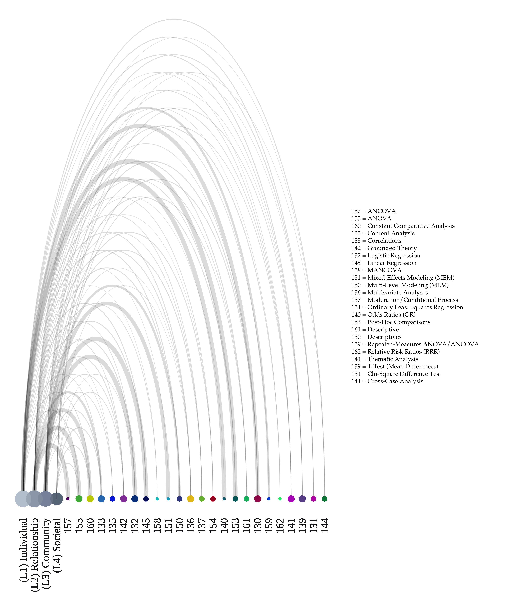{#fig:}


**157** = _Analysis of Covariance (ANCOVA)_, **155** = _Analysis of Variance (ANOVA)_, **166** = _Boostrapping_, **160** = _Constant Comparative Analysis_, **164** = _Confirmatory Factor Analysis (CFA)_, **133** = _Content Analysis_, **135** = _Correlations_, **142** = _Grounded Theory (GT)-Based Analysis_, **169** = _Indirect-Effects_, **132** = _Logistic Regression_, **145** = _Linear Regression_, **158** = _Multivariate Analysis of Covariance (MANCOVA)_, **156** = _Multivariate Analysis of Variance (MANOVA)_, **138** = _Mediation Analysis_, **151** = _Mixed-Effects Modeling (MEM)_, **167** = _Maximum Likelihood Estimation (MLE)_, **150** = _Multi-Level/Hierarchical Linear Modeling (MLM/HLM)_, **136** = _Multivariate Analyses_, **137** = _Moderation/Conditional Process Analysis_, **154** = _Ordinary Least Squares Regression_, **140** = _Odds Ratios (OR)_, **163** = _Path Analysis_, **153** = _Post-Hoc Comparisons_, **161** = _Qualitative Descriptive Analysis_, **130** = _Descriptives_, **159** = _Repeated-Measures ANOVA/ANCOVA_, **162** = _Relative Risk Ratios (RRR)_, **149** = _Structural Equation Modeling (SEM)_, **168** = _Full SEM (Measurement & Structural Models)_, **141** = _Thematic Analysis_, **177** = _Grouped Thematic Analysis_, **139** = _T-Tests (Mean Differences)_, **174** = _Weighted Least Squares (WLS) Estimation_, **131** = _Chi-Square Difference Test_, **144** = _Cross-Case Analysis_


-----


```r
MAP <- MAP[, c("bibkey", "year", "journal", "caseid", "scat", "jrnl", "cpv", 
    "j.loc", "j.year", "SJR", "Hindex", "title")]
MAPtl <- within(MAP, {
    bibkey2 <- as.integer(factor(bibkey))
    bibkey2 <- gsub("(\\w+)\\d{4}\\w+", "\\1", bibkey)
    bibkey2 <- sapply(bibkey2, RtCap, USE.NAMES = FALSE)
    yrv <- ifelse(cpv == "V", year, 0)
    yrcp <- ifelse(cpv == "CP", year, 0)
    cpv <- factor(cpv, labels = c("Community-Psychology", "Violence"))
})
MAPtl <- MAPtl[order(MAPtl$yrv), , drop = FALSE] %>% within({
    posv <- sequence(rle(sort(yrv))$lengths)
    posv <- ifelse(yrv == 0, 0, posv)
    posv <- posv * -1
})
MAPtl <- MAPtl[order(MAPtl$yrcp), , drop = FALSE] %>% within({
    poscp <- sequence(rle(sort(yrcp))$lengths)
    poscp <- ifelse(yrcp == 0, 0, poscp)
    pos <- posv + poscp
})
vawa <- 1994
vawaclr <- grays_nord(12)[7]
gg.tl <- ggplot(MAPtl, aes(x = year, y = 0, colour = cpv)) + thm_Rtft(yticks = FALSE, 
    ytext = FALSE, ytitle = FALSE, ltitle = TRUE, ptitle = TRUE, xtext = FALSE, 
    xticks = FALSE) + theme(legend.text = element_text(size = rel(0.55)), legend.title = element_text(size = rel(0.65), 
    face = "bold"), legend.justification = c(1, 0.635), legend.box.spacing = unit(0, 
    "cm")) + labs(colour = "Journal Category", title = "Timeline of Reviewed Research\n") + 
    scale_colour_manual(values = pcpv) + geom_hline(yintercept = 0, size = 0.25, 
    color = pal_nord$polar[7], alpha = 0.5) + geom_segment(aes(y = 0, yend = pos, 
    x = year, xend = year), colour = pal_my[19], alpha = 0.45, na.rm = TRUE, 
    size = 0.15) + geom_text(aes(y = pos, x = year, label = bibkey2), hjust = 0.5, 
    vjust = 0, angle = 45, size = 2.5, fontface = "bold") + geom_text(aes(y = 0, 
    x = vawa, label = "1994 Violence Against Women Act"), alpha = 0.5, angle = 90, 
    colour = vawaclr, size = 3, nudge_x = -0.25, family = "serif", fontface = "italic") + 
    geom_text(aes(y = 0, x = year, label = year), check_overlap = TRUE, vjust = 0.5, 
        hjust = 0.5, angle = 0, colour = pal_my[20], size = 2.5, family = "serif", 
        fontface = "bold")
gg.tl
```

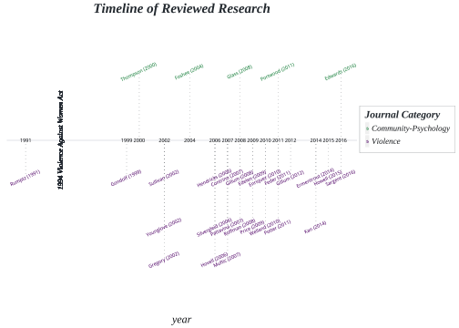{#fig:}


-----

# IPV Intervention \& Prevention Research


```r
levels(cb$scat) <- c(1, 2)
cb$clab <- factor(cb$clab)
```


```r
s3cb <- cb[cb$scat == 1, ] %>% droplevels
s3cb.keys <- paste0("@", levels(s3cb$bibkey))
```


```r
inv <- MAPtl[MAPtl$scat == "S3", ]
tl.inv <- inv[order(inv$year), c("bibkey", "year", "cpv", "journal", "title"), 
    drop = FALSE] %>% droplevels()
tl.inv$bibkey <- paste0("@", tl.inv$bibkey)
tl.inv$journal <- paste0("_", tl.inv$journal, "_")
tl.inv <- dplyr::rename(tl.inv, Study = bibkey, Journal = journal, `Year Published` = year)
rownames(tl.inv) <- NULL
gg.invtl <- ggplot(inv, aes(x = year, y = 0, colour = cpv)) + thm_Rtft(yticks = FALSE, 
    ytext = FALSE, ytitle = FALSE, ltitle = TRUE, ptitle = TRUE, xtext = FALSE, 
    xticks = FALSE) + theme(legend.text = element_text(size = rel(0.55)), legend.title = element_text(size = rel(0.65), 
    face = "bold"), legend.justification = c(1, 0.8), legend.box.spacing = unit(0, 
    "cm")) + ylim(min(inv$pos) - 0.5, max(inv$pos) + 0.5) + labs(colour = "Journal Category", 
    title = "IPV-Interventions Research Timeline") + scale_colour_manual(values = pcpv) + 
    geom_hline(yintercept = 0, size = 0.25, color = pal_nord$polar[7], alpha = 0.5) + 
    geom_segment(aes(y = 0, yend = pos, x = year, xend = year), colour = pal_my[19], 
        alpha = 0.45, na.rm = TRUE, size = 0.15) + geom_text(aes(y = pos, x = year, 
    label = bibkey2), hjust = 0.5, vjust = 1, angle = 45, size = 2.5, fontface = "bold") + 
    geom_text(aes(y = 0, x = vawa, label = "1994 Violence Against Women Act"), 
        alpha = 0.5, angle = 90, colour = vawaclr, size = 2.5, nudge_x = -0.25, 
        family = "serif", fontface = "italic") + geom_text(aes(y = 0, x = year, 
    label = year), check_overlap = TRUE, vjust = 0.5, hjust = 0.5, angle = 0, 
    colour = pal_my[20], size = 2.5, family = "serif", fontface = "bold")
gg.invtl
```

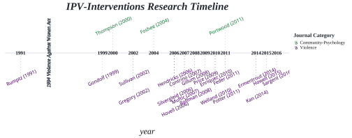{#fig:}

```r
tl.inv[, c(1, 4, 2)] %>% kable(caption = "IPV Interventions Research Timeline")
```


Table: IPV Interventions Research Timeline

Study                         Journal                                       Year Published
----------------------------  -------------------------------------------  ---------------
@rumptz1991ecological         _Violence and Victims_                                  1991
@gondolf1999comparison        _Journal of Interpersonal Violence_                     1999
@thompson2000identification   _American Journal of Preventive Medicine_               2000
@sullivan2002findings         _Journal of Interpersonal Violence_                     2002
@gregory2002effects           _Violence Against Women_                                2002
@foshee2004assessing          _American Journal of Public Health_                     2004
@hendricks2006recidivism      _Journal of Interpersonal Violence_                     2006
@silvergleid2006batterer      _Journal of Interpersonal Violence_                     2006
@hovell2006evaluation         _Violence Against Women_                                2006
@contrino2007compliance       _Journal of Interpersonal Violence_                     2007
@muftic2007evaluation         _Violence Against Women_                                2007
@gillum2008benefits           _Violence Against Women_                                2008
@roffman2008mens              _Violence Against Women_                                2008
@price2009batterer            _Violence and Victims_                                  2009
@enriquez2010development      _Violence Against Women_                                2010
@welland2010culturally        _Violence and Victims_                                  2010
@potter2011bringing           _Violence Against Women_                                2011
@feder2011need                _Violence Against Women_                                2011
@portwood2011evaluation       _Journal of Primary Prevention_                         2011
@ermentrout2014this           _Violence Against Women_                                2014
@boal2014barriers             _Violence and Victims_                                  2014
@kan2014can                   _Violence and Victims_                                  2014
@boal2014impact               _American Journal of Community Psychology_              2014
@howell2015strengthening      _Journal of Interpersonal Violence_                     2015
@sargent2016evaluating        _Journal of Family Violence_                            2016


-----

## Research Topics


```r
s3top <- s3cb[s3cb$cat == "TOPIC", ] %>% droplevels()
s3top <- s3top[!duplicated(s3top), ]
Rtdf(s3top$clab, names = c(" ", "$N_{Articles}$")) %>% kable(caption = "Primary Topics Distribution (IPV Interventions Research)", 
    align = c("l", "r"))
```


Table: Primary Topics Distribution (IPV Interventions Research)

                                         $N_{Articles}$
--------------------------------------  ---------------
Approach Evaluation                                   1
Bystander Intervention                                1
Coordinated Community Response to IPV                 1
HIV Intervention/Prevention                           1
Intervention/Prevention (General)                    25
IPV Intervention Description                          3
IPV Intervention Program Development                  3
IPV Intervention Program Evaluation                  21
IPV Intervention Proposal                             1
IPV Perpetrator Interventions                        13
IPV Screening                                         1
IPV Victimization Intervention                        8
Practitioners' Perspectives                           1
Prevention (General)                                  2
Public/Program Policy                                 2
Research/Evaluation Methods                           3
System Response                                       2
Victims'/Survivors' Perspectives                      2

```r
lvls3.tp <- paste0(seq(1:length(unique(s3top$clab))), " = ", levels(s3top$clab))
levels(s3top$clab) <- seq(1:length(unique(s3top$clab)))
ks3tp <- ftable(s3top$bibkey, s3top$clab) %>% as.matrix
ks3tp <- ifelse(ks3tp >= 1, "&#10003;", "&middot;")
rownames(ks3tp) <- paste0("@", rownames(ks3tp))
```


-----


Table: Primary Topics by Study (IPV Interventions Research [1/2])

                              1          2          3          4          5          6          7          8          9        
----------------------------  ---------  ---------  ---------  ---------  ---------  ---------  ---------  ---------  ---------
@boal2014barriers             &middot;   &middot;   &middot;   &middot;   &#10003;   &middot;   &middot;   &middot;   &middot; 
@boal2014impact               &middot;   &middot;   &middot;   &middot;   &#10003;   &middot;   &middot;   &#10003;   &middot; 
@contrino2007compliance       &middot;   &middot;   &middot;   &middot;   &#10003;   &middot;   &middot;   &#10003;   &middot; 
@enriquez2010development      &middot;   &middot;   &middot;   &#10003;   &#10003;   &middot;   &#10003;   &#10003;   &middot; 
@ermentrout2014this           &middot;   &middot;   &middot;   &middot;   &#10003;   &middot;   &#10003;   &#10003;   &middot; 
@feder2011need                &middot;   &middot;   &middot;   &middot;   &#10003;   &middot;   &middot;   &#10003;   &middot; 
@foshee2004assessing          &middot;   &middot;   &middot;   &middot;   &#10003;   &middot;   &middot;   &#10003;   &middot; 
@gillum2008benefits           &middot;   &middot;   &middot;   &middot;   &#10003;   &middot;   &middot;   &#10003;   &middot; 
@gondolf1999comparison        &middot;   &middot;   &middot;   &middot;   &#10003;   &middot;   &middot;   &#10003;   &middot; 
@gregory2002effects           &middot;   &middot;   &middot;   &middot;   &#10003;   &middot;   &middot;   &#10003;   &middot; 
@hendricks2006recidivism      &middot;   &middot;   &middot;   &middot;   &#10003;   &middot;   &middot;   &#10003;   &middot; 
@hovell2006evaluation         &middot;   &middot;   &middot;   &middot;   &#10003;   &middot;   &middot;   &#10003;   &middot; 
@howell2015strengthening      &middot;   &middot;   &middot;   &middot;   &#10003;   &middot;   &middot;   &#10003;   &middot; 
@kan2014can                   &middot;   &middot;   &middot;   &middot;   &#10003;   &middot;   &middot;   &#10003;   &middot; 
@muftic2007evaluation         &#10003;   &middot;   &#10003;   &middot;   &#10003;   &middot;   &middot;   &middot;   &middot; 
@portwood2011evaluation       &middot;   &middot;   &middot;   &middot;   &#10003;   &middot;   &middot;   &#10003;   &middot; 
@potter2011bringing           &middot;   &#10003;   &middot;   &middot;   &#10003;   &#10003;   &middot;   &#10003;   &middot; 
@price2009batterer            &middot;   &middot;   &middot;   &middot;   &#10003;   &#10003;   &middot;   &middot;   &middot; 
@roffman2008mens              &middot;   &middot;   &middot;   &middot;   &#10003;   &#10003;   &middot;   &#10003;   &middot; 
@rumptz1991ecological         &middot;   &middot;   &middot;   &middot;   &#10003;   &middot;   &middot;   &#10003;   &middot; 
@sargent2016evaluating        &middot;   &middot;   &middot;   &middot;   &#10003;   &middot;   &middot;   &#10003;   &middot; 
@silvergleid2006batterer      &middot;   &middot;   &middot;   &middot;   &#10003;   &middot;   &middot;   &#10003;   &middot; 
@sullivan2002findings         &middot;   &middot;   &middot;   &middot;   &#10003;   &middot;   &middot;   &#10003;   &middot; 
@thompson2000identification   &middot;   &middot;   &middot;   &middot;   &#10003;   &middot;   &middot;   &#10003;   &middot; 
@welland2010culturally        &middot;   &middot;   &middot;   &middot;   &#10003;   &middot;   &#10003;   &middot;   &#10003; 

_1 = Approach Evaluation_, _2 = Bystander Intervention_, _3 = Coordinated Community Response to IPV _, _4 = HIV Intervention/Prevention_, _5 = Intervention/Prevention (General)_, _6 = IPV Intervention Description_, _7 = IPV Intervention Program Development_, _8 = IPV Intervention Program Evaluation_, and _9 = IPV Intervention Proposal_


-----


Table: Primary Topics by Study (IPV Interventions Research [2/2])

                              10         11         12         13         14         15         16         17         18       
----------------------------  ---------  ---------  ---------  ---------  ---------  ---------  ---------  ---------  ---------
@boal2014barriers             &#10003;   &middot;   &middot;   &middot;   &middot;   &#10003;   &middot;   &middot;   &middot; 
@boal2014impact               &#10003;   &middot;   &middot;   &middot;   &middot;   &#10003;   &middot;   &middot;   &middot; 
@contrino2007compliance       &#10003;   &middot;   &middot;   &middot;   &middot;   &middot;   &middot;   &middot;   &middot; 
@enriquez2010development      &middot;   &middot;   &middot;   &middot;   &#10003;   &middot;   &middot;   &middot;   &middot; 
@ermentrout2014this           &middot;   &middot;   &#10003;   &middot;   &middot;   &middot;   &middot;   &middot;   &middot; 
@feder2011need                &#10003;   &middot;   &middot;   &middot;   &middot;   &middot;   &#10003;   &middot;   &middot; 
@foshee2004assessing          &#10003;   &middot;   &#10003;   &middot;   &middot;   &middot;   &middot;   &middot;   &middot; 
@gillum2008benefits           &middot;   &middot;   &#10003;   &middot;   &middot;   &middot;   &middot;   &middot;   &middot; 
@gondolf1999comparison        &#10003;   &middot;   &middot;   &middot;   &middot;   &middot;   &middot;   &middot;   &#10003; 
@gregory2002effects           &#10003;   &middot;   &middot;   &middot;   &middot;   &middot;   &middot;   &middot;   &#10003; 
@hendricks2006recidivism      &#10003;   &middot;   &middot;   &middot;   &middot;   &middot;   &middot;   &middot;   &middot; 
@hovell2006evaluation         &middot;   &middot;   &#10003;   &middot;   &middot;   &middot;   &middot;   &#10003;   &middot; 
@howell2015strengthening      &middot;   &middot;   &#10003;   &middot;   &middot;   &middot;   &middot;   &middot;   &middot; 
@kan2014can                   &middot;   &middot;   &middot;   &middot;   &middot;   &middot;   &middot;   &middot;   &middot; 
@muftic2007evaluation         &#10003;   &middot;   &middot;   &middot;   &middot;   &middot;   &middot;   &middot;   &middot; 
@portwood2011evaluation       &middot;   &middot;   &middot;   &middot;   &middot;   &middot;   &middot;   &middot;   &middot; 
@potter2011bringing           &middot;   &middot;   &middot;   &middot;   &#10003;   &middot;   &#10003;   &middot;   &middot; 
@price2009batterer            &#10003;   &middot;   &middot;   &middot;   &middot;   &middot;   &middot;   &middot;   &middot; 
@roffman2008mens              &#10003;   &middot;   &middot;   &middot;   &middot;   &middot;   &middot;   &middot;   &middot; 
@rumptz1991ecological         &middot;   &middot;   &#10003;   &middot;   &middot;   &middot;   &#10003;   &middot;   &middot; 
@sargent2016evaluating        &middot;   &middot;   &middot;   &middot;   &middot;   &middot;   &middot;   &middot;   &middot; 
@silvergleid2006batterer      &#10003;   &middot;   &middot;   &#10003;   &middot;   &middot;   &middot;   &middot;   &middot; 
@sullivan2002findings         &middot;   &middot;   &#10003;   &middot;   &middot;   &middot;   &middot;   &middot;   &middot; 
@thompson2000identification   &middot;   &#10003;   &#10003;   &middot;   &middot;   &middot;   &middot;   &#10003;   &middot; 
@welland2010culturally        &#10003;   &middot;   &middot;   &middot;   &middot;   &middot;   &middot;   &middot;   &middot; 

_10 = IPV Perpetrator Interventions_, _11 = IPV Screening_, _12 = IPV Victimization Intervention_, _13 = Practitioners' Perspectives_, _14 = Prevention (General)_, _15 = Public/Program Policy_, _16 = Research/Evaluation Methods_, _17 = System Response_, and _18 = Victims'/Survivors' Perspectives_


-----

## Target Populations/Sampling Frames


```r
s3pop <- s3cb[s3cb$cat == "POPULATION", ] %>% droplevels()
s3pop <- s3pop[!duplicated(s3pop), ]
Rtdf(s3pop$clab, names = c(" ", "$N_{Articles}$")) %>% kable(caption = "Populations Included (IPV Interventions Research)", 
    align = c("l", "r"))
```


Table: Populations Included (IPV Interventions Research)

                                              $N_{Articles}$
-------------------------------------------  ---------------
African Americans                                          1
Females/Women/Girls                                        9
General Population                                         2
IPV Intervention Programs                                  6
IPV Perpetrators                                           8
IPV Victims/Survivors                                      4
IPV-Specific Community-Based Practitioners                 1
Latina/os                                                  1
Males/Men/Boys                                             6
Non-IPV Community-Based Practitioners                      2
Non-IPV System Entities                                    1
Parents                                                    3
Youth/Children                                             3

```r
lvla3.pop <- paste0(seq(1:length(unique(s3pop$clab))), " = ", levels(s3pop$clab))
levels(s3pop$clab) <- seq(1:length(unique(s3pop$clab)))
ks3pop <- ftable(s3pop$bibkey, s3pop$clab) %>% as.matrix
ks3pop <- ifelse(ks3pop >= 1, "&#10003;", "&middot;")
rownames(ks3pop) <- paste0("@", rownames(ks3pop))
kable(ks3pop, caption = "Populations Included by Study (IPV Interventions Research)")
```


Table: Populations Included by Study (IPV Interventions Research)

                              1          2          3          4          5          6          7          8          9          10         11         12         13       
----------------------------  ---------  ---------  ---------  ---------  ---------  ---------  ---------  ---------  ---------  ---------  ---------  ---------  ---------
@boal2014barriers             &middot;   &middot;   &middot;   &#10003;   &middot;   &middot;   &middot;   &middot;   &middot;   &middot;   &middot;   &middot;   &middot; 
@boal2014impact               &middot;   &middot;   &middot;   &#10003;   &middot;   &middot;   &middot;   &middot;   &middot;   &middot;   &middot;   &middot;   &middot; 
@contrino2007compliance       &middot;   &middot;   &middot;   &middot;   &#10003;   &middot;   &middot;   &middot;   &#10003;   &middot;   &middot;   &middot;   &middot; 
@enriquez2010development      &middot;   &#10003;   &middot;   &middot;   &middot;   &middot;   &middot;   &middot;   &middot;   &middot;   &middot;   &middot;   &middot; 
@ermentrout2014this           &middot;   &#10003;   &middot;   &#10003;   &middot;   &middot;   &middot;   &middot;   &middot;   &middot;   &middot;   &#10003;   &#10003; 
@feder2011need                &middot;   &middot;   &middot;   &middot;   &middot;   &middot;   &middot;   &middot;   &middot;   &#10003;   &middot;   &middot;   &middot; 
@foshee2004assessing          &middot;   &middot;   &middot;   &middot;   &middot;   &middot;   &middot;   &middot;   &middot;   &middot;   &middot;   &middot;   &#10003; 
@gillum2008benefits           &#10003;   &#10003;   &middot;   &middot;   &middot;   &#10003;   &middot;   &middot;   &middot;   &middot;   &middot;   &middot;   &middot; 
@gondolf1999comparison        &middot;   &#10003;   &middot;   &#10003;   &#10003;   &middot;   &middot;   &middot;   &#10003;   &middot;   &middot;   &middot;   &middot; 
@gregory2002effects           &middot;   &#10003;   &middot;   &middot;   &middot;   &#10003;   &middot;   &middot;   &#10003;   &middot;   &middot;   &middot;   &middot; 
@hendricks2006recidivism      &middot;   &middot;   &middot;   &middot;   &#10003;   &middot;   &middot;   &middot;   &middot;   &middot;   &middot;   &middot;   &middot; 
@hovell2006evaluation         &middot;   &middot;   &middot;   &middot;   &#10003;   &middot;   &middot;   &middot;   &middot;   &middot;   &middot;   &middot;   &middot; 
@howell2015strengthening      &middot;   &#10003;   &middot;   &middot;   &middot;   &#10003;   &middot;   &middot;   &middot;   &middot;   &middot;   &middot;   &middot; 
@muftic2007evaluation         &middot;   &#10003;   &middot;   &middot;   &#10003;   &middot;   &middot;   &middot;   &#10003;   &middot;   &middot;   &middot;   &middot; 
@portwood2011evaluation       &middot;   &middot;   &middot;   &middot;   &middot;   &middot;   &middot;   &middot;   &middot;   &middot;   &middot;   &#10003;   &middot; 
@potter2011bringing           &middot;   &middot;   &#10003;   &middot;   &middot;   &middot;   &middot;   &middot;   &middot;   &middot;   &middot;   &middot;   &middot; 
@price2009batterer            &middot;   &middot;   &middot;   &#10003;   &middot;   &middot;   &middot;   &middot;   &middot;   &middot;   &middot;   &middot;   &middot; 
@roffman2008mens              &middot;   &middot;   &middot;   &middot;   &#10003;   &middot;   &middot;   &middot;   &#10003;   &middot;   &middot;   &middot;   &middot; 
@rumptz1991ecological         &middot;   &#10003;   &middot;   &middot;   &middot;   &#10003;   &middot;   &middot;   &middot;   &middot;   &middot;   &middot;   &middot; 
@sargent2016evaluating        &middot;   &middot;   &#10003;   &middot;   &middot;   &middot;   &middot;   &middot;   &middot;   &middot;   &middot;   &middot;   &middot; 
@silvergleid2006batterer      &middot;   &middot;   &middot;   &#10003;   &#10003;   &middot;   &#10003;   &middot;   &middot;   &middot;   &middot;   &middot;   &middot; 
@sullivan2002findings         &middot;   &#10003;   &middot;   &middot;   &middot;   &middot;   &middot;   &middot;   &middot;   &middot;   &middot;   &#10003;   &#10003; 
@thompson2000identification   &middot;   &middot;   &middot;   &middot;   &middot;   &middot;   &middot;   &middot;   &middot;   &#10003;   &#10003;   &middot;   &middot; 
@welland2010culturally        &middot;   &middot;   &middot;   &middot;   &#10003;   &middot;   &middot;   &#10003;   &#10003;   &middot;   &middot;   &middot;   &middot; 

```r
pander(lvla3.pop)
```

_1 = African Americans_, _2 = Females/Women/Girls_, _3 = General Population_, _4 = IPV Intervention Programs_, _5 = IPV Perpetrators_, _6 = IPV Victims/Survivors_, _7 = IPV-Specific Community-Based Practitioners_, _8 = Latina/os_, _9 = Males/Men/Boys_, _10 = Non-IPV Community-Based Practitioners_, _11 = Non-IPV System Entities_, _12 = Parents_, and _13 = Youth/Children_


-----

## Sampling Settings


```r
s3set <- s3cb[s3cb$cat == "M-SETTINGS", ] %>% droplevels()
s3set <- s3set[!duplicated(s3set), ]
Rtdf(s3set$clab, names = c(" ", "$N_{Articles}$")) %>% kable(caption = "Sampling Settings (IPV Interventions Research)", 
    align = c("l", "r"))
```


Table: Sampling Settings (IPV Interventions Research)

                                           $N_{Articles}$
----------------------------------------  ---------------
Anger Management Programs                               1
Childcare Services                                      2
Children's Services                                     2
CJ - Police                                             1
Colleges/Univeresities                                  2
Community Centers                                       1
Community-Based Services                               21
Criminal Justice System                                 4
Drug & Alcohol Abuse Treatment Services                 2
IPV Perpetrator Intervention Programs                  10
IPV-Victim Services                                     7
Legal-Aid                                               1
Mental Health Services                                  1
Multi-Site                                              5
Online Media/Forums                                     1
Parent Education Services                               2
Primary & Emer. Healthcare Services                     6
Primary Schools                                         1
Print Media                                             1
Social Services                                         1

```r
lvla3.set <- paste0(seq(1:length(unique(s3set$clab))), " = ", levels(s3set$clab))
levels(s3set$clab) <- seq(1:length(unique(s3set$clab)))
ks3set <- ftable(s3set$bibkey, s3set$clab) %>% as.matrix
ks3set <- ifelse(ks3set >= 1, "&#10003;", "&middot;")
rownames(ks3set) <- paste0("@", rownames(ks3set))
kable(ks3set[, 1:10], caption = "Sampling Settings by Study (IPV Interventions Research [1/2])")
```


Table: Sampling Settings by Study (IPV Interventions Research [1/2])

                              1          2          3          4          5          6          7          8          9          10       
----------------------------  ---------  ---------  ---------  ---------  ---------  ---------  ---------  ---------  ---------  ---------
@boal2014barriers             &middot;   &middot;   &middot;   &middot;   &middot;   &middot;   &#10003;   &middot;   &middot;   &#10003; 
@boal2014impact               &middot;   &middot;   &middot;   &middot;   &middot;   &middot;   &middot;   &middot;   &middot;   &#10003; 
@contrino2007compliance       &middot;   &middot;   &middot;   &middot;   &middot;   &middot;   &#10003;   &middot;   &#10003;   &#10003; 
@enriquez2010development      &middot;   &#10003;   &middot;   &middot;   &middot;   &middot;   &#10003;   &middot;   &middot;   &middot; 
@ermentrout2014this           &middot;   &#10003;   &#10003;   &middot;   &middot;   &middot;   &#10003;   &middot;   &middot;   &middot; 
@feder2011need                &middot;   &middot;   &middot;   &middot;   &middot;   &middot;   &#10003;   &middot;   &middot;   &middot; 
@foshee2004assessing          &middot;   &middot;   &middot;   &middot;   &middot;   &middot;   &middot;   &middot;   &middot;   &middot; 
@gillum2008benefits           &middot;   &middot;   &middot;   &middot;   &middot;   &middot;   &#10003;   &middot;   &middot;   &middot; 
@gondolf1999comparison        &middot;   &middot;   &middot;   &middot;   &middot;   &middot;   &#10003;   &middot;   &middot;   &#10003; 
@gregory2002effects           &middot;   &middot;   &middot;   &middot;   &middot;   &middot;   &#10003;   &middot;   &middot;   &#10003; 
@hendricks2006recidivism      &middot;   &middot;   &middot;   &middot;   &middot;   &middot;   &#10003;   &#10003;   &middot;   &middot; 
@hovell2006evaluation         &middot;   &middot;   &middot;   &#10003;   &middot;   &middot;   &#10003;   &#10003;   &middot;   &middot; 
@howell2015strengthening      &middot;   &middot;   &middot;   &middot;   &middot;   &#10003;   &#10003;   &middot;   &middot;   &middot; 
@kan2014can                   &middot;   &middot;   &middot;   &middot;   &middot;   &middot;   &#10003;   &middot;   &middot;   &middot; 
@muftic2007evaluation         &#10003;   &middot;   &middot;   &middot;   &middot;   &middot;   &#10003;   &#10003;   &#10003;   &#10003; 
@portwood2011evaluation       &middot;   &middot;   &#10003;   &middot;   &middot;   &middot;   &#10003;   &middot;   &middot;   &middot; 
@potter2011bringing           &middot;   &middot;   &middot;   &middot;   &#10003;   &middot;   &middot;   &middot;   &middot;   &middot; 
@price2009batterer            &middot;   &middot;   &middot;   &middot;   &middot;   &middot;   &#10003;   &middot;   &middot;   &#10003; 
@roffman2008mens              &middot;   &middot;   &middot;   &middot;   &middot;   &middot;   &#10003;   &#10003;   &middot;   &#10003; 
@rumptz1991ecological         &middot;   &middot;   &middot;   &middot;   &middot;   &middot;   &#10003;   &middot;   &middot;   &middot; 
@sargent2016evaluating        &middot;   &middot;   &middot;   &middot;   &#10003;   &middot;   &middot;   &middot;   &middot;   &middot; 
@silvergleid2006batterer      &middot;   &middot;   &middot;   &middot;   &middot;   &middot;   &#10003;   &middot;   &middot;   &#10003; 
@sullivan2002findings         &middot;   &middot;   &middot;   &middot;   &middot;   &middot;   &#10003;   &middot;   &middot;   &middot; 
@thompson2000identification   &middot;   &middot;   &middot;   &middot;   &middot;   &middot;   &#10003;   &middot;   &middot;   &middot; 
@welland2010culturally        &middot;   &middot;   &middot;   &middot;   &middot;   &middot;   &#10003;   &middot;   &middot;   &#10003; 

```r
pander(lvla3.set[1:9])
```

_1 = Anger Management Programs_, _2 = Childcare Services_, _3 = Children's Services_, _4 = CJ - Police_, _5 = Colleges/Univeresities_, _6 = Community Centers_, _7 = Community-Based Services_, _8 = Criminal Justice System_, and _9 = Drug & Alcohol Abuse Treatment Services_


-----


Table: Sampling Settings by Study (IPV Interventions Research [2/2])

                              11         12         13         14         15         16         17         18         19         20       
----------------------------  ---------  ---------  ---------  ---------  ---------  ---------  ---------  ---------  ---------  ---------
@boal2014barriers             &middot;   &middot;   &middot;   &middot;   &middot;   &middot;   &middot;   &middot;   &middot;   &middot; 
@boal2014impact               &middot;   &middot;   &middot;   &#10003;   &middot;   &middot;   &middot;   &middot;   &middot;   &middot; 
@contrino2007compliance       &middot;   &middot;   &middot;   &middot;   &middot;   &middot;   &middot;   &middot;   &middot;   &middot; 
@enriquez2010development      &middot;   &middot;   &middot;   &middot;   &middot;   &middot;   &middot;   &middot;   &middot;   &middot; 
@ermentrout2014this           &#10003;   &middot;   &middot;   &middot;   &middot;   &middot;   &middot;   &middot;   &middot;   &middot; 
@feder2011need                &middot;   &middot;   &middot;   &middot;   &middot;   &middot;   &#10003;   &middot;   &middot;   &middot; 
@foshee2004assessing          &middot;   &middot;   &middot;   &#10003;   &middot;   &middot;   &middot;   &#10003;   &middot;   &middot; 
@gillum2008benefits           &#10003;   &middot;   &middot;   &middot;   &middot;   &middot;   &middot;   &middot;   &middot;   &middot; 
@gondolf1999comparison        &middot;   &middot;   &middot;   &#10003;   &middot;   &middot;   &middot;   &middot;   &middot;   &middot; 
@gregory2002effects           &middot;   &middot;   &middot;   &middot;   &middot;   &middot;   &middot;   &middot;   &middot;   &middot; 
@hendricks2006recidivism      &middot;   &middot;   &middot;   &#10003;   &middot;   &middot;   &middot;   &middot;   &middot;   &middot; 
@hovell2006evaluation         &#10003;   &middot;   &middot;   &middot;   &middot;   &middot;   &middot;   &middot;   &middot;   &middot; 
@howell2015strengthening      &#10003;   &#10003;   &#10003;   &middot;   &middot;   &middot;   &#10003;   &middot;   &middot;   &middot; 
@kan2014can                   &middot;   &middot;   &middot;   &middot;   &middot;   &#10003;   &#10003;   &middot;   &middot;   &middot; 
@muftic2007evaluation         &#10003;   &middot;   &middot;   &middot;   &middot;   &middot;   &#10003;   &middot;   &middot;   &middot; 
@portwood2011evaluation       &middot;   &middot;   &middot;   &middot;   &middot;   &#10003;   &middot;   &middot;   &middot;   &middot; 
@potter2011bringing           &middot;   &middot;   &middot;   &middot;   &middot;   &middot;   &middot;   &middot;   &middot;   &middot; 
@price2009batterer            &middot;   &middot;   &middot;   &#10003;   &middot;   &middot;   &middot;   &middot;   &middot;   &middot; 
@roffman2008mens              &middot;   &middot;   &middot;   &middot;   &middot;   &middot;   &#10003;   &middot;   &#10003;   &#10003; 
@rumptz1991ecological         &#10003;   &middot;   &middot;   &middot;   &middot;   &middot;   &middot;   &middot;   &middot;   &middot; 
@sargent2016evaluating        &middot;   &middot;   &middot;   &middot;   &#10003;   &middot;   &middot;   &middot;   &middot;   &middot; 
@silvergleid2006batterer      &middot;   &middot;   &middot;   &middot;   &middot;   &middot;   &middot;   &middot;   &middot;   &middot; 
@sullivan2002findings         &#10003;   &middot;   &middot;   &middot;   &middot;   &middot;   &middot;   &middot;   &middot;   &middot; 
@thompson2000identification   &middot;   &middot;   &middot;   &middot;   &middot;   &middot;   &#10003;   &middot;   &middot;   &middot; 
@welland2010culturally        &middot;   &middot;   &middot;   &middot;   &middot;   &middot;   &middot;   &middot;   &middot;   &middot; 

_10 = IPV Perpetrator Intervention Programs_, _11 = IPV-Victim Services_, _12 = Legal-Aid_, _13 = Mental Health Services_, _14 = Multi-Site_, _15 = Online Media/Forums_, _16 = Parent Education Services_, _17 = Primary & Emer. Healthcare Services_, _18 = Primary Schools_, _19 = Print Media_, and _20 = Social Services_


-----

## Sampling Methods


```r
s3smthds <- s3cb[s3cb$cat == "M-SAMPLING", ] %>% droplevels()
s3smthds <- s3smthds[!duplicated(s3smthds), ]
Rtdf(s3smthds$clab, names = c(" ", "$N_{Articles}$")) %>% kable(caption = "Ecological Levels of Analysis (IPV Interventions Research)", 
    align = c("l", "r"))
```


Table: Ecological Levels of Analysis (IPV Interventions Research)

                                            $N_{Articles}$
-----------------------------------------  ---------------
Convenience                                             18
Maximum Variation                                        1
Multiple Sampling Methods                                9
Not Applicable (Archival/Secondary Data)                 1
Probability/Random                                       5
Purposive                                               11
Purposive-Probability                                   13
Snowball                                                 2
Stratified Random                                        1

```r
lvla3.smthds <- paste0(seq(1:length(unique(s3smthds$clab))), " = ", levels(s3smthds$clab))
levels(s3smthds$clab) <- seq(1:length(unique(s3smthds$clab)))
ks3smthds <- ftable(s3smthds$bibkey, s3smthds$clab) %>% as.matrix
ks3smthds <- ifelse(ks3smthds >= 1, "&#10003;", "&middot;")
rownames(ks3smthds) <- paste0("@", rownames(ks3smthds))
kable(ks3smthds, caption = "Sampling Methods by Study (IPV Interventions Research)")
```


Table: Sampling Methods by Study (IPV Interventions Research)

                              1          2          3          4          5          6          7          8          9        
----------------------------  ---------  ---------  ---------  ---------  ---------  ---------  ---------  ---------  ---------
@boal2014barriers             &#10003;   &middot;   &#10003;   &middot;   &middot;   &middot;   &#10003;   &middot;   &middot; 
@boal2014impact               &middot;   &middot;   &#10003;   &middot;   &#10003;   &middot;   &middot;   &middot;   &middot; 
@contrino2007compliance       &#10003;   &middot;   &middot;   &middot;   &middot;   &#10003;   &middot;   &middot;   &middot; 
@enriquez2010development      &#10003;   &middot;   &middot;   &middot;   &middot;   &#10003;   &middot;   &middot;   &middot; 
@ermentrout2014this           &#10003;   &middot;   &middot;   &middot;   &middot;   &middot;   &#10003;   &#10003;   &middot; 
@feder2011need                &#10003;   &middot;   &middot;   &#10003;   &middot;   &middot;   &#10003;   &middot;   &middot; 
@foshee2004assessing          &#10003;   &middot;   &middot;   &middot;   &middot;   &middot;   &#10003;   &middot;   &middot; 
@gillum2008benefits           &middot;   &middot;   &middot;   &middot;   &middot;   &#10003;   &middot;   &middot;   &middot; 
@gondolf1999comparison        &middot;   &middot;   &middot;   &middot;   &middot;   &#10003;   &#10003;   &middot;   &middot; 
@gregory2002effects           &#10003;   &middot;   &#10003;   &middot;   &middot;   &#10003;   &middot;   &middot;   &middot; 
@hendricks2006recidivism      &#10003;   &middot;   &middot;   &middot;   &middot;   &#10003;   &middot;   &middot;   &middot; 
@hovell2006evaluation         &middot;   &middot;   &middot;   &middot;   &#10003;   &middot;   &#10003;   &middot;   &middot; 
@howell2015strengthening      &middot;   &middot;   &#10003;   &middot;   &middot;   &middot;   &#10003;   &middot;   &middot; 
@kan2014can                   &#10003;   &middot;   &#10003;   &middot;   &middot;   &middot;   &#10003;   &middot;   &middot; 
@muftic2007evaluation         &#10003;   &middot;   &middot;   &middot;   &middot;   &middot;   &#10003;   &middot;   &middot; 
@portwood2011evaluation       &#10003;   &middot;   &middot;   &middot;   &middot;   &middot;   &#10003;   &middot;   &middot; 
@potter2011bringing           &#10003;   &middot;   &#10003;   &middot;   &#10003;   &#10003;   &middot;   &middot;   &middot; 
@price2009batterer            &middot;   &middot;   &#10003;   &middot;   &middot;   &middot;   &#10003;   &middot;   &middot; 
@roffman2008mens              &middot;   &middot;   &#10003;   &middot;   &#10003;   &#10003;   &middot;   &middot;   &middot; 
@rumptz1991ecological         &#10003;   &middot;   &middot;   &middot;   &middot;   &middot;   &#10003;   &middot;   &middot; 
@sargent2016evaluating        &#10003;   &middot;   &#10003;   &middot;   &#10003;   &middot;   &middot;   &middot;   &middot; 
@silvergleid2006batterer      &#10003;   &middot;   &middot;   &middot;   &middot;   &#10003;   &middot;   &#10003;   &middot; 
@sullivan2002findings         &#10003;   &middot;   &middot;   &middot;   &middot;   &middot;   &#10003;   &middot;   &middot; 
@thompson2000identification   &#10003;   &middot;   &middot;   &middot;   &middot;   &#10003;   &middot;   &middot;   &#10003; 
@welland2010culturally        &#10003;   &#10003;   &middot;   &middot;   &middot;   &#10003;   &middot;   &middot;   &middot; 

```r
pander(lvla3.smthds)
```

_1 = Convenience_, _2 = Maximum Variation_, _3 = Multiple Sampling Methods_, _4 = Not Applicable (Archival/Secondary Data)_, _5 = Probability/Random_, _6 = Purposive_, _7 = Purposive-Probability_, _8 = Snowball_, and _9 = Stratified Random_


-----

## Overarching Methodology


```r
s3mo <- s3cb[s3cb$cat == "METHODS", ] %>% droplevels()
s3mo <- s3mo[!duplicated(s3mo), ]
Rtdf(s3mo$clab, names = c(" ", "$N_{Articles}$")) %>% kable(caption = "Overarching Methodology (IPV Interventions Research)", 
    align = c("l", "r"))
```


Table: Overarching Methodology (IPV Interventions Research)

                        $N_{Articles}$
---------------------  ---------------
Mixed-Methods                        3
QuaLitative Methods                  6
QuaNTitative Methods                16

```r
lvla3.mo <- paste0(seq(1:length(unique(s3mo$clab))), " = ", levels(s3mo$clab))
levels(s3mo$clab) <- seq(1:length(unique(s3mo$clab)))
ks3mo <- ftable(s3mo$bibkey, s3mo$clab) %>% as.matrix
ks3mo <- ifelse(ks3mo >= 1, "&#10003;", "&middot;")
rownames(ks3mo) <- paste0("@", rownames(ks3mo))
kable(ks3mo, caption = "Methodology by Study (IPV Interventions Research)")
```


Table: Methodology by Study (IPV Interventions Research)

                              1          2          3        
----------------------------  ---------  ---------  ---------
@boal2014barriers             &middot;   &#10003;   &middot; 
@boal2014impact               &middot;   &middot;   &#10003; 
@contrino2007compliance       &middot;   &middot;   &#10003; 
@enriquez2010development      &#10003;   &middot;   &middot; 
@ermentrout2014this           &middot;   &#10003;   &middot; 
@feder2011need                &middot;   &middot;   &#10003; 
@foshee2004assessing          &middot;   &middot;   &#10003; 
@gillum2008benefits           &middot;   &#10003;   &middot; 
@gondolf1999comparison        &middot;   &middot;   &#10003; 
@gregory2002effects           &middot;   &#10003;   &middot; 
@hendricks2006recidivism      &middot;   &middot;   &#10003; 
@hovell2006evaluation         &middot;   &middot;   &#10003; 
@howell2015strengthening      &middot;   &middot;   &#10003; 
@kan2014can                   &middot;   &middot;   &#10003; 
@muftic2007evaluation         &middot;   &middot;   &#10003; 
@portwood2011evaluation       &#10003;   &middot;   &middot; 
@potter2011bringing           &#10003;   &middot;   &middot; 
@price2009batterer            &middot;   &middot;   &#10003; 
@roffman2008mens              &middot;   &middot;   &#10003; 
@rumptz1991ecological         &middot;   &middot;   &#10003; 
@sargent2016evaluating        &middot;   &middot;   &#10003; 
@silvergleid2006batterer      &middot;   &#10003;   &middot; 
@sullivan2002findings         &middot;   &middot;   &#10003; 
@thompson2000identification   &middot;   &middot;   &#10003; 
@welland2010culturally        &middot;   &#10003;   &middot; 

```r
pander(lvla3.mo)
```

_1 = Mixed-Methods_, _2 = QuaLitative Methods_, and _3 = QuaNTitative Methods_


-----

## Qualitative Methods


```r
s3ql <- s3cb[s3cb$cat == "M-QL", ] %>% droplevels()
s3ql <- s3ql[!duplicated(s3ql), ]
Rtdf(s3ql$clab, names = c(" ", "$N_{Articles}$")) %>% kable(caption = "Qua**L**itative Methods (IPV Interventions Research)", 
    align = c("l", "r"))
```


Table: Qua**L**itative Methods (IPV Interventions Research)

                                       $N_{Articles}$
------------------------------------  ---------------
1-on-1 Interviews                                   4
Group Interviews                                    4
Multi-Modal Data Collection Methods                 1
QuaLitative Survey                                  1

```r
lvla3.ql <- paste0(seq(1:length(unique(s3ql$clab))), " = ", levels(s3ql$clab))
levels(s3ql$clab) <- seq(1:length(unique(s3ql$clab)))
ks3ql <- ftable(s3ql$bibkey, s3ql$clab) %>% as.matrix
ks3ql <- ifelse(ks3ql >= 1, "&#10003;", "&middot;")
rownames(ks3ql) <- paste0("@", rownames(ks3ql))
kable(ks3ql, caption = "Qua**L**itative Methods by Study (IPV Interventions Research)")
```


Table: Qua**L**itative Methods by Study (IPV Interventions Research)

                           1          2          3          4        
-------------------------  ---------  ---------  ---------  ---------
@boal2014barriers          &middot;   &middot;   &middot;   &#10003; 
@ermentrout2014this        &middot;   &middot;   &#10003;   &middot; 
@gillum2008benefits        &#10003;   &#10003;   &middot;   &middot; 
@gregory2002effects        &#10003;   &#10003;   &middot;   &middot; 
@silvergleid2006batterer   &#10003;   &#10003;   &middot;   &middot; 
@welland2010culturally     &#10003;   &#10003;   &middot;   &middot; 

```r
pander(lvla3.ql)
```

_1 = 1-on-1 Interviews_, _2 = Group Interviews_, _3 = Multi-Modal Data Collection Methods_, and _4 = QuaLitative Survey_


## Qualitative Analytic Appraoches


```r
s3aqt <- s3cb[s3cb$cat == "A-QT", ] %>% droplevels()
Rtdf(s3aqt$clab, names = c(" ", "$N_{Articles}$")) %>% kable(caption = "Qua**L**itative Methods (IPV Interventions Research)", 
    align = c("l", "r"))
```


Table: Qua**L**itative Methods (IPV Interventions Research)

                                                      $N_{Articles}$
---------------------------------------------------  ---------------
Analysis of Covariance (ANCOVA)                                    1
Analysis of Variance (ANOVA)                                       7
Chi-Square Difference Test                                         8
Correlations                                                       4
Descriptives                                                      18
Linear Regression                                                  2
Logistic Regression                                                4
Mixed-Effects Modeling (MEM)                                       1
Moderation/Conditional Process Analysis                            3
Multi-Level/Hierarchical Linear Modeling (MLM/HLM)                 2
Multivariate Analyses                                              5
Multivariate Analysis of Covariance (MANCOVA)                      1
Multivariate Analysis of Variance (MANOVA)                         2
Odds Ratios (OR)                                                   3
Ordinary Least Squares Regression                                  1
Post-Hoc Comparisons                                               1
Repeated-Measures ANOVA/ANCOVA                                     1
T-Tests (Mean Differences)                                         8

```r
lvla3.ql <- paste0(seq(1:length(unique(s3aqt$clab))), " = ", levels(s3aqt$code))
levels(s3aqt$clab) <- seq(1:length(unique(s3aqt$clab)))
ks3aqt <- ftable(s3aqt$bibkey, s3aqt$clab) %>% as.matrix
ks3aqt <- ifelse(ks3aqt >= 1, "&#10003;", "&middot;")
rownames(ks3aqt) <- paste0("@", rownames(ks3aqt))
kable(ks3aqt, caption = "Qua**L**itative Analytic Approaches by Study (IPV Interventions Research)")
```


Table: Qua**L**itative Analytic Approaches by Study (IPV Interventions Research)

                              1          2          3          4          5          6          7          8          9          10         11         12         13         14         15         16         17         18       
----------------------------  ---------  ---------  ---------  ---------  ---------  ---------  ---------  ---------  ---------  ---------  ---------  ---------  ---------  ---------  ---------  ---------  ---------  ---------
@boal2014impact               &middot;   &#10003;   &middot;   &middot;   &#10003;   &middot;   &middot;   &middot;   &middot;   &middot;   &#10003;   &middot;   &#10003;   &middot;   &middot;   &middot;   &middot;   &middot; 
@contrino2007compliance       &middot;   &middot;   &middot;   &#10003;   &#10003;   &middot;   &middot;   &middot;   &middot;   &middot;   &middot;   &middot;   &middot;   &middot;   &middot;   &middot;   &middot;   &#10003; 
@enriquez2010development      &middot;   &middot;   &middot;   &middot;   &#10003;   &middot;   &middot;   &middot;   &middot;   &middot;   &middot;   &middot;   &middot;   &middot;   &middot;   &middot;   &middot;   &#10003; 
@foshee2004assessing          &middot;   &middot;   &middot;   &#10003;   &middot;   &middot;   &#10003;   &middot;   &#10003;   &middot;   &#10003;   &middot;   &middot;   &#10003;   &middot;   &middot;   &middot;   &middot; 
@gondolf1999comparison        &middot;   &middot;   &#10003;   &middot;   &#10003;   &middot;   &#10003;   &middot;   &middot;   &middot;   &middot;   &middot;   &middot;   &middot;   &middot;   &middot;   &middot;   &middot; 
@hendricks2006recidivism      &middot;   &#10003;   &#10003;   &middot;   &#10003;   &middot;   &middot;   &middot;   &middot;   &middot;   &middot;   &middot;   &middot;   &middot;   &middot;   &middot;   &middot;   &#10003; 
@hovell2006evaluation         &middot;   &middot;   &#10003;   &middot;   &#10003;   &middot;   &middot;   &middot;   &middot;   &middot;   &middot;   &middot;   &middot;   &#10003;   &middot;   &middot;   &middot;   &middot; 
@howell2015strengthening      &middot;   &middot;   &middot;   &#10003;   &#10003;   &#10003;   &middot;   &middot;   &middot;   &middot;   &middot;   &middot;   &middot;   &middot;   &middot;   &middot;   &middot;   &middot; 
@kan2014can                   &middot;   &middot;   &middot;   &middot;   &middot;   &middot;   &middot;   &#10003;   &#10003;   &#10003;   &#10003;   &middot;   &middot;   &middot;   &middot;   &middot;   &middot;   &middot; 
@muftic2007evaluation         &middot;   &middot;   &#10003;   &middot;   &#10003;   &middot;   &#10003;   &middot;   &middot;   &middot;   &middot;   &middot;   &middot;   &middot;   &middot;   &middot;   &middot;   &#10003; 
@portwood2011evaluation       &middot;   &#10003;   &middot;   &middot;   &#10003;   &middot;   &middot;   &middot;   &middot;   &#10003;   &middot;   &middot;   &middot;   &middot;   &middot;   &#10003;   &middot;   &middot; 
@potter2011bringing           &middot;   &#10003;   &#10003;   &middot;   &#10003;   &middot;   &middot;   &middot;   &middot;   &middot;   &middot;   &middot;   &middot;   &middot;   &#10003;   &middot;   &middot;   &#10003; 
@price2009batterer            &middot;   &middot;   &middot;   &middot;   &#10003;   &middot;   &middot;   &middot;   &middot;   &middot;   &middot;   &middot;   &middot;   &middot;   &middot;   &middot;   &middot;   &middot; 
@roffman2008mens              &middot;   &middot;   &middot;   &middot;   &#10003;   &middot;   &middot;   &middot;   &middot;   &middot;   &middot;   &middot;   &middot;   &middot;   &middot;   &middot;   &middot;   &middot; 
@rumptz1991ecological         &middot;   &middot;   &middot;   &middot;   &#10003;   &middot;   &middot;   &middot;   &middot;   &middot;   &middot;   &middot;   &middot;   &middot;   &middot;   &middot;   &middot;   &middot; 
@sargent2016evaluating        &middot;   &#10003;   &#10003;   &middot;   &#10003;   &middot;   &middot;   &middot;   &#10003;   &middot;   &middot;   &middot;   &middot;   &middot;   &middot;   &middot;   &middot;   &#10003; 
@sullivan2002findings         &#10003;   &middot;   &#10003;   &middot;   &#10003;   &middot;   &middot;   &middot;   &middot;   &middot;   &#10003;   &#10003;   &middot;   &middot;   &middot;   &middot;   &#10003;   &#10003; 
@thompson2000identification   &middot;   &#10003;   &#10003;   &#10003;   &#10003;   &#10003;   &#10003;   &middot;   &middot;   &middot;   &middot;   &middot;   &middot;   &#10003;   &middot;   &middot;   &middot;   &#10003; 
@welland2010culturally        &middot;   &middot;   &middot;   &middot;   &#10003;   &middot;   &middot;   &middot;   &middot;   &middot;   &middot;   &middot;   &middot;   &middot;   &middot;   &middot;   &middot;   &middot; 

```r
pander(lvla3.ql)
```

_1 = ANCOVA_, _2 = ANOVA_, _3 = CORR_, _4 = LGR_, _5 = LNR_, _6 = MANCOVA_, _7 = MANOVA_, _8 = MEM_, _9 = MLM_, _10 = MLTV_, _11 = MOD_, _12 = OLSRG_, _13 = OR_, _14 = PHCOMP_, _15 = QTDESC_, _16 = RMANOVA_, _17 = TTEST_, and _18 = X2D_


-----

## Quantitative Methods


```r
s3qt <- s3cb[s3cb$cat == "M-QT", ] %>% droplevels()
s3qt <- s3ql[!duplicated(s3qt), ]
Rtdf(s3qt$clab, names = c(" ", "$N_{Articles}$")) %>% kable(caption = "Qua**NT**itative Methods (IPV Interventions Research)", 
    align = c("l", "r"))
```


Table: Qua**NT**itative Methods (IPV Interventions Research)

      $N_{Articles}$
---  ---------------
1                  2
2                  4
3                  1
4                  0

```r
lvla3.qt <- paste0(seq(1:length(unique(s3qt$clab))), " = ", levels(s3qt$clab))
levels(s3qt$clab) <- seq(1:length(unique(s3qt$clab)))
ks3qt <- ftable(s3qt$bibkey, s3qt$clab) %>% as.matrix
ks3qt <- ifelse(ks3qt >= 1, "&#10003;", "&middot;")
rownames(ks3qt) <- paste0("@", rownames(ks3qt))
kable(ks3qt, caption = "Qua**NT**itative Methods by Study (IPV Interventions Research)")
```


Table: Qua**NT**itative Methods by Study (IPV Interventions Research)

                           1          2          3          4        
-------------------------  ---------  ---------  ---------  ---------
@ermentrout2014this        &middot;   &middot;   &#10003;   &middot; 
@gillum2008benefits        &#10003;   &#10003;   &middot;   &middot; 
@gregory2002effects        &#10003;   &#10003;   &middot;   &middot; 
@silvergleid2006batterer   &middot;   &#10003;   &middot;   &middot; 
@welland2010culturally     &middot;   &#10003;   &middot;   &middot; 

```r
pander(lvla3.qt)
```

_1 = 1_, _2 = 2_, _3 = 3_, and _4 = 4_


## Quantitative Analytic Approaches


```r
s3aqt <- s3cb[s3cb$cat == "A-QT", ] %>% droplevels()
Rtdf(s3aqt$clab, names = c(" ", "$N_{Articles}$")) %>% kable(caption = "Qua**NT**itative Methods (IPV Interventions Research)", 
    align = c("l", "r"))
```


Table: Qua**NT**itative Methods (IPV Interventions Research)

                                                      $N_{Articles}$
---------------------------------------------------  ---------------
Analysis of Covariance (ANCOVA)                                    1
Analysis of Variance (ANOVA)                                       7
Chi-Square Difference Test                                         8
Correlations                                                       4
Descriptives                                                      18
Linear Regression                                                  2
Logistic Regression                                                4
Mixed-Effects Modeling (MEM)                                       1
Moderation/Conditional Process Analysis                            3
Multi-Level/Hierarchical Linear Modeling (MLM/HLM)                 2
Multivariate Analyses                                              5
Multivariate Analysis of Covariance (MANCOVA)                      1
Multivariate Analysis of Variance (MANOVA)                         2
Odds Ratios (OR)                                                   3
Ordinary Least Squares Regression                                  1
Post-Hoc Comparisons                                               1
Repeated-Measures ANOVA/ANCOVA                                     1
T-Tests (Mean Differences)                                         8

```r
lvls3.aqt <- paste0(seq(1:length(unique(s3aqt$clab))), " = ", as.character(levels(s3aqt$clab)))
levels(s3aqt$clab) <- seq(1:length(unique(s3aqt$clab)))
ks3aqt <- ftable(s3aqt$bibkey, s3aqt$clab) %>% as.matrix
ks3aqt <- ifelse(ks3aqt >= 1, "&#10003;", "&middot;")
rownames(ks3aqt) <- paste0("@", rownames(ks3aqt))
kable(ks3aqt, caption = "Qua**NT**itative Methods by Study (IPV Interventions Research)")
```


Table: Qua**NT**itative Methods by Study (IPV Interventions Research)

                              1          2          3          4          5          6          7          8          9          10         11         12         13         14         15         16         17         18       
----------------------------  ---------  ---------  ---------  ---------  ---------  ---------  ---------  ---------  ---------  ---------  ---------  ---------  ---------  ---------  ---------  ---------  ---------  ---------
@boal2014impact               &middot;   &#10003;   &middot;   &middot;   &#10003;   &middot;   &middot;   &middot;   &middot;   &middot;   &#10003;   &middot;   &#10003;   &middot;   &middot;   &middot;   &middot;   &middot; 
@contrino2007compliance       &middot;   &middot;   &middot;   &#10003;   &#10003;   &middot;   &middot;   &middot;   &middot;   &middot;   &middot;   &middot;   &middot;   &middot;   &middot;   &middot;   &middot;   &#10003; 
@enriquez2010development      &middot;   &middot;   &middot;   &middot;   &#10003;   &middot;   &middot;   &middot;   &middot;   &middot;   &middot;   &middot;   &middot;   &middot;   &middot;   &middot;   &middot;   &#10003; 
@foshee2004assessing          &middot;   &middot;   &middot;   &#10003;   &middot;   &middot;   &#10003;   &middot;   &#10003;   &middot;   &#10003;   &middot;   &middot;   &#10003;   &middot;   &middot;   &middot;   &middot; 
@gondolf1999comparison        &middot;   &middot;   &#10003;   &middot;   &#10003;   &middot;   &#10003;   &middot;   &middot;   &middot;   &middot;   &middot;   &middot;   &middot;   &middot;   &middot;   &middot;   &middot; 
@hendricks2006recidivism      &middot;   &#10003;   &#10003;   &middot;   &#10003;   &middot;   &middot;   &middot;   &middot;   &middot;   &middot;   &middot;   &middot;   &middot;   &middot;   &middot;   &middot;   &#10003; 
@hovell2006evaluation         &middot;   &middot;   &#10003;   &middot;   &#10003;   &middot;   &middot;   &middot;   &middot;   &middot;   &middot;   &middot;   &middot;   &#10003;   &middot;   &middot;   &middot;   &middot; 
@howell2015strengthening      &middot;   &middot;   &middot;   &#10003;   &#10003;   &#10003;   &middot;   &middot;   &middot;   &middot;   &middot;   &middot;   &middot;   &middot;   &middot;   &middot;   &middot;   &middot; 
@kan2014can                   &middot;   &middot;   &middot;   &middot;   &middot;   &middot;   &middot;   &#10003;   &#10003;   &#10003;   &#10003;   &middot;   &middot;   &middot;   &middot;   &middot;   &middot;   &middot; 
@muftic2007evaluation         &middot;   &middot;   &#10003;   &middot;   &#10003;   &middot;   &#10003;   &middot;   &middot;   &middot;   &middot;   &middot;   &middot;   &middot;   &middot;   &middot;   &middot;   &#10003; 
@portwood2011evaluation       &middot;   &#10003;   &middot;   &middot;   &#10003;   &middot;   &middot;   &middot;   &middot;   &#10003;   &middot;   &middot;   &middot;   &middot;   &middot;   &#10003;   &middot;   &middot; 
@potter2011bringing           &middot;   &#10003;   &#10003;   &middot;   &#10003;   &middot;   &middot;   &middot;   &middot;   &middot;   &middot;   &middot;   &middot;   &middot;   &#10003;   &middot;   &middot;   &#10003; 
@price2009batterer            &middot;   &middot;   &middot;   &middot;   &#10003;   &middot;   &middot;   &middot;   &middot;   &middot;   &middot;   &middot;   &middot;   &middot;   &middot;   &middot;   &middot;   &middot; 
@roffman2008mens              &middot;   &middot;   &middot;   &middot;   &#10003;   &middot;   &middot;   &middot;   &middot;   &middot;   &middot;   &middot;   &middot;   &middot;   &middot;   &middot;   &middot;   &middot; 
@rumptz1991ecological         &middot;   &middot;   &middot;   &middot;   &#10003;   &middot;   &middot;   &middot;   &middot;   &middot;   &middot;   &middot;   &middot;   &middot;   &middot;   &middot;   &middot;   &middot; 
@sargent2016evaluating        &middot;   &#10003;   &#10003;   &middot;   &#10003;   &middot;   &middot;   &middot;   &#10003;   &middot;   &middot;   &middot;   &middot;   &middot;   &middot;   &middot;   &middot;   &#10003; 
@sullivan2002findings         &#10003;   &middot;   &#10003;   &middot;   &#10003;   &middot;   &middot;   &middot;   &middot;   &middot;   &#10003;   &#10003;   &middot;   &middot;   &middot;   &middot;   &#10003;   &#10003; 
@thompson2000identification   &middot;   &#10003;   &#10003;   &#10003;   &#10003;   &#10003;   &#10003;   &middot;   &middot;   &middot;   &middot;   &middot;   &middot;   &#10003;   &middot;   &middot;   &middot;   &#10003; 
@welland2010culturally        &middot;   &middot;   &middot;   &middot;   &#10003;   &middot;   &middot;   &middot;   &middot;   &middot;   &middot;   &middot;   &middot;   &middot;   &middot;   &middot;   &middot;   &middot; 

```r
pander(lvls3.aqt)
```

_1 = Analysis of Covariance (ANCOVA)_, _2 = Analysis of Variance (ANOVA)_, _3 = Chi-Square Difference Test_, _4 = Correlations_, _5 = Descriptives_, _6 = Linear Regression_, _7 = Logistic Regression_, _8 = Mixed-Effects Modeling (MEM)_, _9 = Moderation/Conditional Process Analysis_, _10 = Multi-Level/Hierarchical Linear Modeling (MLM/HLM)_, _11 = Multivariate Analyses_, _12 = Multivariate Analysis of Covariance (MANCOVA)_, _13 = Multivariate Analysis of Variance (MANOVA)_, _14 = Odds Ratios (OR)_, _15 = Ordinary Least Squares Regression_, _16 = Post-Hoc Comparisons_, _17 = Repeated-Measures ANOVA/ANCOVA_, and _18 = T-Tests (Mean Differences)_


-----

## Mixed-Methods


```r
s3mm <- s3cb[s3cb$cat == "M-MM", ] %>% droplevels()
s3mm <- s3mm[!duplicated(s3mm), ]
Rtdf(s3mm$clab, names = c(" ", "$N_{Articles}$")) %>% kable(caption = "Mixed-Methods (IPV Interventions Research)", 
    align = c("l", "r"))
```


Table: Mixed-Methods (IPV Interventions Research)

                                       $N_{Articles}$
------------------------------------  ---------------
Focus Groups                                        3
Multi-Modal Data Collection Methods                 1
QuaNTitative Survey                                 3

```r
lvls3.mm <- paste0(seq(1:length(unique(s3mm$clab))), " = ", levels(s3mm$clab))
levels(s3mm$clab) <- seq(1:length(unique(s3mm$clab)))
ks3mm <- ftable(s3mm$bibkey, s3mm$clab) %>% as.matrix
ks3mm <- ifelse(ks3mm >= 1, "&#10003;", "&middot;")
rownames(ks3mm) <- paste0("@", rownames(ks3mm))
kable(ks3mm, caption = "Mixed-Methods by Study (IPV Interventions Research)")
```


Table: Mixed-Methods by Study (IPV Interventions Research)

                           1          2          3        
-------------------------  ---------  ---------  ---------
@enriquez2010development   &#10003;   &middot;   &#10003; 
@portwood2011evaluation    &#10003;   &middot;   &#10003; 
@potter2011bringing        &#10003;   &#10003;   &#10003; 

```r
pander(lvls3.mm)
```

_1 = Focus Groups_, _2 = Multi-Modal Data Collection Methods_, and _3 = QuaNTitative Survey_


-----

## Ecological Levels of Analysis


```r
s3eco <- s3cb[s3cb$cat == "ECO", ] %>% droplevels()
s3eco <- s3eco[!duplicated(s3eco), ]
Rtdf(s3eco$clab, names = c(" ", "$N_{Articles}$")) %>% kable(caption = "Ecological Levels of Analysis (IPV Interventions Research)", 
    align = c("l", "r"))
```


Table: Ecological Levels of Analysis (IPV Interventions Research)

                $N_{Articles}$
-------------  ---------------
Community                   25
Individual                  22
Relationship                11
Societal                     5

```r
lvls3.eco <- paste0(seq(1:length(unique(s3eco$clab))), " = ", levels(s3eco$clab))
levels(s3eco$clab) <- seq(1:length(unique(s3eco$clab)))
ks3eco <- ftable(s3eco$bibkey, s3eco$clab) %>% as.matrix
ks3eco <- ifelse(ks3eco >= 1, "&#10003;", "&middot;")
rownames(ks3eco) <- paste0("@", rownames(ks3eco))
kable(ks3eco, caption = "Levels of Analysis by Study (IPV Interventions Research)")
```


Table: Levels of Analysis by Study (IPV Interventions Research)

                              1          2          3          4        
----------------------------  ---------  ---------  ---------  ---------
@boal2014barriers             &#10003;   &#10003;   &middot;   &#10003; 
@boal2014impact               &#10003;   &middot;   &middot;   &#10003; 
@contrino2007compliance       &#10003;   &#10003;   &#10003;   &middot; 
@enriquez2010development      &#10003;   &#10003;   &middot;   &middot; 
@ermentrout2014this           &#10003;   &#10003;   &#10003;   &middot; 
@feder2011need                &#10003;   &#10003;   &middot;   &middot; 
@foshee2004assessing          &#10003;   &#10003;   &middot;   &middot; 
@gillum2008benefits           &#10003;   &#10003;   &middot;   &#10003; 
@gondolf1999comparison        &#10003;   &#10003;   &#10003;   &middot; 
@gregory2002effects           &#10003;   &#10003;   &#10003;   &middot; 
@hendricks2006recidivism      &#10003;   &#10003;   &middot;   &middot; 
@hovell2006evaluation         &#10003;   &#10003;   &middot;   &middot; 
@howell2015strengthening      &#10003;   &#10003;   &middot;   &middot; 
@kan2014can                   &#10003;   &middot;   &#10003;   &middot; 
@muftic2007evaluation         &#10003;   &#10003;   &middot;   &middot; 
@portwood2011evaluation       &#10003;   &#10003;   &#10003;   &middot; 
@potter2011bringing           &#10003;   &#10003;   &#10003;   &middot; 
@price2009batterer            &#10003;   &middot;   &middot;   &#10003; 
@roffman2008mens              &#10003;   &#10003;   &#10003;   &middot; 
@rumptz1991ecological         &#10003;   &#10003;   &middot;   &middot; 
@sargent2016evaluating        &#10003;   &#10003;   &#10003;   &middot; 
@silvergleid2006batterer      &#10003;   &#10003;   &#10003;   &middot; 
@sullivan2002findings         &#10003;   &#10003;   &middot;   &middot; 
@thompson2000identification   &#10003;   &#10003;   &middot;   &middot; 
@welland2010culturally        &#10003;   &#10003;   &#10003;   &#10003; 

```r
pander(lvls3.eco)
```

_1 = Community_, _2 = Individual_, _3 = Relationship_, and _4 = Societal_


-----

# SMW-Inclusive IPV Research


```r
s4cb <- cb[cb$scat == 2, ] %>% droplevels
s4cb.keys <- paste0("@", levels(s4cb$bibkey))
```


```r
smw <- MAPtl[MAPtl$scat == "S4", ]
tl.smw <- smw[order(smw$year), c("bibkey", "year", "cpv", "journal", "title")] %>% 
    droplevels()
tl.smw$bibkey <- paste0("@", tl.smw$bibkey)
tl.smw$journal <- paste0("_", tl.smw$journal, "_")
tl.smw <- dplyr::rename(tl.smw, Study = bibkey, Journal = journal, `Year Published` = year)
rownames(tl.smw) <- NULL
psmw <- pal_sci[1:length(unique(smw$journal))]
smw$pos <- rep_len(c(1, -1), length(smw$pos))
gg.smwtl <- ggplot(smw, aes(x = year, y = 0, colour = journal)) + thm_Rtft(yticks = FALSE, 
    ytext = FALSE, ytitle = FALSE, ltitle = TRUE, ptitle = TRUE, xtext = FALSE, 
    xticks = FALSE) + theme(legend.text = element_text(size = rel(0.55)), legend.title = element_text(size = rel(0.65), 
    face = "bold"), legend.justification = c(1, 0.635), legend.box.spacing = unit(0, 
    "cm")) + ylim(min(smw$pos) - 0.5, max(smw$pos) + 0.5) + labs(colour = "Journal Title", 
    title = "SMW-Inclusive IPV Research Timeline\n") + scale_colour_manual(values = psmw) + 
    geom_hline(yintercept = 0, size = 0.25, color = pal_nord$polar[7], alpha = 0.5) + 
    geom_segment(aes(y = 0, yend = pos, x = year, xend = year), colour = pal_my[19], 
        alpha = 0.45, na.rm = TRUE, size = 0.15) + geom_text(aes(y = pos, x = year, 
    label = bibkey2), hjust = 0.5, vjust = 0, angle = 45, size = 2.5, fontface = "bold") + 
    geom_text(aes(y = 0, x = year, label = year), check_overlap = TRUE, vjust = 0.5, 
        hjust = 0.5, angle = 0, colour = pal_my[20], size = 2.5, family = "serif", 
        fontface = "bold")
gg.smwtl
```

{#fig:}

```r
tl.smw[, c(1, 4)] %>% kable(caption = "SMW-Inclusive Research Timeline")
```


Table: SMW-Inclusive Research Timeline

Study                      Journal                                    
-------------------------  -------------------------------------------
@balsam2005relationship    _Psychology of Women Quarterly_            
@glass2008risk             _American Journal of Public Health_        
@blosnich2009comparisons   _American Journal of Public Health_        
@oswald2010lesbian         _Psychology of Women Quarterly_            
@lewis2014sexual           _Psychology of Women Quarterly_            
@sylaska2015disclosure     _American Journal of Community Psychology_ 
@edwards2016college        _American Journal of Community Psychology_ 


-----

## Research Topics


```r
s4top <- s4cb[s4cb$cat == "TOPIC", ] %>% droplevels()
s4top <- s4top[!duplicated(s4top), ]
Rtdf(s4top$clab, names = c(" ", "$N_{Articles}$")) %>% kable(caption = "Primary Topics (SMW-Inclusive Research)", 
    align = c("l", "r"))
```


Table: Primary Topics (SMW-Inclusive Research)

                                         $N_{Articles}$
--------------------------------------  ---------------
Community Capacity                                    1
Coordinated Community Response to IPV                 1
Help-Seeking                                          1
IPV Consequences                                      1
IPV Prevalance                                        1
Measures                                              1
Outsiders' (general) Perspective                      1
Risk Factors                                          3

```r
lvls4.tp <- paste0(seq(1:length(unique(s4top$clab))), " = ", levels(s4top$clab))
levels(s4top$clab) <- seq(1:length(unique(s4top$clab)))
ks4tp <- ftable(s4top$bibkey, s4top$clab) %>% as.matrix
ks4tp <- ifelse(ks4tp >= 1, "&#10003;", "&middot;")
rownames(ks4tp) <- paste0("@", rownames(ks4tp))
kable(ks4tp, caption = "Primary Topics by Study (SMW-Inclusive Research)")
```


Table: Primary Topics by Study (SMW-Inclusive Research)

                           1          2          3          4          5          6          7          8        
-------------------------  ---------  ---------  ---------  ---------  ---------  ---------  ---------  ---------
@balsam2005relationship    &middot;   &middot;   &middot;   &middot;   &middot;   &middot;   &middot;   &#10003; 
@blosnich2009comparisons   &middot;   &middot;   &middot;   &#10003;   &#10003;   &middot;   &middot;   &middot; 
@edwards2016college        &#10003;   &#10003;   &middot;   &middot;   &middot;   &middot;   &middot;   &middot; 
@glass2008risk             &middot;   &middot;   &middot;   &middot;   &middot;   &#10003;   &middot;   &#10003; 
@lewis2014sexual           &middot;   &middot;   &middot;   &middot;   &middot;   &middot;   &middot;   &#10003; 
@oswald2010lesbian         &middot;   &middot;   &middot;   &middot;   &middot;   &middot;   &#10003;   &middot; 
@sylaska2015disclosure     &middot;   &middot;   &#10003;   &middot;   &middot;   &middot;   &middot;   &middot; 

```r
pander(lvls4.tp)
```

_1 = Community Capacity_, _2 = Coordinated Community Response to IPV _, _3 = Help-Seeking_, _4 = IPV Consequences_, _5 = IPV Prevalance_, _6 = Measures_, _7 = Outsiders' (general) Perspective_, and _8 = Risk Factors_


-----

## Target Populations/Sampling Frames


```r
s4pop <- s4cb[s4cb$cat == "POPULATION", ] %>% droplevels()
s4pop <- s4pop[!duplicated(s4pop), ]
Rtdf(s4pop$clab, names = c(" ", "$N_{Articles}$")) %>% kable(caption = "Populations Included (SMW-Inclusive Research)", 
    align = c("l", "r"))
```


Table: Populations Included (SMW-Inclusive Research)

                                             $N_{Articles}$
------------------------------------------  ---------------
College Students                                          2
Couples                                                   1
Females/Women/Girls                                       7
IPV Perpetrators                                          3
IPV Victims/Survivors                                     4
Males/Men/Boys                                            3
Parents                                                   1
Sexual Minorities                                         7
Sexual Minority Women (as distinct group)                 5
Sexual Minority Women Only                                4
Urban-Specific Populations                                1

```r
lvla4.pop <- paste0(seq(1:length(unique(s4pop$clab))), " = ", levels(s4pop$clab))
levels(s4pop$clab) <- seq(1:length(unique(s4pop$clab)))
ks4pop <- ftable(s4pop$bibkey, s4pop$clab) %>% as.matrix
ks4pop <- ifelse(ks4pop >= 1, "&#10003;", "&middot;")
rownames(ks4pop) <- paste0("@", rownames(ks4pop))
kable(ks4pop, caption = "Populations Included by Study (SMW-Inclusive Research)")
```


Table: Populations Included by Study (SMW-Inclusive Research)

                           1          2          3          4          5          6          7          8          9          10         11       
-------------------------  ---------  ---------  ---------  ---------  ---------  ---------  ---------  ---------  ---------  ---------  ---------
@balsam2005relationship    &middot;   &middot;   &#10003;   &#10003;   &middot;   &middot;   &middot;   &#10003;   &#10003;   &#10003;   &middot; 
@blosnich2009comparisons   &middot;   &middot;   &#10003;   &middot;   &#10003;   &#10003;   &middot;   &#10003;   &middot;   &middot;   &#10003; 
@edwards2016college        &#10003;   &middot;   &#10003;   &middot;   &middot;   &#10003;   &middot;   &#10003;   &#10003;   &middot;   &middot; 
@glass2008risk             &middot;   &#10003;   &#10003;   &#10003;   &#10003;   &middot;   &middot;   &#10003;   &#10003;   &#10003;   &middot; 
@lewis2014sexual           &middot;   &middot;   &#10003;   &#10003;   &#10003;   &middot;   &middot;   &#10003;   &#10003;   &#10003;   &middot; 
@oswald2010lesbian         &middot;   &middot;   &#10003;   &middot;   &middot;   &middot;   &#10003;   &#10003;   &#10003;   &#10003;   &middot; 
@sylaska2015disclosure     &#10003;   &middot;   &#10003;   &middot;   &#10003;   &#10003;   &middot;   &#10003;   &middot;   &middot;   &middot; 

```r
pander(lvla4.pop)
```

_1 = College Students_, _2 = Couples_, _3 = Females/Women/Girls_, _4 = IPV Perpetrators_, _5 = IPV Victims/Survivors_, _6 = Males/Men/Boys_, _7 = Parents_, _8 = Sexual Minorities_, _9 = Sexual Minority Women (as distinct group)_, _10 = Sexual Minority Women Only_, and _11 = Urban-Specific Populations_


-----

## Sampling Settings


```r
s4set <- s4cb[s4cb$cat == "M-SETTINGS", ] %>% droplevels()
s4set <- s4set[!duplicated(s4set), ]
Rtdf(s4set$clab, names = c(" ", "$N_{Articles}$")) %>% kable(caption = "Sampling Settings (SMW-Inclusive Research)", 
    align = c("l", "r"))
```


Table: Sampling Settings (SMW-Inclusive Research)

                                               $N_{Articles}$
--------------------------------------------  ---------------
Colleges/Univeresities                                      2
Community-Based Services                                    2
IPV-Victim Services                                         2
LGBT Pride Festivals                                        1
Multi-Site                                                  2
National Telephone Survey                                   1
Online Market Research Panels                               1
Online Media/Forums                                         5
Online Media/Forums - Colleges/Universities                 2
Online Media/Forums - IPV-Victims                           1
Online Media/Forums - LGBT                                  5

```r
lvla4.set <- paste0(seq(1:length(unique(s4set$clab))), " = ", levels(s4set$clab))
levels(s4set$clab) <- seq(1:length(unique(s4set$clab)))
ks4set <- ftable(s4set$bibkey, s4set$clab) %>% as.matrix
ks4set <- ifelse(ks4set >= 1, "&#10003;", "&middot;")
rownames(ks4set) <- paste0("@", rownames(ks4set))
kable(ks4set, caption = "Sampling Settings by Study (SMW-Inclusive IPV Research)")
```


Table: Sampling Settings by Study (SMW-Inclusive IPV Research)

                           1          2          3          4          5          6          7          8          9          10         11       
-------------------------  ---------  ---------  ---------  ---------  ---------  ---------  ---------  ---------  ---------  ---------  ---------
@balsam2005relationship    &middot;   &middot;   &middot;   &#10003;   &#10003;   &middot;   &middot;   &#10003;   &middot;   &middot;   &#10003; 
@blosnich2009comparisons   &middot;   &middot;   &middot;   &middot;   &middot;   &#10003;   &middot;   &middot;   &middot;   &middot;   &middot; 
@edwards2016college        &#10003;   &middot;   &middot;   &middot;   &middot;   &middot;   &middot;   &#10003;   &#10003;   &middot;   &#10003; 
@glass2008risk             &middot;   &#10003;   &#10003;   &middot;   &#10003;   &middot;   &middot;   &#10003;   &middot;   &middot;   &#10003; 
@lewis2014sexual           &middot;   &middot;   &middot;   &middot;   &middot;   &middot;   &#10003;   &middot;   &middot;   &middot;   &middot; 
@oswald2010lesbian         &middot;   &#10003;   &#10003;   &middot;   &middot;   &middot;   &middot;   &#10003;   &middot;   &#10003;   &#10003; 
@sylaska2015disclosure     &#10003;   &middot;   &middot;   &middot;   &middot;   &middot;   &middot;   &#10003;   &#10003;   &middot;   &#10003; 

```r
pander(lvla4.set)
```

_1 = Colleges/Univeresities_, _2 = Community-Based Services_, _3 = IPV-Victim Services_, _4 = LGBT Pride Festivals_, _5 = Multi-Site_, _6 = National Telephone Survey_, _7 = Online Market Research Panels_, _8 = Online Media/Forums_, _9 = Online Media/Forums - Colleges/Universities_, _10 = Online Media/Forums - IPV-Victims_, and _11 = Online Media/Forums - LGBT_


-----

## Sampling Methods


```r
s4smthds <- s4cb[s4cb$cat == "M-SAMPLING", ] %>% droplevels()
s4smthds <- s4smthds[!duplicated(s4smthds), ]
Rtdf(s4smthds$clab, names = c(" ", "$N_{Articles}$")) %>% kable(caption = "Sampling Methods (SMW-Inclusive Research)", 
    align = c("l", "r"))
```


Table: Sampling Methods (SMW-Inclusive Research)

                                            $N_{Articles}$
-----------------------------------------  ---------------
Convenience                                              4
Multiple Sampling Methods                                4
Not Applicable (Archival/Secondary Data)                 2
Probability/Random                                       3
Purposive                                                4
Purposive-Probability                                    4
Random Digit Dialing                                     1
Snowball                                                 2

```r
lvla4.smthds <- paste0(seq(1:length(unique(s4smthds$clab))), " = ", levels(s4smthds$clab))
levels(s4smthds$clab) <- seq(1:length(unique(s4smthds$clab)))
ks4smthds <- ftable(s4smthds$bibkey, s4smthds$clab) %>% as.matrix
ks4smthds <- ifelse(ks4smthds >= 1, "&#10003;", "&middot;")
rownames(ks4smthds) <- paste0("@", rownames(ks4smthds))
kable(ks4smthds, caption = "Sampling Methods by Study (SMW-Inclusve Research)")
```


Table: Sampling Methods by Study (SMW-Inclusve Research)

                           1          2          3          4          5          6          7          8        
-------------------------  ---------  ---------  ---------  ---------  ---------  ---------  ---------  ---------
@balsam2005relationship    &#10003;   &#10003;   &middot;   &middot;   &middot;   &#10003;   &middot;   &#10003; 
@blosnich2009comparisons   &middot;   &middot;   &#10003;   &#10003;   &#10003;   &middot;   &#10003;   &middot; 
@edwards2016college        &#10003;   &#10003;   &middot;   &#10003;   &middot;   &#10003;   &middot;   &middot; 
@glass2008risk             &middot;   &#10003;   &middot;   &middot;   &#10003;   &#10003;   &middot;   &middot; 
@lewis2014sexual           &#10003;   &middot;   &middot;   &middot;   &#10003;   &middot;   &middot;   &middot; 
@oswald2010lesbian         &middot;   &middot;   &#10003;   &middot;   &#10003;   &middot;   &middot;   &middot; 
@sylaska2015disclosure     &#10003;   &#10003;   &middot;   &#10003;   &middot;   &#10003;   &middot;   &#10003; 

```r
pander(lvla4.smthds)
```

_1 = Convenience_, _2 = Multiple Sampling Methods_, _3 = Not Applicable (Archival/Secondary Data)_, _4 = Probability/Random_, _5 = Purposive_, _6 = Purposive-Probability_, _7 = Random Digit Dialing_, and _8 = Snowball_


-----

## Overarching Methodology


```r
s4mo <- s4cb[s4cb$cat == "METHODS", ] %>% droplevels()
s4mo <- s4mo[!duplicated(s4mo), ]
Rtdf(s4mo$clab, names = c(" ", "$N_{Articles}$")) %>% kable(caption = "Overarching Methodology (SMW-Inclusive Research)", 
    align = c("l", "r"))
```


Table: Overarching Methodology (SMW-Inclusive Research)

                        $N_{Articles}$
---------------------  ---------------
Mixed-Methods                        2
QuaLitative Methods                  1
QuaNTitative Methods                 4

```r
lvla4.mo <- paste0(seq(1:length(unique(s4mo$clab))), " = ", levels(s4mo$clab))
levels(s4mo$clab) <- seq(1:length(unique(s4mo$clab)))
ks4mo <- ftable(s4mo$bibkey, s4mo$clab) %>% as.matrix
ks4mo <- ifelse(ks4mo >= 1, "&#10003;", "&middot;")
rownames(ks4mo) <- paste0("@", rownames(ks4mo))
kable(ks4mo, caption = "Methodology by Study (SMW-Inclusive Research)")
```


Table: Methodology by Study (SMW-Inclusive Research)

                           1          2          3        
-------------------------  ---------  ---------  ---------
@balsam2005relationship    &middot;   &middot;   &#10003; 
@blosnich2009comparisons   &middot;   &middot;   &#10003; 
@edwards2016college        &middot;   &middot;   &#10003; 
@glass2008risk             &#10003;   &middot;   &middot; 
@lewis2014sexual           &middot;   &middot;   &#10003; 
@oswald2010lesbian         &middot;   &#10003;   &middot; 
@sylaska2015disclosure     &#10003;   &middot;   &middot; 

```r
pander(lvla4.mo)
```

_1 = Mixed-Methods_, _2 = QuaLitative Methods_, and _3 = QuaNTitative Methods_


-----

## Qua**L**itative Methods


```r
s4ql <- s4cb[s4cb$cat == "M-QL", ] %>% droplevels()
s4ql <- s4ql[!duplicated(s4ql), ]
Rtdf(s4ql$clab, names = c(" ", "$N_{Articles}$")) %>% kable(caption = "Qua**L**itative Methods (SMW-Inclusive Research)", 
    align = c("l", "r"))
```


Table: Qua**L**itative Methods (SMW-Inclusive Research)

                           $N_{Articles}$
------------------------  ---------------
1-on-1 Interviews                       1
Archival/Secondary Data                 1
Group Interviews                        1

```r
lvla4.ql <- paste0(seq(1:length(unique(s4ql$clab))), " = ", levels(s4ql$clab))
levels(s4ql$clab) <- seq(1:length(unique(s4ql$clab)))
ks4ql <- ftable(s4ql$bibkey, s4ql$clab) %>% as.matrix
ks4ql <- ifelse(ks4ql >= 1, "&#10003;", "&middot;")
rownames(ks4ql) <- paste0("@", rownames(ks4ql))
kable(ks4ql, caption = "Qua**L**itative Methods by Study (SMW-Inclusive Research)")
```


Table: Qua**L**itative Methods by Study (SMW-Inclusive Research)

                     1          2          3        
-------------------  ---------  ---------  ---------
@oswald2010lesbian   &#10003;   &#10003;   &#10003; 

```r
pander(lvla4.ql)
```

_1 = 1-on-1 Interviews_, _2 = Archival/Secondary Data_, and _3 = Group Interviews_


## Qualitative Analytic Appraoches


```r
s4aqt <- s4cb[s4cb$cat == "A-QT", ] %>% droplevels()
Rtdf(s4aqt$clab, names = c(" ", "$N_{Articles}$")) %>% kable(caption = "Qua**L**itative Methods (IPV Interventions Research)", 
    align = c("l", "r"))
```


Table: Qua**L**itative Methods (IPV Interventions Research)

                                              $N_{Articles}$
-------------------------------------------  ---------------
Analysis of Variance (ANOVA)                               1
Boostrapping                                               1
Chi-Square Difference Test                                 2
Confirmatory Factor Analysis (CFA)                         1
Correlations                                               3
Descriptives                                               5
Full SEM (Measurement & Structural Models)                 1
Indirect-Effects                                           1
Logistic Regression                                        2
Maximum Likelihood Estimation (MLE)                        1
Mediation Analysis                                         1
Odds Ratios (OR)                                           1
Path Analysis                                              1
Post-Hoc Comparisons                                       1
Relative Risk Ratios (RRR)                                 1
Structural Equation Modeling (SEM)                         1
T-Tests (Mean Differences)                                 1
Weighted Least Squares (WLS) Estimation                    1

```r
lvla4.ql <- paste0(seq(1:length(unique(s4aqt$clab))), " = ", levels(s4aqt$code))
levels(s4aqt$clab) <- seq(1:length(unique(s4aqt$clab)))
ks4aqt <- ftable(s4aqt$bibkey, s4aqt$clab) %>% as.matrix
ks4aqt <- ifelse(ks4aqt >= 1, "&#10003;", "&middot;")
rownames(ks4aqt) <- paste0("@", rownames(ks4aqt))
kable(ks4aqt, caption = "Qua**L**itative Analytic Approaches by Study (IPV Interventions Research)")
```


Table: Qua**L**itative Analytic Approaches by Study (IPV Interventions Research)

                           1          2          3          4          5          6          7          8          9          10         11         12         13         14         15         16         17         18       
-------------------------  ---------  ---------  ---------  ---------  ---------  ---------  ---------  ---------  ---------  ---------  ---------  ---------  ---------  ---------  ---------  ---------  ---------  ---------
@balsam2005relationship    &middot;   &middot;   &middot;   &middot;   &#10003;   &#10003;   &middot;   &middot;   &middot;   &middot;   &middot;   &middot;   &#10003;   &middot;   &middot;   &middot;   &middot;   &middot; 
@blosnich2009comparisons   &middot;   &middot;   &#10003;   &middot;   &middot;   &#10003;   &middot;   &middot;   &#10003;   &middot;   &middot;   &#10003;   &middot;   &middot;   &middot;   &middot;   &middot;   &#10003; 
@edwards2016college        &#10003;   &middot;   &#10003;   &middot;   &#10003;   &#10003;   &middot;   &middot;   &middot;   &middot;   &middot;   &middot;   &middot;   &#10003;   &middot;   &middot;   &middot;   &middot; 
@glass2008risk             &middot;   &middot;   &middot;   &middot;   &#10003;   &#10003;   &middot;   &middot;   &#10003;   &middot;   &middot;   &middot;   &middot;   &middot;   &#10003;   &middot;   &middot;   &middot; 
@lewis2014sexual           &middot;   &#10003;   &middot;   &#10003;   &middot;   &middot;   &#10003;   &#10003;   &middot;   &#10003;   &#10003;   &middot;   &middot;   &middot;   &middot;   &#10003;   &middot;   &middot; 
@sylaska2015disclosure     &middot;   &middot;   &middot;   &middot;   &middot;   &#10003;   &middot;   &middot;   &middot;   &middot;   &middot;   &middot;   &middot;   &middot;   &middot;   &middot;   &#10003;   &middot; 

```r
pander(lvla4.ql)
```

_1 = ANOVA_, _2 = BOOT_, _3 = CFA_, _4 = CORR_, _5 = INDEFF_, _6 = LGR_, _7 = MED_, _8 = MLE_, _9 = OR_, _10 = PATH_, _11 = PHCOMP_, _12 = QTDESC_, _13 = RRR_, _14 = SEM_, _15 = SEM-FULL_, _16 = TTEST_, _17 = WLSE_, and _18 = X2D_


-----

## Quantitativeitative Methods


```r
s4qt <- s4cb[s4cb$cat == "M-QT", ] %>% droplevels()
s4qt <- s4qt[!duplicated(s4qt), ]
Rtdf(s4qt$clab, names = c(" ", "$N_{Articles}$")) %>% kable(caption = "Qua**NT**itative Methods (SMW-Inclusive Research)", 
    align = c("l", "r"))
```


Table: Qua**NT**itative Methods (SMW-Inclusive Research)

                           $N_{Articles}$
------------------------  ---------------
Archival/Secondary Data                 1
QuaNTitative Survey                     4

```r
lvla4.qt <- paste0(seq(1:length(unique(s4qt$clab))), " = ", levels(s4qt$clab))
levels(s4qt$clab) <- seq(1:length(unique(s4qt$clab)))
ks4qt <- ftable(s4qt$bibkey, s4qt$clab) %>% as.matrix
ks4qt <- ifelse(ks4qt >= 1, "&#10003;", "&middot;")
rownames(ks4qt) <- paste0("@", rownames(ks4qt))
kable(ks4qt, caption = "Qua**NT**itative Methods by Study (SMW-Inclusive Research)")
```


Table: Qua**NT**itative Methods by Study (SMW-Inclusive Research)

                           1          2        
-------------------------  ---------  ---------
@balsam2005relationship    &middot;   &#10003; 
@blosnich2009comparisons   &#10003;   &#10003; 
@edwards2016college        &middot;   &#10003; 
@lewis2014sexual           &middot;   &#10003; 

```r
pander(lvla4.qt)
```

_1 = Archival/Secondary Data_, and _2 = QuaNTitative Survey_


## Quantitative Analytic Appraoches


```r
s4aqt <- s4cb[s4cb$cat == "A-QT", ] %>% droplevels()
Rtdf(s4aqt$clab, names = c(" ", "$N_{Articles}$")) %>% kable(caption = "Qua**NT**itative Methods (IPV Interventions Research)", 
    align = c("l", "r"))
```


Table: Qua**NT**itative Methods (IPV Interventions Research)

                                              $N_{Articles}$
-------------------------------------------  ---------------
Analysis of Variance (ANOVA)                               1
Boostrapping                                               1
Chi-Square Difference Test                                 2
Confirmatory Factor Analysis (CFA)                         1
Correlations                                               3
Descriptives                                               5
Full SEM (Measurement & Structural Models)                 1
Indirect-Effects                                           1
Logistic Regression                                        2
Maximum Likelihood Estimation (MLE)                        1
Mediation Analysis                                         1
Odds Ratios (OR)                                           1
Path Analysis                                              1
Post-Hoc Comparisons                                       1
Relative Risk Ratios (RRR)                                 1
Structural Equation Modeling (SEM)                         1
T-Tests (Mean Differences)                                 1
Weighted Least Squares (WLS) Estimation                    1

```r
lvla4.qt <- paste0(seq(1:length(unique(s4aqt$clab))), " = ", levels(s4aqt$code))
levels(s4aqt$clab) <- seq(1:length(unique(s4aqt$clab)))
ks4aqt <- ftable(s4aqt$bibkey, s4aqt$clab) %>% as.matrix
ks4aqt <- ifelse(ks4aqt >= 1, "&#10003;", "&middot;")
rownames(ks4aqt) <- paste0("@", rownames(ks4aqt))
kable(ks4aqt, caption = "Qua**NT**itative Analytic Approaches by Study (IPV Interventions Research)")
```


Table: Qua**NT**itative Analytic Approaches by Study (IPV Interventions Research)

                           1          2          3          4          5          6          7          8          9          10         11         12         13         14         15         16         17         18       
-------------------------  ---------  ---------  ---------  ---------  ---------  ---------  ---------  ---------  ---------  ---------  ---------  ---------  ---------  ---------  ---------  ---------  ---------  ---------
@balsam2005relationship    &middot;   &middot;   &middot;   &middot;   &#10003;   &#10003;   &middot;   &middot;   &middot;   &middot;   &middot;   &middot;   &#10003;   &middot;   &middot;   &middot;   &middot;   &middot; 
@blosnich2009comparisons   &middot;   &middot;   &#10003;   &middot;   &middot;   &#10003;   &middot;   &middot;   &#10003;   &middot;   &middot;   &#10003;   &middot;   &middot;   &middot;   &middot;   &middot;   &#10003; 
@edwards2016college        &#10003;   &middot;   &#10003;   &middot;   &#10003;   &#10003;   &middot;   &middot;   &middot;   &middot;   &middot;   &middot;   &middot;   &#10003;   &middot;   &middot;   &middot;   &middot; 
@glass2008risk             &middot;   &middot;   &middot;   &middot;   &#10003;   &#10003;   &middot;   &middot;   &#10003;   &middot;   &middot;   &middot;   &middot;   &middot;   &#10003;   &middot;   &middot;   &middot; 
@lewis2014sexual           &middot;   &#10003;   &middot;   &#10003;   &middot;   &middot;   &#10003;   &#10003;   &middot;   &#10003;   &#10003;   &middot;   &middot;   &middot;   &middot;   &#10003;   &middot;   &middot; 
@sylaska2015disclosure     &middot;   &middot;   &middot;   &middot;   &middot;   &#10003;   &middot;   &middot;   &middot;   &middot;   &middot;   &middot;   &middot;   &middot;   &middot;   &middot;   &#10003;   &middot; 

```r
pander(lvla4.qt)
```

_1 = ANOVA_, _2 = BOOT_, _3 = CFA_, _4 = CORR_, _5 = INDEFF_, _6 = LGR_, _7 = MED_, _8 = MLE_, _9 = OR_, _10 = PATH_, _11 = PHCOMP_, _12 = QTDESC_, _13 = RRR_, _14 = SEM_, _15 = SEM-FULL_, _16 = TTEST_, _17 = WLSE_, and _18 = X2D_


-----

## Mixed-Methods


```r
s4mm <- s4cb[s4cb$cat == "M-MM", ] %>% droplevels()
s4mm <- s4mm[!duplicated(s4mm), ]
Rtdf(s4mm$clab, names = c(" ", "$N_{Articles}$")) %>% kable(caption = "Mixed-Methods (SMW-Inclusive Research)", 
    align = c("l", "r"))
```


Table: Mixed-Methods (SMW-Inclusive Research)

                       $N_{Articles}$
--------------------  ---------------
1-on-1 Interviews                   1
Focus Groups                        1
Group Interviews                    1
QuaLitative Survey                  1
QuaNTitative Survey                 2

```r
lvla4.mm <- paste0(seq(1:length(unique(s4mm$clab))), " = ", levels(s4mm$clab))
levels(s4mm$clab) <- seq(1:length(unique(s4mm$clab)))
ks4mm <- ftable(s4mm$bibkey, s4mm$clab) %>% as.matrix
ks4mm <- ifelse(ks4mm >= 1, "&#10003;", "&middot;")
rownames(ks4mm) <- paste0("@", rownames(ks4mm))
kable(ks4mm, caption = "Mixed-Methods by Study (SMW-Inclusive Research)")
```


Table: Mixed-Methods by Study (SMW-Inclusive Research)

                         1          2          3          4          5        
-----------------------  ---------  ---------  ---------  ---------  ---------
@glass2008risk           &#10003;   &#10003;   &#10003;   &middot;   &#10003; 
@sylaska2015disclosure   &middot;   &middot;   &middot;   &#10003;   &#10003; 

```r
pander(lvla4.mm)
```

_1 = 1-on-1 Interviews_, _2 = Focus Groups_, _3 = Group Interviews_, _4 = QuaLitative Survey_, and _5 = QuaNTitative Survey_


-----

## Ecological Levels of Analysis


```r
s4eco <- s4cb[s4cb$cat == "ECO", ] %>% droplevels()
s4eco <- s4eco[!duplicated(s4eco), ]
Rtdf(s4eco$clab, names = c(" ", "$N_{Articles}$")) %>% kable(caption = "Ecological Levels of Analysis (SMW-Inclusive Research)", 
    align = c("l", "r"))
```


Table: Ecological Levels of Analysis (SMW-Inclusive Research)

                $N_{Articles}$
-------------  ---------------
Community                    3
Individual                   7
Relationship                 4
Societal                     1

```r
lvla4.eco <- paste0(seq(1:length(unique(s4eco$clab))), " = ", levels(s4eco$clab))
levels(s4eco$clab) <- seq(1:length(unique(s4eco$clab)))
ks4eco <- ftable(s4eco$bibkey, s4eco$clab) %>% as.matrix
ks4eco <- ifelse(ks4eco >= 1, "&#10003;", "&middot;")
rownames(ks4eco) <- paste0("@", rownames(ks4eco))
kable(ks4eco, caption = "Levels of Analysis by Study (SMW-Inclusive Research)")
```


Table: Levels of Analysis by Study (SMW-Inclusive Research)

                           1          2          3          4        
-------------------------  ---------  ---------  ---------  ---------
@balsam2005relationship    &middot;   &#10003;   &#10003;   &middot; 
@blosnich2009comparisons   &#10003;   &#10003;   &middot;   &middot; 
@edwards2016college        &#10003;   &#10003;   &middot;   &middot; 
@glass2008risk             &middot;   &#10003;   &#10003;   &middot; 
@lewis2014sexual           &middot;   &#10003;   &#10003;   &#10003; 
@oswald2010lesbian         &#10003;   &#10003;   &middot;   &middot; 
@sylaska2015disclosure     &middot;   &#10003;   &#10003;   &middot; 

```r
pander(lvla4.eco)
```

_1 = Community_, _2 = Individual_, _3 = Relationship_, and _4 = Societal_


<hr class="Bold" />


<span class="newthought">This document was created using</span> _**R**-v3.3.3_ [@R-base], and the following _**R**-packages_:

_base-v3.3._ [@R-base], _bibtex-v0.4._ [@R-bibtex], _cairoDevice-v2.24._ [@R-cairoDevice], _car-v2.1._ [@R-car], _DBI-v0.7._ [@R-DBI], _dplyr-v0.5._ [@R-dplyr], _extrafont-v0.17._ [@R-extrafont], _ggplot2-v2.2._ [@R-ggplot2], _gWidgets-v0.0._ [@R-gWidgets], _gWidgetsRGtk2-v0.0._ [@R-gWidgetsRGtk2], _igraph-v1.0._ [@R-igraph], _knitr-v1.16._ [@R-knitr], _pander-v0.6._ [@R-pander], _plyr-v1.8._ [@R-plyr], _RGtk2-v2.20._ [@R-RGtk2], _rmarkdown-v1.5._ [@R-rmarkdown], _RQDA-v0.2._ [@R-RQDA], _RSQLite-v1.0._ [@R-RSQLite], _scales-v0.4._ [@R-scales], _tidyr-v0.6._ [@R-tidyr], _ggthemes-v3.4._ [@R-ggthemes], _kableExtra-v0.2._ [@R-kableExtra], _tufte-v0.2._ [@R-tufte], _devtools-v1.13._ [@R-devtools], _sysfonts-v0.5._ [@R-sysfonts], _showtext-v0.4._ [@R-showtext], and _Riley-v0.1._ [@R-Riley]

-----

# References

<div class="refs">

---
title: "bibs_html.R"
author: "rachel97"
date: "Wed Jul 12 22:52:20 2017"
---
